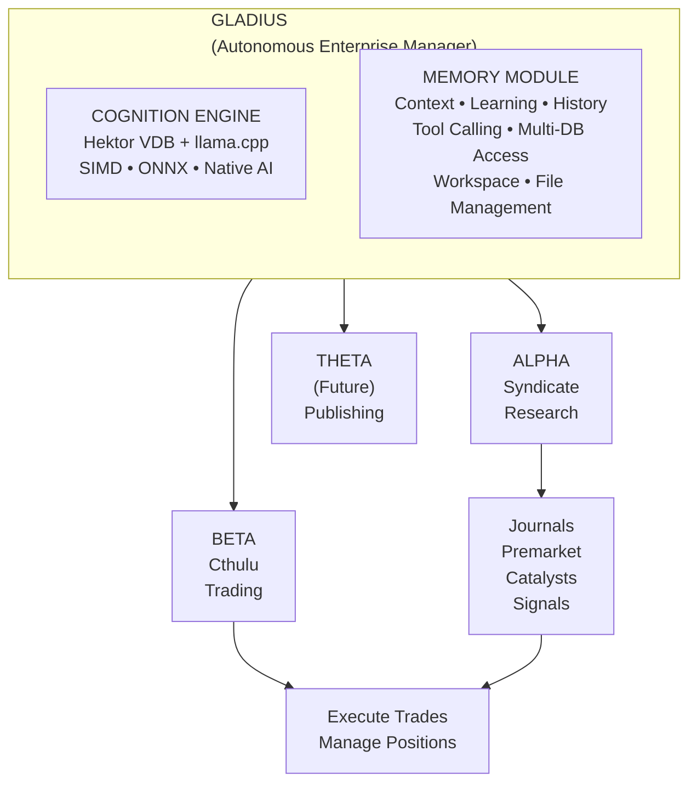

# Gladius Architecture

> Autonomous Enterprise Operating System with Native AI

---
## High-Level Architecture



---

## Core Components

### 1. Gladius (Enterprise Brain)
- **Context Management**: Unified context across all artifacts via native vectorization
- **Hektor VDB**: SIMD-optimized vector database with hybrid search (BM25 + semantic)
- **Native AI**: llama.cpp + ONNX Runtime for local inference and embeddings
- **Memory Module**: Historical learning, prediction tracking, native tool/function calling
- **Cognition Engine**: Autonomous learning loop with self-improvement capabilities
- **Multi-DB Access**: Read/write across all databases with unified memory hooks
- **Workspace Access**: File/structure management for business and automata training

### 2. Artifacts (Autonomous Units)
Each artifact is a self-contained operational unit with its own identity:

| Artifact | Codename | Purpose | Status | Domain |
|----------|----------|---------|--------|--------|
| Alpha | Syndicate | Market research & analysis | ✅ Production | /alpha |
| Beta | Cthulu | Trade execution (MQL5/MT5) | ✅ Staging | /beta |
| Theta | TBD | Social/Publishing | 🚧 Planned | /theta |

### 3. Infrastructure Layer
- **Infra API** (7000): Market data, assets, portfolios
- **Automata Dashboard** (5000): Control panel, orchestration
- **Frontend UI** (3000): React-based operator interface
- **Grafana** (3000 via Docker): Metrics and monitoring dashboards

---

## Data Flow

```
┌──────────────────────────────────────────────────────────────────┐
│                      SYNDICATE PIPELINE                          │
└──────────────────────────────────────────────────────────────────┘
                              │
    ┌─────────────────────────┼─────────────────────────┐
    │                         │                         │
    ▼                         ▼                         ▼
┌──────────┐           ┌──────────┐            ┌──────────┐
│ Journals │           │ Premarket│            │Catalysts │
│ Analysis │           │ Reports  │            │ Calendar │
└────┬─────┘           └────┬─────┘            └────┬─────┘
     │                      │                       │
     └──────────────────────┼───────────────────────┘
                            │
                            ▼
              ┌─────────────────────────┐
              │    COGNITION ENGINE     │
              │   ┌─────────────────┐   │
              │   │  Hektor VDB     │   │
              │   │  SIMD Vectors   │   │
              │   │  BM25 Hybrid    │   │
              │   └─────────────────┘   │
              │   ┌─────────────────┐   │
              │   │  llama.cpp +    │   │
              │   │  ONNX Runtime   │   │
              │   │  Native AI      │   │
              │   └─────────────────┘   │
              └───────────┬─────────────┘
                          │
         ┌────────────────┼────────────────┐
         │                │                │
         ▼                ▼                ▼
    ┌─────────┐     ┌──────────┐    ┌──────────┐
    │ Context │     │ Learning │    │ Signals  │
    │ Memory  │     │ History  │    │ to Trade │
    └─────────┘     └──────────┘    └────┬─────┘
                                         │
                                         ▼
                                  ┌──────────┐
                                  │  Cthulu  │
                                  │ (Execute)│
                                  └──────────┘
```

---

## Cognition Engine Architecture

```
┌─────────────────────────────────────────────────────────────────┐
│                     COGNITION ENGINE                             │
├─────────────────────────────────────────────────────────────────┤
│                                                                  │
│  ┌─────────────────────────────────────────────────────────┐    │
│  │                    HEKTOR VDB                            │    │
│  │  ┌───────────┐  ┌───────────┐  ┌───────────┐            │    │
│  │  │  HNSW     │  │   BM25    │  │ Hybrid    │            │    │
│  │  │  Vectors  │  │  Lexical  │  │  Search   │            │    │
│  │  └───────────┘  └───────────┘  └───────────┘            │    │
│  │  Features: SIMD, Native NLP, Gold Standard Doc Types    │    │
│  └─────────────────────────────────────────────────────────┘    │
│                                                                  │
│  ┌─────────────────────────────────────────────────────────┐    │
│  │                   INFERENCE LAYER                        │    │
│  │  ┌───────────┐  ┌───────────┐  ┌───────────┐            │    │
│  │  │ llama.cpp │  │   ONNX    │  │ Native    │            │    │
│  │  │ GGUF/GGM  │  │  Runtime  │  │ Embeddings│            │    │
│  │  └───────────┘  └───────────┘  └───────────┘            │    │
│  │  GPU: CUDA (if available), CPU: AVX2/AVX512             │    │
│  └─────────────────────────────────────────────────────────┘    │
│                                                                  │
│  ┌─────────────────────────────────────────────────────────┐    │
│  │                   MEMORY MODULE                          │    │
│  │  ┌─────────────────────────────────────────────────┐    │    │
│  │  │  Multi-Database Access                           │    │    │
│  │  │  • Hektor VDB (vectors)  • SQLite (relational)   │    │    │
│  │  │  • JSON stores           • Prediction history    │    │    │
│  │  └─────────────────────────────────────────────────┘    │    │
│  │  ┌─────────────────────────────────────────────────┐    │    │
│  │  │  Native Tool Calling                             │    │    │
│  │  │  • DB read/write         • File operations       │    │    │
│  │  │  • Semantic search       • Context retrieval     │    │    │
│  │  │  • Workspace management  • Structure learning    │    │    │
│  │  └─────────────────────────────────────────────────┘    │    │
│  └─────────────────────────────────────────────────────────┘    │
│                                                                  │
│  ┌─────────────────────────────────────────────────────────┐    │
│  │                   FALLBACK LAYER                         │    │
│  │  SQLite persistence • TF-IDF embeddings • JSON export    │    │
│  └─────────────────────────────────────────────────────────┘    │
│                                                                  │
└─────────────────────────────────────────────────────────────────┘
```

---

## Hektor VDB Capabilities

| Feature | Status | Description |
|---------|--------|-------------|
| **SIMD Optimization** | ✅ | AVX2/AVX512 vector operations |
| **HNSW Index** | ✅ | Approximate nearest neighbor search |
| **BM25 Engine** | ✅ | Lexical/keyword search |
| **Hybrid Search** | ✅ | Vector + BM25 fusion (RRF) |
| **Gold Standard Types** | ✅ | Journal, Chart, Catalyst, Calendar, etc. |
| **Native Tokenizer** | ✅ | WordPiece (BERT-compatible) |
| **llama.cpp Integration** | ✅ | Local GGUF model inference (b7716) |
| **Python Bindings** | ✅ | pyvdb module for integration |
| **ONNX Runtime** | ✅ | Text/image encoders (libonnxruntime-dev) |
| **CUDA Acceleration** | 🔧 | Optional GPU support |

---

## Memory Module Architecture

```
┌─────────────────────────────────────────────────────────────────┐
│                      MEMORY MODULE                               │
├─────────────────────────────────────────────────────────────────┤
│                                                                  │
│  ┌──────────────────────┐  ┌──────────────────────┐             │
│  │   UNIFIED MEMORY     │  │   DATABASE HOOKS     │             │
│  │   INTERFACE          │  │                      │             │
│  │                      │  │  ┌────────────────┐  │             │
│  │  • Query routing     │  │  │ Hektor VDB     │  │             │
│  │  • Context assembly  │  │  │ (vectors)      │  │             │
│  │  • Tool dispatch     │  │  └────────────────┘  │             │
│  │  • Response merge    │  │  ┌────────────────┐  │             │
│  │                      │  │  │ SQLite DBs     │  │             │
│  └──────────────────────┘  │  │ (relational)   │  │             │
│                            │  └────────────────┘  │             │
│  ┌──────────────────────┐  │  ┌────────────────┐  │             │
│  │   NATIVE TOOL        │  │  │ JSON stores    │  │             │
│  │   CALLING            │  │  │ (configs)      │  │             │
│  │                      │  │  └────────────────┘  │             │
│  │  • read_db(name, q)  │  └──────────────────────┘             │
│  │  • write_db(name, d) │                                       │
│  │  • search(query, k)  │  ┌──────────────────────┐             │
│  │  • read_file(path)   │  │   WORKSPACE ACCESS   │             │
│  │  • write_file(p, d)  │  │                      │             │
│  │  • list_dir(path)    │  │  • Sandboxed access  │             │
│  │  • get_context(q)    │  │  • File operations   │             │
│  │                      │  │  • Structure learn   │             │
│  └──────────────────────┘  └──────────────────────┘             │
│                                                                  │
└─────────────────────────────────────────────────────────────────┘
```

---

## Technology Stack

| Layer | Primary | Fallback |
|-------|---------|----------|
| **Vectorization** | Hektor VDB (C++/SIMD) | hnswlib + TF-IDF |
| **Embeddings** | ONNX Runtime + llama.cpp | TF-IDF sklearn |
| **LLM Inference** | llama.cpp (GGUF) | Ollama → Gemini API |
| **Persistence** | Hektor native + SQLite | JSON export |
| **API Framework** | FastAPI | Flask |
| **Frontend** | React + Vite | Grafana |
| **Trading** | MQL5/MetaTrader 5 | - |
| **Infrastructure** | GCP + Docker | systemd |

---

## Document Types (Gold Standard)

Hektor VDB supports typed document storage for Syndicate outputs:

| Type | Enum | Description |
|------|------|-------------|
| `Journal` | Journal | Daily/weekly market journals |
| `Chart` | Chart | Annotated chart analysis |
| `CatalystWatchlist` | CatalystWatchlist | Upcoming market catalysts |
| `EconomicCalendar` | EconomicCalendar | Economic event schedules |
| `PreMarket` | PreMarket | Pre-market analysis reports |
| `WeeklyRundown` | WeeklyRundown | Weekly market summaries |
| `MonthlyReport` | MonthlyReport | Monthly analysis |
| `ThreeMonthReport` | ThreeMonthReport | Quarterly outlook |
| `OneYearReport` | OneYearReport | Annual predictions |
| `InstitutionalMatrix` | InstitutionalMatrix | Institutional flow analysis |
| `Outcome` | Outcome | Prediction outcomes for learning |

---

## Prediction Learning System

The cognition engine learns from predictions through a feedback loop:

```
┌─────────────────────────────────────────────────────────────────┐
│                   PREDICTION LEARNING LOOP                       │
├─────────────────────────────────────────────────────────────────┤
│                                                                  │
│   ┌──────────────┐     ┌──────────────┐     ┌──────────────┐    │
│   │   Market     │────▶│   Predict    │────▶│   Record     │    │
│   │   Analysis   │     │   Bias       │     │   Outcome    │    │
│   └──────────────┘     └──────────────┘     └──────┬───────┘    │
│          ▲                                         │            │
│          │                                         ▼            │
│   ┌──────┴───────┐                        ┌──────────────┐      │
│   │   Pattern    │◀───────────────────────│   Grade      │      │
│   │   Feedback   │                        │   Performance│      │
│   └──────────────┘                        └──────────────┘      │
│                                                                  │
│   Features:                                                      │
│   • Pattern success rate analysis                                │
│   • Similar historical outcomes search                           │
│   • Adaptive recommendations                                     │
│   • Confidence scoring with streak tracking                      │
│   • Learning feedback generation for AI context                  │
│                                                                  │
└─────────────────────────────────────────────────────────────────┘
```

### Learning Methods

| Method | Purpose |
|--------|---------|
| `learn_from_prediction()` | Record prediction outcomes with context |
| `get_similar_historical_outcomes()` | Find similar market conditions |
| `get_pattern_success_rate()` | Calculate pattern reliability |
| `generate_learning_feedback()` | Generate AI context from history |
| `get_prediction_accuracy()` | Comprehensive accuracy statistics |

---

## Future: Web3 Integration

| Component | Domain | Purpose |
|-----------|--------|---------|
| Gladius Core | artifactvirtual.com | Enterprise governance |
| Alpha (Syndicate) | /alpha | Research signal access |
| Beta (Cthulu) | /beta | Trading profit sharing |
| Theta | /theta | Content monetization |

Each artifact will have:
- **Blockchain integration** for transparency
- **Utility tokens** for access/governance
- **Soulbound tokens (SBT)** for reputation
- **Native GGUF/GGM models** for artifact-specific AI

---

## File Structure

```
gladius/
├── Artifact/
│   ├── syndicate/             # Alpha: Research engine
│   │   ├── src/
│   │   │   └── cognition/     # Vector memory system
│   │   │       ├── embedder.py
│   │   │       ├── vector_store.py    # hnswlib fallback
│   │   │       ├── hektor_store.py    # Native Hektor VDB
│   │   │       ├── memory_module.py   # Unified memory access
│   │   │       ├── tool_calling.py    # Native tool definitions
│   │   │       └── syndicate_integration.py
│   │   ├── main.py            # Core daemon
│   │   └── output/            # Generated reports
│   ├── hektor/                # Native VDB (C++)
│   │   ├── src/               # Core implementation
│   │   ├── include/vdb/       # Headers
│   │   ├── bindings/python/   # pyvdb module
│   │   └── build/             # Compiled artifacts
│   ├── deployment/
│   │   ├── infra/             # Market/Portfolio API
│   │   └── automata/          # Dashboard & orchestration
│   └── arty/                  # Automation framework
├── RESEARCH/                  # Articles & papers
├── docs/                      # Documentation
├── gladius.sh                 # Unified control script
├── ARCHITECTURE.md            # This file
├── COMMANDS.md                # Command reference
└── CONTEXT.md                 # Operational context
```

---

## Training & Self-Improvement System

The system now includes autonomous learning capabilities:

```
┌─────────────────────────────────────────────────────────────────┐
│                   LEARNING LOOP                                  │
├─────────────────────────────────────────────────────────────────┤
│                                                                  │
│   ┌──────────────┐     ┌──────────────┐     ┌──────────────┐    │
│   │   Ingest     │────▶│   Generate   │────▶│   Propose    │    │
│   │   Reports    │     │   Training   │     │   Improve    │    │
│   └──────────────┘     │   Data       │     └──────┬───────┘    │
│                        └──────────────┘            │            │
│                                                    ▼            │
│   ┌──────────────┐                        ┌──────────────┐      │
│   │   Snapshot   │◀───────────────────────│   Execute    │      │
│   │   Benchmark  │                        │   Changes    │      │
│   └──────────────┘                        └──────────────┘      │
│                                                                  │
│   Components:                                                    │
│   • TrainingDataGenerator - Generate fine-tuning data           │
│   • SelfImprovementEngine - Proposal lifecycle with audit       │
│   • CognitionLearningLoop - Autonomous learning cycles          │
│   • Snapshot management for rollback                            │
│                                                                  │
└─────────────────────────────────────────────────────────────────┘
```

### Training Data Generation

| Format | Description | Use Case |
|--------|-------------|----------|
| Chat | Conversational format | Instruction tuning |
| Completion | Prompt-completion pairs | Causal LM training |
| llama.cpp | llama.cpp specific JSON | GGUF fine-tuning |
| Tool | OpenAI tool-calling format | Function calling |

### Self-Improvement Workflow

1. **Proposal Creation** → Draft with items, rationale, risk
2. **Review Cycle** → Approve, request changes, or reject
3. **Implementation Plan** → Checklist, blueprint, execution plan
4. **Execution** → Pre/post snapshots, task tracking
5. **Completion** → Audit trail preserved

### Improvement Categories

| Category | Description |
|----------|-------------|
| COGNITION | Core reasoning and analysis |
| MEMORY | Database and storage |
| TOOLS | Tool calling capabilities |
| STRUCTURE | File and code organization |
| AUTOMATION | Workflow automation |
| PERFORMANCE | Speed and efficiency |
| ACCURACY | Prediction improvement |
| DOCUMENTATION | Docs and guides |

---

*Last updated: 2026-01-13*
