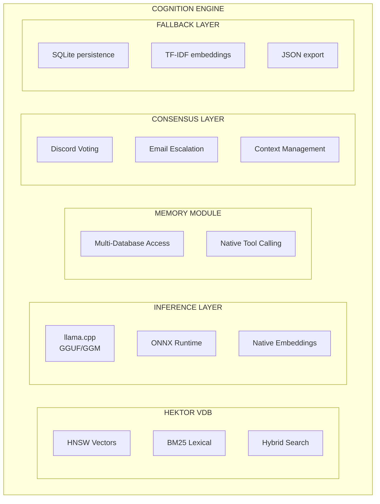
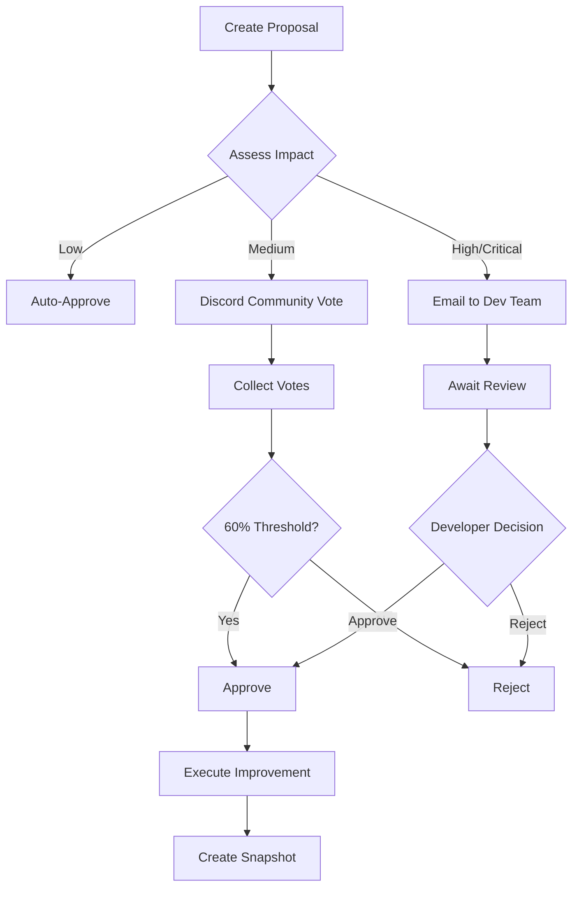
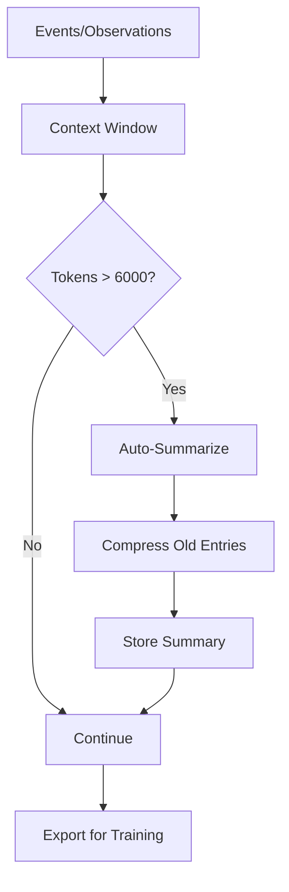
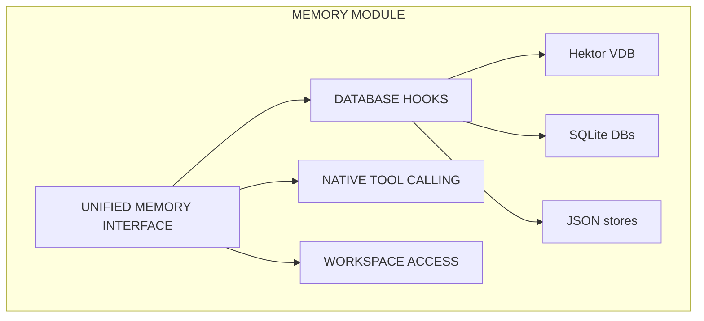
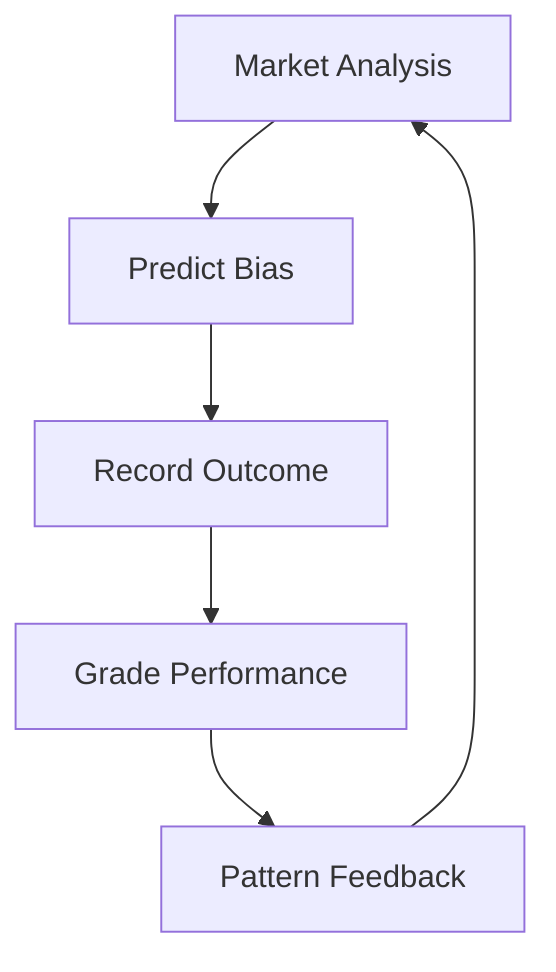
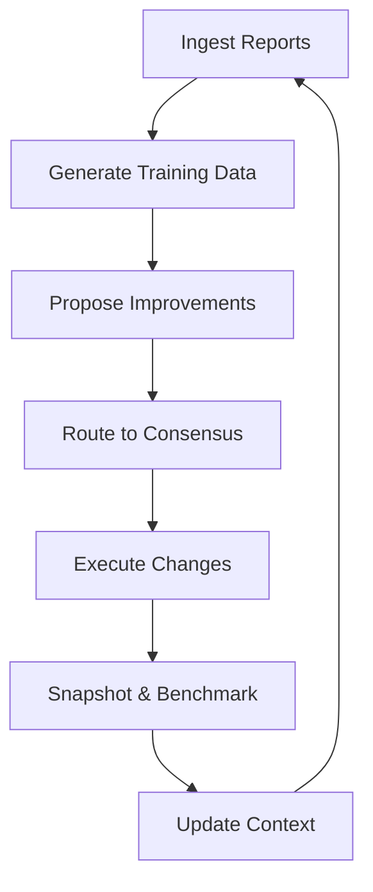
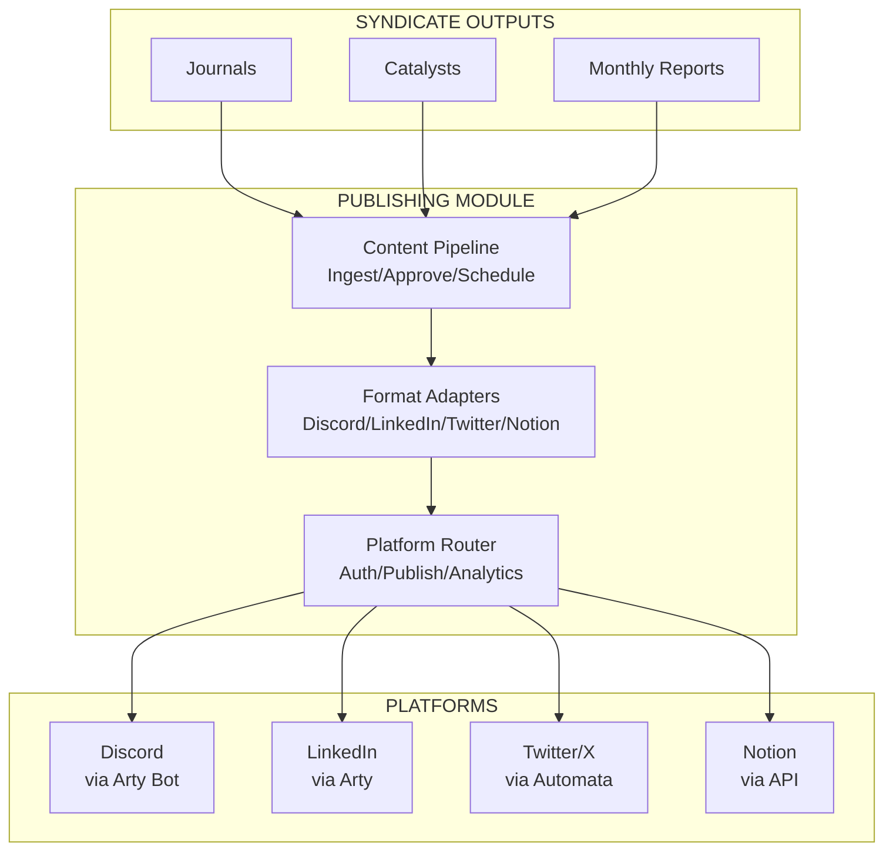

# System Architecture

> Autonomous Enterprise Operating System with Native AI

---

## High-Level Architecture

```mermaid
flowchart TD
       subgraph GLADIUS [GLADIUS (Autonomous Enterprise Manager)]
              subgraph COGNITION_ENGINE [COGNITION ENGINE]
                     HEKTOR[Hektor VDB<br/>SIMD/HNSW<br/>Vectors]
                     TOOL_ROUTER[Native Tool Router<br/>(<10ms)]
                     MEMORY[Memory Module<br/>Multi-DB]
                     LEARNING[Learning Loop<br/>Training]
                     CONSENSUS[Consensus System<br/>Discord/Email]
                     CONTEXT[Context Manager<br/>Summarization]
                     HEKTOR --> MODEL_STACK
                     TOOL_ROUTER --> MODEL_STACK
                     MEMORY --> MODEL_STACK
                     LEARNING --> MODEL_STACK
                     CONSENSUS --> MODEL_STACK
                     CONTEXT --> MODEL_STACK
                     subgraph MODEL_STACK [MODEL STACK]
                            TOOL_ROUTER2[Tool Router<br/>(tiny GGUF)<br/><10ms]
                            OLLAMA[Ollama LLM<br/>(fallback)<br/>~100ms]
                            GLADIUS_NATIVE[Gladius Native<br/>(future: full)<br/><50ms all tasks]
                     end
              end
       end
       GLADIUS -->|Artifact Alpha| ALPHA[ARTIFACT ALPHA<br/>Syndicate<br/>Research]
       GLADIUS -->|Artifact Beta| BETA[ARTIFACT BETA<br/>Cthulu<br/>Trading]
       GLADIUS -->|Artifact Theta| THETA[ARTIFACT THETA<br/>(Future)<br/>Publishing]
```

---

## Data Flow

```mermaid
flowchart TD
       MarketSources[Market Sources<br/>(yfinance, FRED)] --> SyndicatePipeline
       subgraph SyndicatePipeline [SYNDICATE PIPELINE]
              Journals[Journals]
              Premarket[Premarket]
              Catalysts[Catalysts]
              Calendar[Calendar]
              Journals -->| | CognitionEngine
              Premarket -->| | CognitionEngine
              Catalysts -->| | CognitionEngine
              Calendar -->| | CognitionEngine
       end
       subgraph CognitionEngine [COGNITION ENGINE]
              NativeToolRouter[NativeToolRouter<br/>(route → execute)]
              HektorVDB[Hektor VDB<br/>(ingest → search)]
              TrainingGenerator[TrainingGenerator<br/>(history → dataset)]
              ModelTrainer[ModelTrainer<br/>(train → deploy)]
              ContextManager[ContextManager<br/>(summarize → coherence)]
              ConsensusSystem[ConsensusSystem<br/>(vote → escalate)]
              NativeToolRouter --> HektorVDB
              HektorVDB --> TrainingGenerator
              TrainingGenerator --> ModelTrainer
              TrainingGenerator --> ConsensusSystem
              ContextManager --> TrainingGenerator
       end
       SyndicatePipeline --> CognitionEngine
       ModelTrainer -->|Trade Signals| Cthulu[Cthulu<br/>(Execution)]
       ConsensusSystem -->|Approved| SelfImprove[Self Improve<br/>(Execute)]
```

---

## Cognition Engine Architecture



---

## Consensus System Flow



---

## Context Management Flow



---

## Memory Module Architecture



---

## Prediction Learning System



---

## Training & Self-Improvement System



---

## Digital Footprint Architecture



---

## Module Summary

| Module | Purpose | Status |
|--------|---------|--------|
| Hektor VDB | Native C++ vector database with SIMD | ✅ Implemented |
| Memory Module | Multi-database access with 16 tools | ✅ Implemented |
| Tool Calling | Native function definitions | ✅ Implemented |
| Training Generator | Generate fine-tuning data | ✅ Implemented |
| Self-Improvement | Autonomous proposals with audit | ✅ Implemented |
| Learning Loop | Continuous learning cycles | ✅ Implemented |
| Consensus System | Discord voting + email escalation | ✅ Implemented |
| Context Manager | Summarization + coherence | ✅ Implemented |
| Native Tool Router | Pattern-based tool routing | ✅ Implemented |
| Model Trainer | GGUF fine-tuning pipeline | 🚧 In Progress |
| **Digital Footprint** | Content pipeline + publishing | ✅ Implemented |
| **Content Pipeline** | Ingest → Approve → Schedule → Track | ✅ Implemented |
| **Format Adapters** | Platform-specific formatting | ✅ Implemented |
| **Platform Router** | Multi-platform publishing | ✅ Implemented |

---

*Last updated: 2026-01-13*
