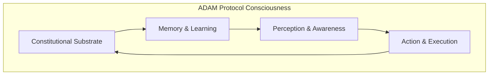
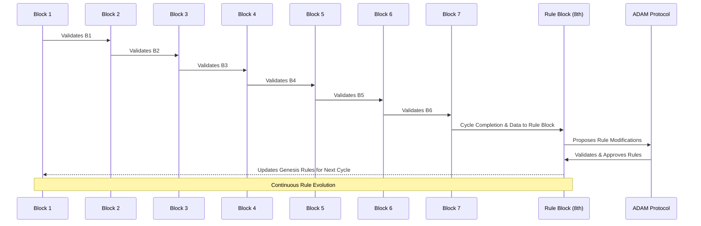
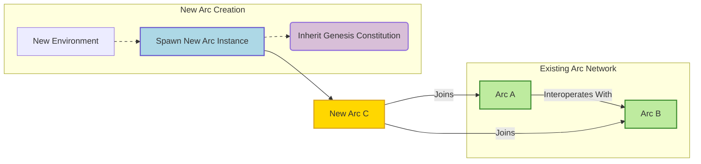
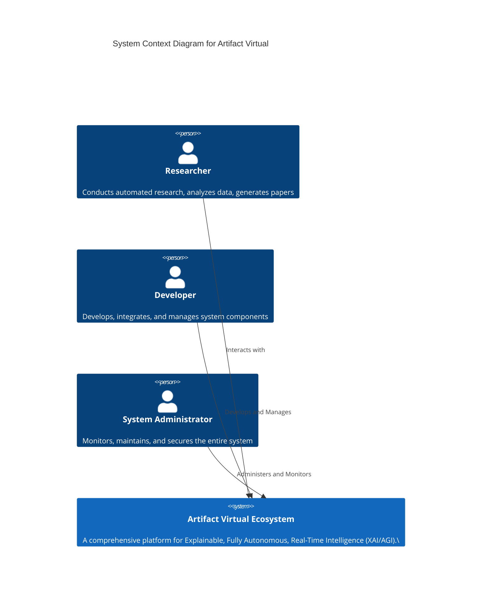

This document is designed to provide a holistic understanding of the system, integrating architectural designs, functional components, governance structures, and integration frameworks.

### **System Overview**
Artifact Virtual is an innovative open-source platform integrating AI into the research process. Its goal is to automate routine tasks and provide intelligent assistance, thereby accelerating scientific discovery and enhancing the efficiency of research endeavors.

### **Vision**
The primary vision of Artifact Virtual is to establish a Decentralized Autonomous Organization (DAO) that coordinates self-hosted Decentralized Autonomous Research Organizations (DAROs) and intelligent agent teams.

### **Key Features**
1.  **Modular Architecture**
2.  **Flexible Deployment**
3.  **Autonomous Operational Capabilities**
4.  **Advanced AI Integration**

### **System Architecture**
The system architecture comprises several layers, each with specific responsibilities.

#### **Diagram of System Architecture**
![System Architecture]
   - **User Interface Layer**: The front-facing components where users interact with the system.
   - **Data Management Layer**: Responsible for storing, versioning, and retrieving data effectively.
   - **Control and Orchestration Layer**: Manages workflows and ensures that each component communicates seamlessly.
   - **Resource Management Subsystem**: Allocates hardware and software resources to optimize task performance.
   - **Task Management Subsystem**: Schedules and monitors tasks, ensuring efficient execution.
   - **Intelligent Optimization Layer**: Utilizes machine learning algorithms to enhance system performance dynamically.
   - **Computational Core Layer**: The main processing unit that performs computations and handles data analysis.
   - **Hardware Abstraction Layer**: Interfaces directly with hardware, allowing for compatibility across various platforms.

### **Core Components**
- **Core Framework**: This component forms the foundation of the Artifact Virtual Ecosystem.
- **Integration Systems**: They integrate the core framework.
- **Research Automation & AI**: This section integrates AI and machine learning components into the architecture.
- **Governance & Security Structures**: They encompass the protocols and architectures for governance and security.
- **User Interaction and Deployment Environments**: These elements complete the architecture by interfacing with the system.

### **Detailed Topics by Category**

#### **1. Core Framework**
- **Core Components**:
  - **Backend Technologies**:
    - FastAPI
    - PostgreSQL
    - Uvicorn
    - Docker
  - **Frontend Technologies**:
    - React
    - Next.js
    - Tailwind CSS
  - **Quantum Engine (QENG)**:
    - Simulates quantum systems, providing unique computing capabilities
    - Integrated with container orchestration tools like Kubernetes

- **Architectural Principles**:
  - Modular architecture enabling independent deployment and scaling
  - Containerized structure facilitating easier updates and environment consistency

#### **2. Integration Systems**
- **API Structures**:
  - **Backend APIs**:
    - Main Backend API
      - Key routes: `/api/status`, `/api/metrics`
    - Research Portal API
    - Chat Application API
  - **Frontend APIs**:
    - WebSocket implementations
    - REST API connections

- **Overall Integration Framework**:
  - Microservices architecture
  - Coordinated communication through message brokers and API gateways
  - Cross-service dependencies managed using container orchestration (e.g., Docker, Kubernetes)

#### **3. Research Automation & AI**
- **AI Components**:
  - **Machine Learning Pipelines**:
    - Automated pipelines for data ingestion, analysis, and insight generation
  - **Agent Coordination**:
    - Use of AI agents (e.g., ART and MAOS) for task management 
  - **Quantum Integration**:
    - Leveraging QENG for advanced quantum simulations

- **Research Processes**:
  - Live internet research with verified sources
  - Automated generation of insights and research papers
  - Data visualization tools for impactful presentation of findings

#### **4. Governance & Security Structures**
- **ADAM Protocol**:
  - Constitutional intelligence framework governing the entire system
  - Multi-signature, role-based governance for critical actions
  - Self-modifying constitutional logic allowing adaptive evolution

- **Security Mechanisms**:
  - Robust role-based access control (RBAC) systems
  - Data encryption protocols for sensitive interactions
  - Audit logging for compliance and transparency

#### **5. User Interaction and Deployment Environments**
- **User Interfaces**:
  - Web dashboards for system interaction and user management
  - Chat interfaces for real-time communication and support
  - Interactive components for data exploration

- **Deployment Strategies**:
  - CI/CD pipelines for smooth deployment and version control 
  - Monitoring and metrics systems to track performance in real time
  - Containerization for portability and scalable deployments

### **API Documentation**
Artifact Virtual utilizes robust APIs to facilitate interaction between components. These APIs offer extensive functionalities, including data retrieval, task management, and integration with external systems such as blockchain applications.

-   **Main Backend API**: Provides access to all core functionalities and system metrics.
-   **Research Portal API**: Interfaces directly with research tools and data analysis features.
-   **User Management API**: Handles user authentication and authorization processes.

### **ADAM Protocol**
(Autonomous Decentralized Awareness Module) is a seminal advancement in decentralized governance, establishing itself as the constitutional intelligence module of the Artifact Virtual ecosystem. Its revolutionary architecture emphasizes its blockchain-native implementation of self-modifying constitutional logic, Turing-complete governance programs, and interconnected block validation.

**Architectural Principles:**
- Smart Contract-Level Constitutional Logic
- Interconnected Program Architecture (Cryptographic 2FA)
- Self-Modifying Constitutional Logic
- Advanced Rule Architecture

**ADAM Protocol's Consciousness Layers:**

| Layer                        | Description                                                                                                                              |
| :--------------------------- | :--------------------------------------------------------------------------------------------------------------------------------------- |
| **Constitutional Substrate** | The fundamental MetaBlock system, defining the immutable foundational rules and providing an auditable record of their evolution [Reference 1](). |\
| **Memory & Learning**        | An append-only memory system utilizing [Merkle trees](https://en.wikipedia.org/wiki/Merkle_tree) for cryptographically secure, versioned event storage and continuous learning from historical data [Reference 1](). |\
| **Perception & Awareness**   | Achieved through [oracle integration](https://en.wikipedia.org/wiki/Oracle_(blockchain)), event listeners, and cross-chain monitoring to gather and process external information [Reference 1](). |\
| **Action & Execution**       | Involves smart contract operations, resource management, NFT operations, and multi-signature actions for executing validated decisions and deploying services [Reference 1](). |

**Diagrams:**
1.  **ADAM Protocol Consciousness Layers (Block Diagram):**


2.  **MetaBlock Constitutional Chain with Rule Evolution (Flowchart / Sequence):**
```mermaid
flowchart TD
    B_N[MetaBlock N]
    B_N_plus_1[MetaBlock N+1]
    B_N_plus_2[MetaBlock N+2]
    RE[Rule Evolution Function]
    FB[Feedback (Metrics, Votes)]

    B_N -- H(b_i-1), R_i, E_i, S_i --> B_N_plus_1
    B_N_plus_1 -- H(b_i-1), R_i, E_i, S_i --> B_N_plus_2

    B_N -- R_i, E_i --> RE
    FB --> RE
    RE --> R_i_plus_1[R_i+1 (New Rules)]
    R_i_plus_1 --> B_N_plus_1
    R_i_plus_1 --> B_N_plus_2

    classDef metarect fill:#add8e6,stroke:#333,stroke-width:2px;
    class B_N,B_N_plus_1,B_N_plus_2 metarect;
```

3.  **ADAM Protocol vs. Traditional AI (Comparison Table):**
```mermaid
graph TD
    subgraph "Key Distinctions"
        A[Traditional AI]
        B[AVA (Constitutional Intelligence)]
    end

    A --- C[Decision Process: Black box, hard to audit]
    B --- D[Decision Process: Transparent, rule-based, auditable]

    A --- E[Execution: Probabilistic, data-driven]
    B --- F[Execution: Deterministic, explicit rules]

    A --- G[Adaptation: Trained on static datasets]
    B --- H[Adaptation: Evolves via governed processes]

    A --- I[Architecture: Centralized, model-centric]
    B --- J[Architecture: Distributed, modular, consensus-driven]

    A --- K[Governance: No built-in governance]
    B --- L[Governance: Democratic/consensus at core]

    A --- M[Memory: Mutable, often ephemeral]
    B --- N[Memory: Immutable, cryptographically secure]

    A --- O[Sovereignty: Dependent on external control]
    B --- P[Sovereignty: Self-governing, autonomous]
```

4.  **Production Deployment Architecture:**
```mermaid
flowchart TD
    subgraph "ADAM Protocol Production Deployment"
        A[MetaBlock Constitutional Chain] --> B{Hybrid Consensus (Constitutional PoS)}
        B --> C[ADAM Protocol Core]
        C -- Synchronizes --> D[Cross-Chain Governance Module]
        D -- Governs --> E[Blockchain A (e.g., Ethereum)]
        D -- Governs --> F[Blockchain B (e.g., Polygon)]
        D -- Governs --> G[Blockchain C (e.g., Custom Arc)]
    end
```

### **The Arc**
The Arc represents the primordial foundation of the Artifact Virtual ecosystem, serving as a private, sovereign blockchain deployment meticulously designed to birth constitutional intelligence. It features a two-phase ethical blockchain architecture.

**The Arc’s Two-Phase Ethical Blockchain Architecture:**
```mermaid
flowchart TD
    subgraph "Phase 2: Constitutional Intelligence Layer (adamprotocol)"
        A[AI Decision Engine] --> B(Constitutional Voting)
        B --> C[Learning Database]
        A -- Data & Rules --> B
        C -- Feedback --> A
    end

    subgraph "Phase 1: The Arc Foundation"
        D[Block 1] --> E[Block 2]
        E --> F[Block 3]
        F --> G[Block 4]
        G --> H[Block 5]
        H --> I[Block 6]
        I --> J[Block 7]
        J --> K[Rule Block (8th Block)]
        K --> D
        D -- Validator --> D_V[Validator]
        E -- Validator --> E_V[Validator]
        F -- Validator --> F_V[Validator]
        G -- Validator --> G_V[Validator]
        H -- Validator --> H_V[Validator]
        I -- Validator --> I_V[Validator]
        J -- Validator --> J_V[Validator]
        K -- Validator --> K_V[Validator]
    end

    A -- Influences Rules --> K
    K -- Provides Data --> A
    K -- Integrates --> A
```

**Diagrams:**
1.  **The Arc's 7-Block Circular Validation and Rule Evolution:**


2.  **Replication and Expansion of Arcs:**


### **Artifact Virtual Assistant (AVA)**
*   **Transparency**:
*   **Auditability**:
*   **Evolving**:

### **QVM**
This paper proposes a novel architecture for simulating quantum systems on classical hardware with enhanced fidelity and temporal accuracy.

### **Diagrams and Charts**
These diagrams provide a visual representation of the relationships and actions in the system.

1.  **Artifact Virtual High-Level System Context:**


2.  **Artifact Virtual Container Diagram:**
```mermaid
C4Container
    title Container Diagram for Artifact Virtual Ecosystem

    Container(core, "CORE System", "Foundation for Artifact Virtual, including AROS, Orchestrator, Data/Cache, and Networking components.\")
    Container(research, "RESEARCH Lab System", "Manages automated research, secure labs, data analysis, visualization, and paper generation.\")
    Container(modules, "MODULES System", "Houses AI frameworks, agent orchestration (MAOS, ART), Blockchain R&D, and the Quantum Engine (QENG).\")
    Container(tools, "TOOLS Ecosystem", "Provides utilities like data analysis, context management, backup, and history tracking.\")
    Container(enterprise, "ENTERPRISE System", "Handles business functions such as operations, finance, marketing, and legal aspects.\")
    Container(frontend, "FRONTEND System", "Offers web interfaces including various dashboards, chat, and interactive components for user interaction.\")
    Container(supporting, "SUPPORTING Systems", "Includes Workshop, Security, Monitoring, Optimization, Reports, Tests, and Documentation.\")

    Rel(core, research, "Provides foundational services for research operations")
    Rel(core, modules, "Supports AI/Blockchain/Quantum modules")
    Rel(core, tools, "Enables utility functions")
    Rel(core, enterprise, "Underpins business operations")
    Rel(core, frontend, "Serves data and backend logic for user interfaces")

    Rel(research, modules, "Utilizes AI agents and Quantum Engine for advanced research")
    Rel(research, tools, "Leverages analysis and context tools")
    Rel(modules, research, "Provides AI and Blockchain services to Research Lab")
    Rel(modules, tools, "Utilizes utilities for module management")

    Rel(frontend, research, "Visualizes research data and progress")
    Rel(frontend, modules, "Interacts with AI agents and Blockchain modules")
    Rel(frontend, enterprise, "Displays enterprise metrics and controls")
    Rel(frontend, tools, "Accesses system utilities for display")

    Rel(artifactVirtual, core, "Comprises")
    Rel(artifactVirtual, research, "Comprises")
    Rel(artifactVirtual, modules, "Comprises")
    Rel(artifactVirtual, tools, "Comprises")
    Rel(artifactVirtual, enterprise, "Comprises")
    Rel(artifactVirtual, frontend, "Comprises")
    Rel(artifactVirtual, supporting, "Supports all core functions")

    Boundary(qengBoundary, "Quantum Engine (QENG) within Modules") {
        Container(quantumEngine, "Quantum Engine (QENG)", "Simulates qubits and their many superpositioned states using Kubernetes for deployment.\", \"Python, Kubernetes, Docker")
        Rel(modules, quantumEngine, "Hosts")
    }

    Rel(research, quantumEngine, "Leverages for quantum simulations")
    Rel(quantumEngine, core, "Relies on core services")
    Rel(quantumEngine, tools, "Utilizes analysis and utility tools")
```

3.  **Artifact Virtual Architectural Phases:**
```mermaid
flowchart TD
    A[Phase 0: The Thought] --> B[Phase 1: Virtualization & Containerization]
    B --> C[Phase 2: The Arc (Constitutional Intelligence Genesis)]
    C --> D[Phase 3: The Artifact (Emergence of DAE)]
    D --> E[Phase 4: The Network (Constellation of Arcs)]
    E --> F[Phase 5: Interplanetary & Intergalactic Expansion]
```

4.  **Automated Research Pipeline:**
```mermaid
flowchart TD
    A[Data Ingestion (Verified Sources)] --> B[Research Queue]
    B --> C{AI Agent Orchestration}
    C -- Utilizes ART/MAOS --> D[Data Analysis & Experimentation]
    D -- Integrates --> E[Quantum Engine (QENG) for Simulation]
    E -- Results --> D
    D --> F[Insight Generation]
    F --> G[Automated Paper/Documentation Generation]
    G --> H[Knowledge Base & Reporting]
```

### **Economic and Financial Model**
Artifact Virtual's economic model supports sustainable development and community engagement:
-   **Mining Mechanism**: An efficient mining protocol to validate transactions and secure the network.
-   **Tokenomics**: The distribution and utility of the native token, incentivizing users and developers.
-   **Community Governance**: Mechanisms for community involvement in governance decisions, fostering a sense of ownership and participation.

### **Development Environment**
Artifact Virtual is built on a modern development environment with specific tools and technologies to support the development and operation of the platform.

-   **Integrated Development Environment (IDE)**: Supports real-time collaboration and version control.
-   **Backend Development**: Based on frameworks like FastAPI.
-   **Frontend Development**: Utilizes React for dynamic user interfaces.

### **Security**
Artifact Virtual incorporates robust security measures, including RBAC, data encryption, audit logging, and AI-powered threat detection and classification.

