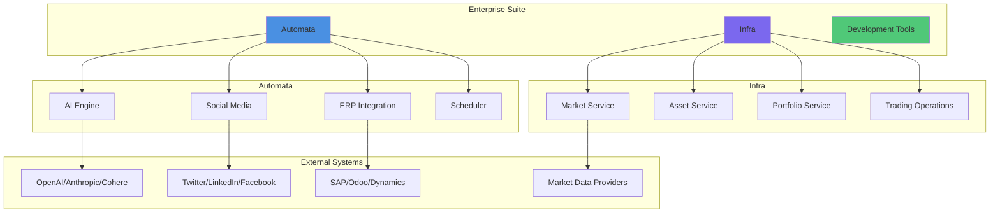

# Enterprise Drive

**Version:** 1.0.0  
**Status:** ✅ Production Ready  
**Last Updated:** January 2026

---

## 🎯 Overview

The Gold Standard Enterprise Suite is a comprehensive, production-grade platform integrating advanced AI capabilities, multi-platform business automation, ERP systems, and financial infrastructure for enterprise operations.

### Key Components

1. **Infra** - Market data, asset management, portfolio operations
2. **Automata** - AI-powered automation, social media, ERP integration  
3. **Development Tools** - VM management, SSH tunneling, secure access

---

## 📊 High-Level Architecture



---

## 🚀 Quick Start

```bash
# Navigate to deployment directory
cd /home/adam/worxpace/_deployment/automata

# Run setup script
./setup.sh

# Configure environment
cp .env.template .env
nano .env  # Add your API keys

# Run examples
python3 examples.py
```

---

## 📁 Directory Structure

```
_deployment/
├── LICENSE                          # Enterprise software license
├── README.md                        # This file
│
├── docs/                           # Complete documentation suite
│   ├── 01-ARCHITECTURE.md          # System architecture & diagrams
│   ├── 02-INTEGRATION-GUIDE.md     # Integration documentation
│   ├── 03-API-REFERENCE.md         # API documentation
│   ├── 04-DEPLOYMENT.md            # Deployment guide
│   ├── 05-SECURITY.md              # Security guidelines
│   ├── 06-TROUBLESHOOTING.md       # Problem resolution
│   └── THIRD-PARTY-LICENSES.md     # Third-party licenses
│
├── automata/                       # AI & automation platform
│   ├── ai_engine/                  # AI with memory & reflection
│   ├── social_media/               # Social platform integrations
│   ├── erp_integrations/           # ERP system connectors
│   ├── scheduler/                  # Autonomous scheduler
│   ├── integrations/               # Third-party integrations
│   └── IMPLEMENTATION_COMPLETE.md  # Complete feature documentation
│
├── infra/                          # Financial operations
│   ├── models/                     # Domain models
│   ├── repositories/               # Data persistence
│   ├── services/                   # Business logic
│   └── README.md                   # Infrastructure docs
│
└── scripts/                        # Deployment & management scripts
    ├── odyssey_startup.sh          # VM initialization
    ├── setup_nssm_tunnel.ps1       # SSH tunnel service (Windows)
    └── setup_odyssey_ssh.ps1       # SSH key setup (Windows)
```

---

## 🎯 Core Features

### Automata (Enterprise Automation)

- ✅ **AI Engine** - Multi-provider support (OpenAI, Anthropic, Cohere, Local)
- ✅ **Persistent Memory** - Context survives restarts with SQLite storage
- ✅ **Self-Reflection** - AI analyzes and improves itself hourly
- ✅ **Tool Calling** - AI executes Python functions autonomously
- ✅ **Social Media** - 5+ platforms (Twitter, LinkedIn, Facebook, Instagram, YouTube)
- ✅ **ERP Integration** - 5 systems (SAP, Odoo, NetSuite, Dynamics, Salesforce)
- ✅ **Smart Scheduler** - Optimal timing, priority queue, auto-retry
- ✅ **Discord Notifications** - Rich embeds for all system events

### Infra (Business Infrastructure)

- ✅ **Market Management** - Multi-exchange support, real-time data
- ✅ **Asset Operations** - Stocks, bonds, crypto, derivatives
- ✅ **Portfolio Service** - Position tracking, P&L calculation, risk metrics
- ✅ **Trading Engine** - Order management, execution, compliance
- ✅ **Repository Pattern** - Abstract data layer for any backend
- ✅ **100% Test Coverage** - Comprehensive unit and integration tests

---

## 📚 Documentation

Complete documentation is available in the `docs/` directory:

1. **[Architecture Guide](docs/01-ARCHITECTURE.md)** - System design, components, data flow with Mermaid diagrams
2. **[Integration Guide](docs/02-INTEGRATION-GUIDE.md)** - External system integrations with examples 
3. **[API Reference](docs/03-API-REFERENCE.md)** - Complete API documentation
4. **[Deployment Guide](docs/04-DEPLOYMENT.md)** - Production deployment procedures
5. **[Security Guide](docs/05-SECURITY.md)** - Security best practices & configuration
6. **[Troubleshooting](docs/06-TROUBLESHOOTING.md)** - Common issues and solutions
7. **[System Requirements](SYSTEM_REQUIREMENTS.md)** - Hardware, software, performance specifications
8. **[Quick Reference](QUICK_REFERENCE.md)** - Common commands and configurations

### Additional Resources

- **Automata (Enterprise Automation)**: See `automata/IMPLEMENTATION_COMPLETE.md`
- **Infra (Business Infrastructure)**: See `infra/README.md`
- **Development Setup**: See `scripts/` directory for VM and SSH setup

---

## 🔒 Security

### Authentication & Authorization

- **SSH Key-Based Access** - No password authentication
- **OAuth 2.0** - For social media and external services
- **API Keys** - Encrypted storage, rotation support
- **Role-Based Access Control** - Granular permissions

### Data Security

- **Encryption at Rest** - SQLite database encryption
- **Encryption in Transit** - TLS 1.3 for all API calls
- **SSH Tunneling** - Secure VNC and service access
- **Audit Logging** - Complete activity tracking

### Network Security

- **Firewall Configuration** - Minimal port exposure
- **VPN/IAP Access** - Production access controls
- **Rate Limiting** - DDoS protection
- **IP Whitelisting** - Restricted admin access

See [docs/05-SECURITY.md](docs/05-SECURITY.md) for comprehensive security guidelines.

---

## 🚀 Deployment

See [docs/04-DEPLOYMENT.md](docs/04-DEPLOYMENT.md) for complete deployment guide.

**Quick Deployment Checklist:**

- [ ] Configure environment variables
- [ ] Set up SSH keys and access
- [ ] Configure firewalls and network
- [ ] Initialize databases
- [ ] Start services
- [ ] Verify health checks
- [ ] Enable monitoring
- [ ] Configure backups

---

## 📄 License

This software is licensed under the Gold Standard Enterprise Software License Agreement.

See [LICENSE](LICENSE) for complete terms and conditions.

### Third-Party Licenses

This software includes third-party components. See [docs/THIRD-PARTY-LICENSES.md](docs/THIRD-PARTY-LICENSES.md) for complete attribution.

---

## 📞 Support

### Getting Help

- **Documentation**: Check `docs/` directory
- **Examples**: See `automata/examples.py`
- **Logs**: Review system logs for errors
- **Tests**: Run test suite to verify functionality

### Reporting Issues

When reporting issues, include:

1. System version and configuration
2. Error messages and stack traces
3. Steps to reproduce
4. Expected vs actual behavior
5. Relevant log files

---

## 📮 Contact

**Gold Standard Enterprise Solutions**

- Website: https://goldstandard.enterprise
- Email: support@goldstandard.enterprise
- Documentation: https://docs.goldstandard.enterprise
- Security: security@goldstandard.enterprise

---

**Version**: 1.0.0  
**Build**: Production  
**Last Updated**: January 2026  
**Status**: ✅ Production Ready

---

*This is enterprise-grade software. Always test in staging before deploying to production.*
