# Architecture Guide

**Gold Standard Enterprise Suite v1.0.0**

---

## Table of Contents

1. [System Architecture](#system-architecture)
2. [Component Architecture](#component-architecture)
3. [Data Flow](#data-flow)
4. [Integration Architecture](#integration-architecture)
5. [Deployment Architecture](#deployment-architecture)
6. [Security Architecture](#security-architecture)

---

## System Architecture

### High-Level Overview

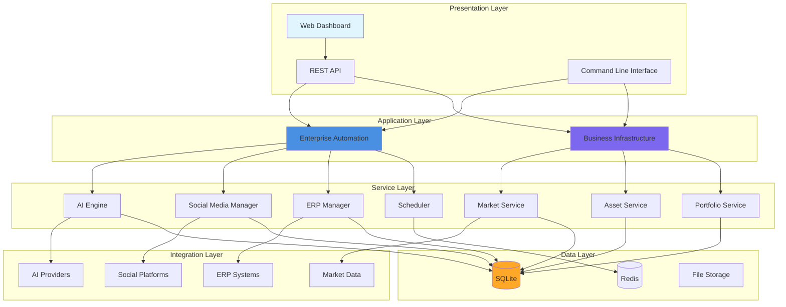

### Architecture Principles

1. **Separation of Concerns** - Clear boundaries between layers
2. **Dependency Injection** - Loose coupling between components
3. **Repository Pattern** - Abstract data access
4. **Service Layer** - Business logic encapsulation
5. **Event-Driven** - Async operations where appropriate
6. **Scalability** - Horizontal scaling capability

---

## Component Architecture

### Enterprise Automation System

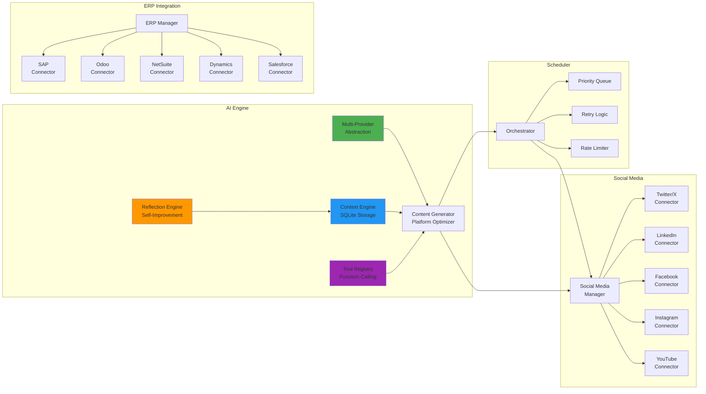

### Business Infrastructure System

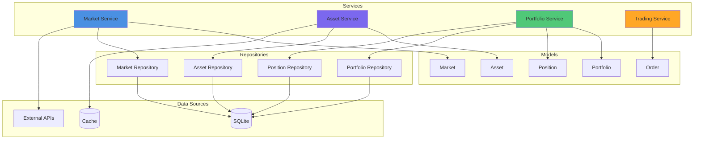

---

## Data Flow

### AI Content Generation Flow

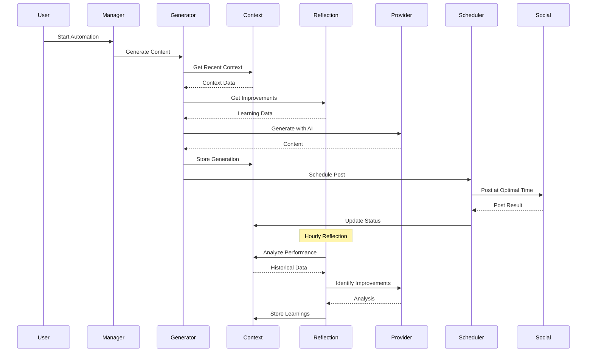

### ERP Synchronization Flow

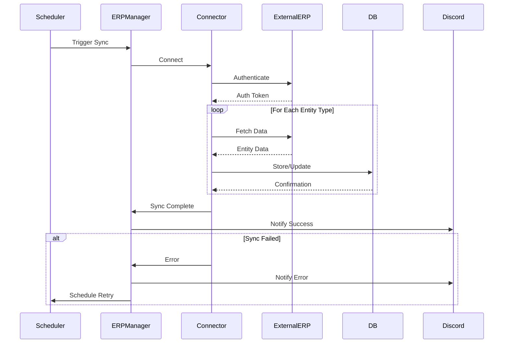

### Portfolio Management Flow

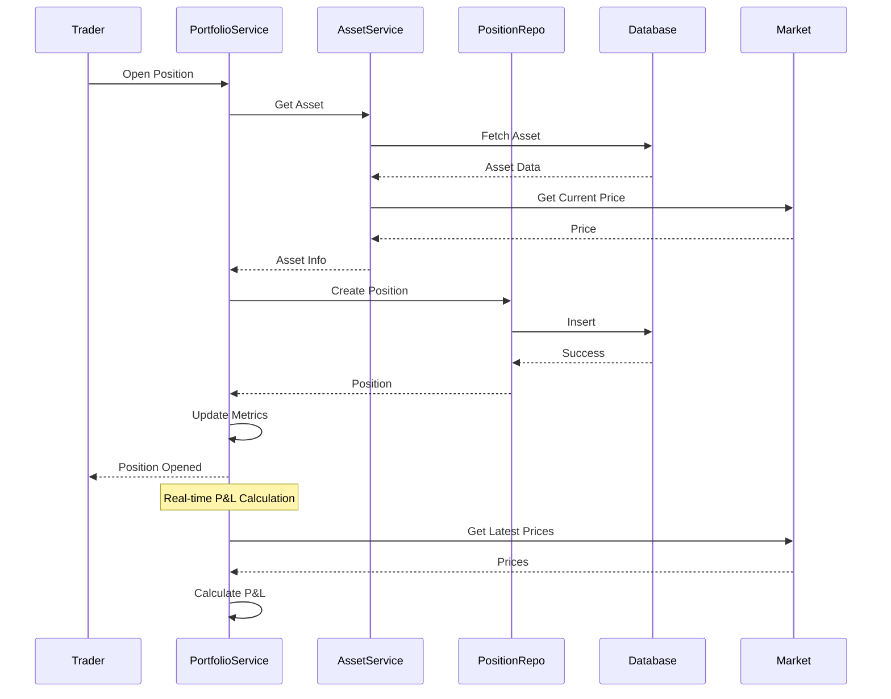

---

## Integration Architecture

### External System Integration

```mermaid
graph TB
    subgraph "Internal Systems"
        AI[AI Engine]
        SM[Social Media]
        ERP[ERP Manager]
        MKT[Market Service]
    end
    
    subgraph "AI Providers"
        OAI[OpenAI<br/>GPT-4]
        ANT[Anthropic<br/>Claude]
        COH[Cohere]
        LOC[Local Models<br/>Llama/Mistral]
    end
    
    subgraph "Social Platforms"
        TW[Twitter/X API]
        LI[LinkedIn API]
        FB[Facebook Graph]
        IG[Instagram Graph]
        YT[YouTube Data]
    end
    
    subgraph "ERP Systems"
        SAP[SAP OData]
        ODO[Odoo XML-RPC]
        NET[NetSuite REST]
        DYN[Dynamics Web API]
        SF[Salesforce REST]
    end
    
    subgraph "Market Data"
        YAHOO[Yahoo Finance]
        ALPHA[Alpha Vantage]
        POLY[Polygon.io]
    end
    
    AI -->|HTTPS/REST| OAI
    AI -->|HTTPS/REST| ANT
    AI -->|HTTPS/REST| COH
    AI -->|Local| LOC
    
    SM -->|OAuth 2.0| TW
    SM -->|OAuth 2.0| LI
    SM -->|OAuth 2.0| FB
    SM -->|OAuth 2.0| IG
    SM -->|OAuth 2.0| YT
    
    ERP -->|Basic Auth| SAP
    ERP -->|XML-RPC| ODO
    ERP -->|OAuth| NET
    ERP -->|OAuth| DYN
    ERP -->|OAuth| SF
    
    MKT -->|REST| YAHOO
    MKT -->|REST| ALPHA
    MKT -->|REST| POLY
    
    style OAI fill:#10a37f
    style ANT fill:#c27852
    style COH fill:#00b8d4
```

### Authentication Flow

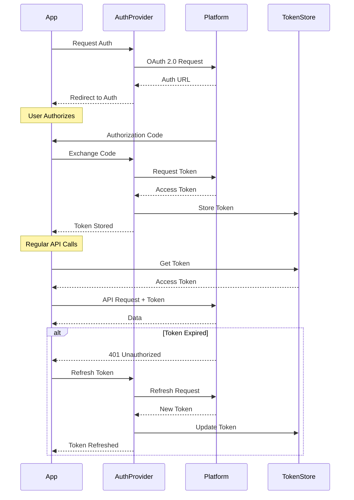

---

## Deployment Architecture

### Production Deployment

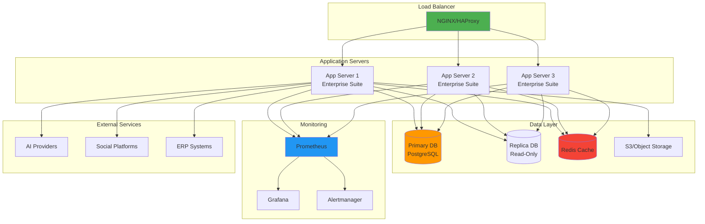

### VM Infrastructure

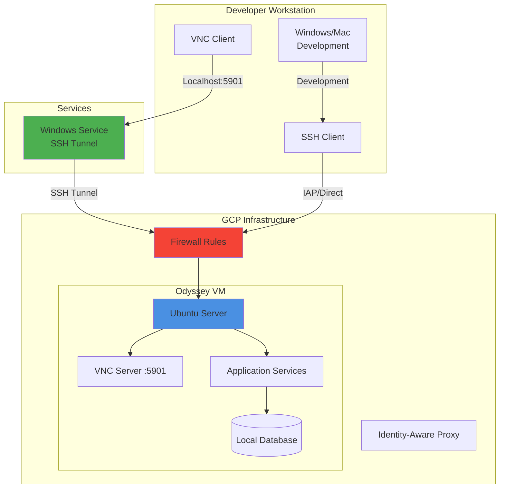

---

## Security Architecture

### Security Layers

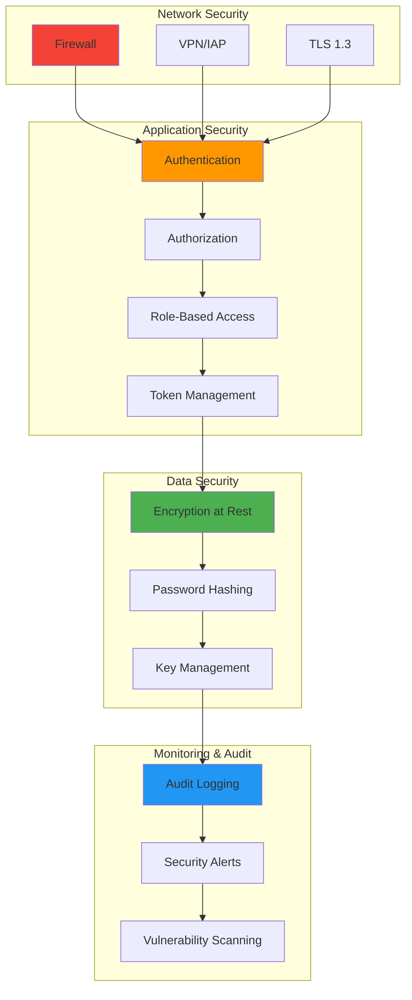

### Data Encryption Flow

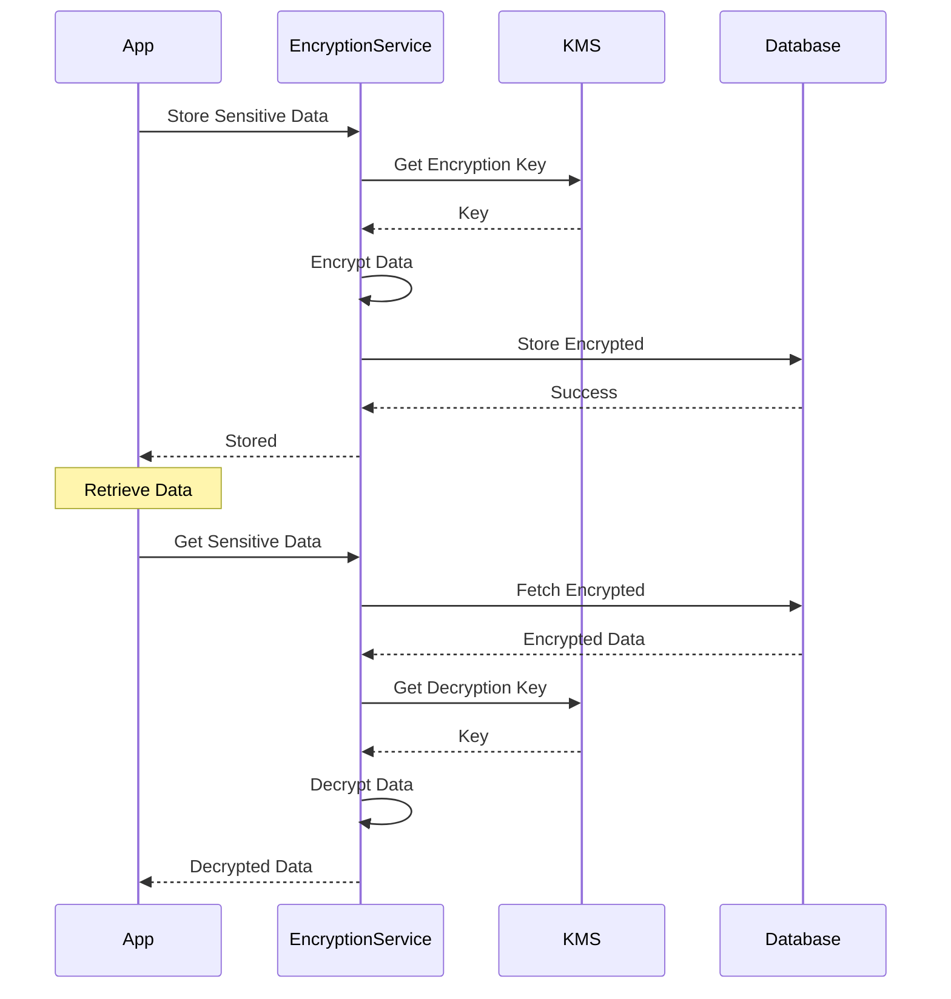

---

## Performance Optimization

### Caching Strategy

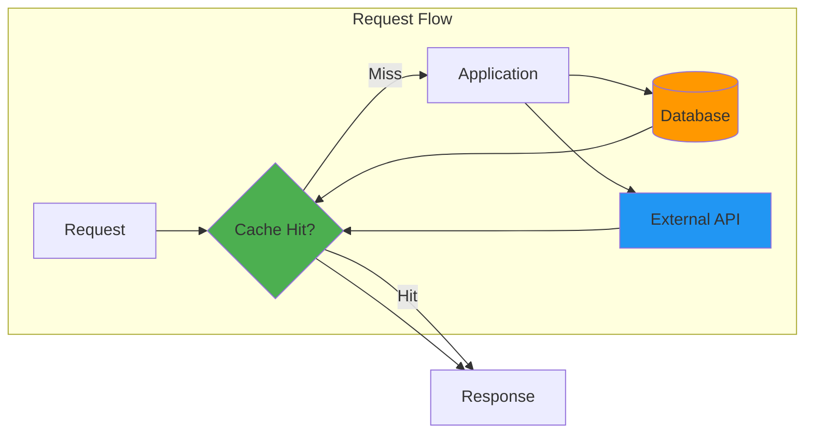

---

## Scalability Architecture

### Horizontal Scaling

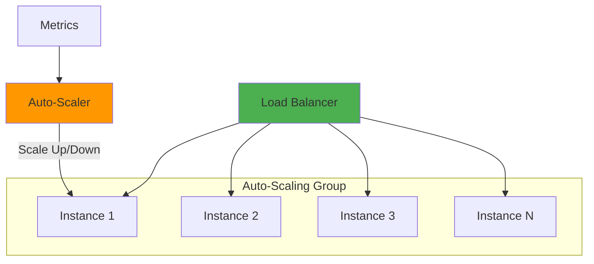

---

**Document Version:** 1.0.0  
**Last Updated:** January 2026  
**Maintained By:** Gold Standard Enterprise Solutions
