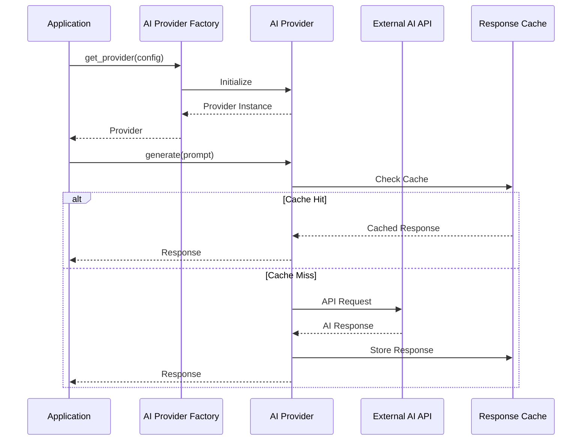
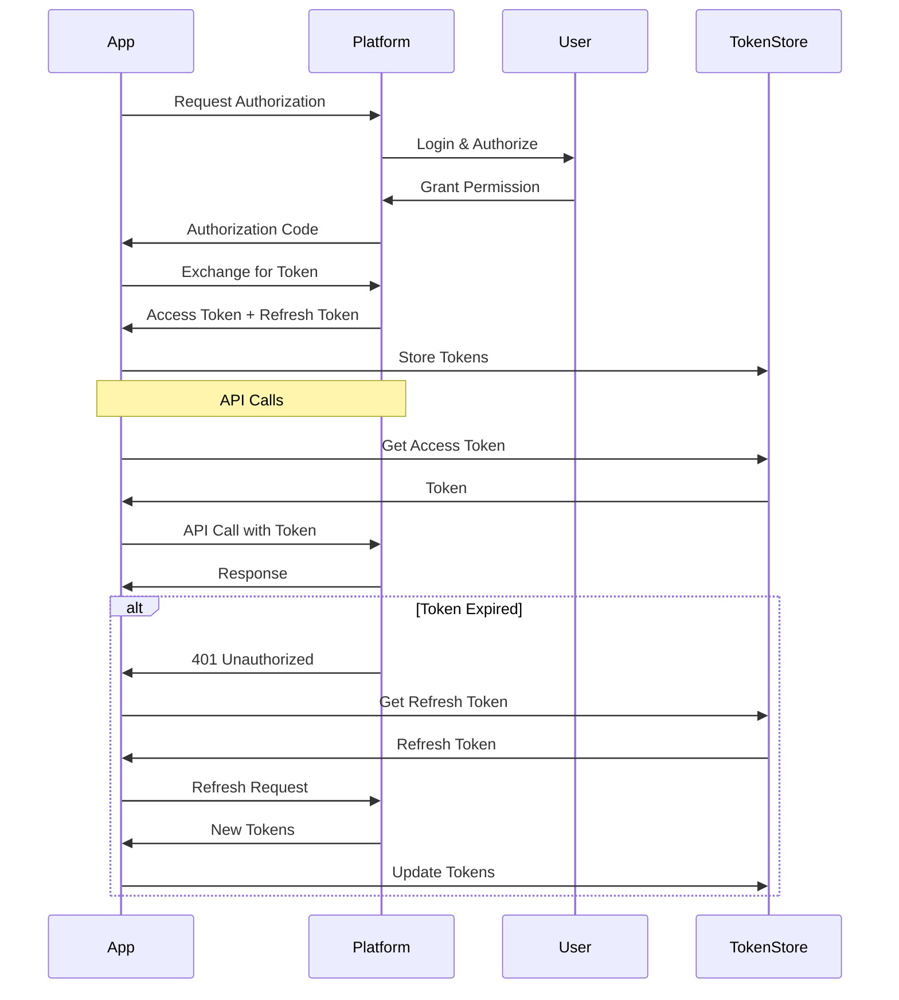
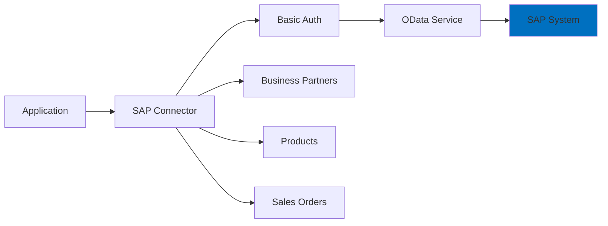
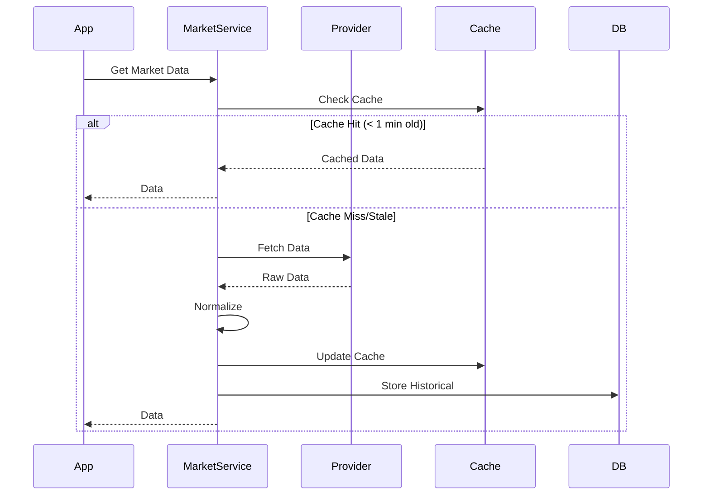

# Integration Guide

**Gold Standard Enterprise Suite v1.0.0**

---

## Table of Contents

1. [AI Provider Integration](#ai-provider-integration)
2. [Social Media Integration](#social-media-integration)
3. [ERP System Integration](#erp-system-integration)
4. [Market Data Integration](#market-data-integration)
5. [Custom Integrations](#custom-integrations)

---

## AI Provider Integration

### Integration Flow



### OpenAI Integration

**Configuration:**
```python
AI_PROVIDER=openai
AI_MODEL=gpt-4
AI_API_KEY=sk-...
AI_TEMPERATURE=0.7
AI_MAX_TOKENS=2000
```

**Usage:**
```python
from automata.ai_engine import get_provider

config = {
    'provider': 'openai',
    'api_key': os.getenv('AI_API_KEY'),
    'model': 'gpt-4',
    'temperature': 0.7
}

provider = get_provider(config)
result = await provider.generate(
    prompt="Generate a professional LinkedIn post",
    system_message="You are a business content expert"
)
```

### Anthropic (Claude) Integration

**Configuration:**
```python
AI_PROVIDER=anthropic
AI_MODEL=claude-3-opus-20240229
ANTHROPIC_API_KEY=sk-ant-...
```

**Usage:**
```python
config = {
    'provider': 'anthropic',
    'api_key': os.getenv('ANTHROPIC_API_KEY'),
    'model': 'claude-3-opus-20240229'
}

provider = get_provider(config)
result = await provider.generate(
    prompt="Analyze this market data",
    system_message="You are a financial analyst"
)
```

### Cohere Integration

**Configuration:**
```python
AI_PROVIDER=cohere
AI_MODEL=command
COHERE_API_KEY=...
```

**Usage:**
```python
config = {
    'provider': 'cohere',
    'api_key': os.getenv('COHERE_API_KEY'),
    'model': 'command'
}

provider = get_provider(config)
result = await provider.generate(prompt="Content here")
```

### Local Model Integration

**Configuration:**
```python
AI_PROVIDER=local
LOCAL_MODEL_PATH=/path/to/model
LOCAL_MODEL_TYPE=llama
```

**Supported Models:**
- Llama 2
- Mistral
- CodeLlama
- Any GGUF format model

---

## Social Media Integration

### OAuth 2.0 Flow



### Twitter/X Integration

**Setup:**
1. Create app at https://developer.twitter.com
2. Get API keys and OAuth credentials
3. Configure callback URL

**Configuration:**
```bash
TWITTER_ENABLED=true
TWITTER_API_KEY=...
TWITTER_API_SECRET=...
TWITTER_ACCESS_TOKEN=...
TWITTER_ACCESS_TOKEN_SECRET=...
TWITTER_BEARER_TOKEN=...
```

**Usage:**
```python
from automata.social_media import SocialMediaManager

config = {
    'Twitter/X': {
        'enabled': True,
        'api_key': os.getenv('TWITTER_API_KEY'),
        'api_secret': os.getenv('TWITTER_API_SECRET'),
        'access_token': os.getenv('TWITTER_ACCESS_TOKEN'),
        'access_token_secret': os.getenv('TWITTER_ACCESS_TOKEN_SECRET')
    }
}

manager = SocialMediaManager(config)
result = await manager.post_content(
    platform='Twitter/X',
    content={'text': 'Hello World! #automation'},
    media_urls=None
)
```

### LinkedIn Integration

**Setup:**
1. Create LinkedIn app
2. Request appropriate scopes: w_member_social, r_basicprofile
3. Obtain OAuth 2.0 credentials

**Configuration:**
```bash
LINKEDIN_ENABLED=true
LINKEDIN_CLIENT_ID=...
LINKEDIN_CLIENT_SECRET=...
LINKEDIN_ACCESS_TOKEN=...
LINKEDIN_ORGANIZATION_ID=...  # For company page posting
```

**Posting to Company Page:**
```python
result = await connector.post_content(
    content="Professional content here",
    media_urls=['https://example.com/image.jpg'],
    post_to_company=True,
    article_title="Optional article title"
)
```

### Facebook Integration

**Setup:**
1. Create Facebook App
2. Get Page Access Token
3. Configure permissions: pages_manage_posts, pages_read_engagement

**Configuration:**
```bash
FACEBOOK_ENABLED=true
FACEBOOK_PAGE_ID=...
FACEBOOK_ACCESS_TOKEN=...
FACEBOOK_APP_ID=...
FACEBOOK_APP_SECRET=...
```

### Instagram Integration

**Setup:**
1. Connect Instagram Business Account to Facebook Page
2. Get Page Access Token with instagram_basic, instagram_content_publish
3. Get Instagram Business Account ID

**Configuration:**
```bash
INSTAGRAM_ENABLED=true
INSTAGRAM_ACCOUNT_ID=...
INSTAGRAM_ACCESS_TOKEN=...
```

**Post with Image:**
```python
result = await connector.post_content(
    content="Caption with #hashtags",
    media_urls=['https://example.com/photo.jpg'],
    is_reel=False  # Set to True for Reels
)
```

### YouTube Integration

**Setup:**
1. Create Google Cloud Project
2. Enable YouTube Data API v3
3. Create OAuth 2.0 credentials
4. Get refresh token

**Configuration:**
```bash
YOUTUBE_ENABLED=true
YOUTUBE_CLIENT_ID=...
YOUTUBE_CLIENT_SECRET=...
YOUTUBE_REFRESH_TOKEN=...
YOUTUBE_CHANNEL_ID=...
```

---

## ERP System Integration

### SAP Integration (OData API)

**Integration Architecture:**


**Configuration:**
```bash
SAP_ENABLED=true
SAP_API_URL=https://your-sap.com:port
SAP_CLIENT=100
SAP_USERNAME=...
SAP_PASSWORD=...
SAP_SYNC_INTERVAL=3600
```

**Sync Operations:**
```python
from automata.erp_integrations import ERPManager

manager = ERPManager(config)

# Sync customers
result = await manager.sync_entity(
    system='SAP',
    entity_type='customers'
)

# Sync products
result = await manager.sync_entity(
    system='SAP',
    entity_type='products'
)
```

### Odoo Integration (XML-RPC)

**Configuration:**
```bash
ODOO_ENABLED=true
ODOO_URL=https://your-odoo.com
ODOO_DATABASE=your_database
ODOO_USERNAME=...
ODOO_PASSWORD=...
```

**Custom Model Access:**
```python
connector = OdooConnector(config)
await connector.connect()

# Access custom model
import xmlrpc.client
models = xmlrpc.client.ServerProxy(f'{connector.url}/xmlrpc/2/object')

records = models.execute_kw(
    connector.database,
    connector.uid,
    connector.password,
    'custom.model',  # Your custom model
    'search_read',
    [[]],
    {'fields': ['name', 'field1'], 'limit': 100}
)
```

### NetSuite Integration

**Configuration:**
```bash
NETSUITE_ENABLED=true
NETSUITE_ACCOUNT_ID=...
NETSUITE_CONSUMER_KEY=...
NETSUITE_CONSUMER_SECRET=...
NETSUITE_TOKEN_ID=...
NETSUITE_TOKEN_SECRET=...
```

**OAuth 1.0a Signature:**
```python
import oauth2 as oauth
import time
import urllib.parse

def create_oauth_signature(url, method='GET'):
    consumer = oauth.Consumer(
        key=CONSUMER_KEY,
        secret=CONSUMER_SECRET
    )
    token = oauth.Token(
        key=TOKEN_ID,
        secret=TOKEN_SECRET
    )
    
    params = {
        'oauth_nonce': str(int(time.time())),
        'oauth_timestamp': str(int(time.time())),
        'oauth_version': '1.0',
        'oauth_signature_method': 'HMAC-SHA256'
    }
    
    req = oauth.Request(
        method=method,
        url=url,
        parameters=params
    )
    
    signature = oauth.SignatureMethod_HMAC_SHA256().sign(
        req, consumer, token
    )
    
    req['oauth_signature'] = signature
    return req.to_header()
```

### Microsoft Dynamics 365 Integration

**Configuration:**
```bash
DYNAMICS_ENABLED=true
DYNAMICS_URL=https://org.crm.dynamics.com
DYNAMICS_CLIENT_ID=...
DYNAMICS_CLIENT_SECRET=...
DYNAMICS_TENANT_ID=...
```

**Azure AD Authentication:**
```python
import msal

app = msal.ConfidentialClientApplication(
    client_id=CLIENT_ID,
    client_credential=CLIENT_SECRET,
    authority=f"https://login.microsoftonline.com/{TENANT_ID}"
)

result = app.acquire_token_for_client(
    scopes=[f"{DYNAMICS_URL}/.default"]
)

access_token = result['access_token']
```

### Salesforce Integration

**Configuration:**
```bash
SALESFORCE_ENABLED=true
SALESFORCE_USERNAME=...
SALESFORCE_PASSWORD=...
SALESFORCE_SECURITY_TOKEN=...
SALESFORCE_CONSUMER_KEY=...
SALESFORCE_CONSUMER_SECRET=...
```

**SOQL Queries:**
```python
# Query accounts
query = "SELECT Id, Name, Industry FROM Account WHERE Industry = 'Technology'"
result = sf_connector.query(query)

# Query with relationships
query = """
SELECT Id, Name, 
    (SELECT Id, Name FROM Contacts)
FROM Account
WHERE CreatedDate = THIS_MONTH
"""
```

---

## Market Data Integration

### Data Provider Integration Flow



### Yahoo Finance Integration

**Usage:**
```python
from infra import MarketService

market_service = MarketService()

# Get quote
quote = market_service.get_quote('AAPL')

# Get historical data
historical = market_service.get_historical(
    symbol='AAPL',
    start_date='2024-01-01',
    end_date='2024-12-31',
    interval='1d'
)
```

---

## Custom Integrations

### Creating a Custom AI Provider

```python
from automata.ai_engine.providers import AIProvider

class CustomAIProvider(AIProvider):
    """Custom AI provider implementation."""
    
    def __init__(self, config: Dict[str, Any]):
        super().__init__(config)
        self.api_key = config.get('api_key')
        self.base_url = config.get('base_url')
    
    async def generate(
        self,
        prompt: str,
        system_message: Optional[str] = None,
        **kwargs
    ) -> Dict[str, Any]:
        """Generate content using custom API."""
        
        async with aiohttp.ClientSession() as session:
            async with session.post(
                f"{self.base_url}/generate",
                json={
                    'prompt': prompt,
                    'system': system_message,
                    **kwargs
                },
                headers={'Authorization': f'Bearer {self.api_key}'}
            ) as response:
                data = await response.json()
                
                return {
                    'content': data['text'],
                    'model': data.get('model'),
                    'usage': data.get('usage', {})
                }
```

### Creating a Custom Social Media Connector

```python
from automata.social_media.base_platform import SocialPlatform

class CustomPlatformConnector(SocialPlatform):
    """Custom social media platform connector."""
    
    def __init__(self, config: Dict[str, Any]):
        super().__init__(config)
        self.api_key = config.get('api_key')
        self.authenticated = False
    
    async def authenticate(self) -> bool:
        """Authenticate with platform."""
        # Implement authentication
        self.authenticated = True
        return True
    
    async def post_content(
        self,
        content: str,
        media_urls: Optional[List[str]] = None,
        **kwargs
    ) -> Dict[str, Any]:
        """Post content to platform."""
        
        if not self.authenticated:
            await self.authenticate()
        
        # Implement posting logic
        async with aiohttp.ClientSession() as session:
            async with session.post(
                f"{self.api_base}/posts",
                json={'content': content, 'media': media_urls},
                headers={'Authorization': f'Bearer {self.api_key}'}
            ) as response:
                result = await response.json()
                
                return {
                    'id': result['id'],
                    'url': result['url'],
                    'platform': 'CustomPlatform',
                    'timestamp': datetime.now(timezone.utc).isoformat()
                }
```

---

**Document Version:** 1.0.0  
**Last Updated:** January 2026  
**Maintained By:** Gold Standard Enterprise Solutions
