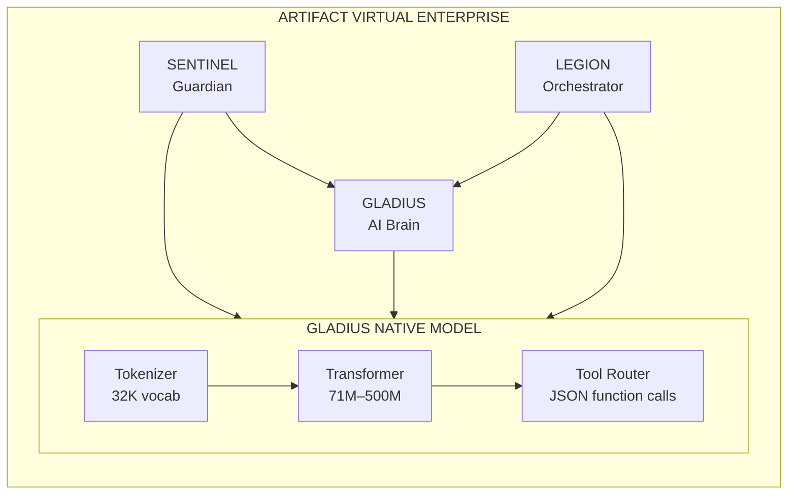

# GLADIUS Native Model Blueprint

> Technical specification for building and deploying GLADIUS native models.

## System Architecture



## Build Pipeline

### Phase 1: Data Preparation

```bash
# Data location
GLADIUS/training/data/gladius_1b_training.jsonl

# Format
{"text": "<|im_start|>system\n...<|im_end|>\n<|im_start|>user\n...<|im_end|>\n<|im_start|>assistant\n...<|im_end|>"}
```

### Phase 2: Training

```bash
# Activate environment
source GLADIUS/training_venv/bin/activate

# Train 71M model (default)
python3 GLADIUS/training/gladius_native_trainer.py \
    --params 150 \
    --epochs 3 \
    --batch-size 4 \
    --max-length 256

# Train larger model (GPU recommended)
python3 GLADIUS/training/gladius_native_trainer.py \
    --params 500 \
    --epochs 5 \
    --batch-size 32 \
    --max-length 512
```

### Phase 3: Export to GGUF

```bash
# Export to GGUF format
python3 GLADIUS/training/gladius_native_trainer.py --export-gguf

# Or manual export
python3 << 'EOF'
from gladius_native_trainer import NativeTrainer
trainer = NativeTrainer(target_params_m=150)
trainer.load_checkpoint()
trainer.export_gguf()
EOF
```

### Phase 4: Deploy to Ollama

```bash
# Create Modelfile
cat > GLADIUS/models/native/Modelfile << 'EOF'
# GLADIUS Native Model
FROM ./gladius1.1-71M.gguf

PARAMETER temperature 0.1
PARAMETER top_p 0.9
PARAMETER stop "<|im_end|>"
PARAMETER num_ctx 2048

SYSTEM """
You are GLADIUS, the native AI for Artifact Virtual Enterprise.
Respond with JSON tool calls: {"tool": "name", "args": {...}}
"""

TEMPLATE """
{{ if .System }}<|im_start|>system
{{ .System }}<|im_end|>
{{ end }}<|im_start|>user
{{ .Prompt }}<|im_end|>
<|im_start|>assistant
{{ .Response }}<|im_end|>
"""
EOF

# Create Ollama model
ollama create gladius1.1:71M -f GLADIUS/models/native/Modelfile

# Test
ollama run gladius1.1:71M "What tools do you have?"
```

## Component Specifications

### Transformer Block

```
Input (batch, seq_len, hidden_size)
    │
    ▼
┌───────────────────────────────────────┐
│           RMSNorm                      │
└───────────────────────────────────────┘
    │
    ▼
┌───────────────────────────────────────┐
│      Grouped Query Attention          │
│  ┌─────────┬─────────┬─────────┐     │
│  │ Q proj  │ K proj  │ V proj  │     │
│  │ (h×d)   │(kv×d)   │(kv×d)   │     │
│  └────┬────┴────┬────┴────┬────┘     │
│       │         │         │          │
│       ▼         ▼         ▼          │
│  ┌─────────────────────────────┐     │
│  │  RoPE (Q, K only)           │     │
│  └─────────────────────────────┘     │
│       │                              │
│       ▼                              │
│  ┌─────────────────────────────┐     │
│  │  Scaled Dot-Product Attn    │     │
│  │  softmax(QK^T/√d) × V       │     │
│  └─────────────────────────────┘     │
│       │                              │
│       ▼                              │
│  ┌─────────────────────────────┐     │
│  │  Output Projection (h×d → h)│     │
│  └─────────────────────────────┘     │
└───────────────────────────────────────┘
    │
    ▼
┌───────────────────────────────────────┐
│         Residual Connection           │
└───────────────────────────────────────┘
    │
    ▼
┌───────────────────────────────────────┐
│           RMSNorm                      │
└───────────────────────────────────────┘
    │
    ▼
┌───────────────────────────────────────┐
│           SwiGLU MLP                   │
│  ┌─────────────────────────────┐     │
│  │ gate = silu(gate_proj(x))   │     │
│  │ up = up_proj(x)             │     │
│  │ out = down_proj(gate * up)  │     │
│  └─────────────────────────────┘     │
└───────────────────────────────────────┘
    │
    ▼
┌───────────────────────────────────────┐
│         Residual Connection           │
└───────────────────────────────────────┘
    │
    ▼
Output (batch, seq_len, hidden_size)
```

### Memory Layout (71M variant)

```
Component                    Parameters      Memory (F16)
─────────────────────────────────────────────────────────
Embeddings                   16,384,000      32 MB
  └─ embed_tokens            32000 × 512

Layer 0-11 (×12)             4,587,520/ea    110 MB total
  ├─ input_layernorm         512
  ├─ q_proj                  262,144
  ├─ k_proj                  131,072
  ├─ v_proj                  131,072
  ├─ o_proj                  262,144
  ├─ post_attn_layernorm     512
  ├─ gate_proj               720,896
  ├─ up_proj                 720,896
  └─ down_proj               720,896

Final Norm                   512             1 KB
LM Head                      16,384,000      32 MB
─────────────────────────────────────────────────────────
TOTAL                        ~71M            ~140 MB
```

## Integration Points

### GLADIUS Interactive Mode

```python
# GLADIUS/interactive.py integration
from gladius_native_trainer import GladiusModel, SimpleTokenizer

class NativeGladiusProvider:
    def __init__(self, model_path):
        self.model = GladiusModel.from_pretrained(model_path)
        self.tokenizer = SimpleTokenizer.load(model_path / "tokenizer.json")
    
    def generate(self, prompt, max_tokens=100):
        input_ids = self.tokenizer.encode(prompt)
        output_ids = self.model.generate(input_ids, max_tokens)
        return self.tokenizer.decode(output_ids)
```

### SENTINEL Learning Daemon

```python
# SENTINEL uses GLADIUS for text analysis
from GLADIUS.models.native import load_native_model

model = load_native_model("gladius1.1:71M")
analysis = model.analyze("Extract keywords from: {text}")
```

### BUILD_CLASS Integration

```python
# build_class/adapter.py
NATIVE_MODEL_PATH = Path(__file__).parent.parent / "GLADIUS/models/native"

def get_native_model():
    return GladiusModel.from_pretrained(NATIVE_MODEL_PATH / "gladius_native_final")
```

## Deployment Targets

### Local (CPU)

```bash
# Direct inference
python3 -c "
from GLADIUS.models.native import inference
print(inference('Hello GLADIUS'))
"

# Via Ollama
ollama run gladius1.1:71M
```

### Server (GPU)

```bash
# llama.cpp server
./server -m gladius1.1-71M.gguf -c 2048 --host 0.0.0.0 --port 8080

# vLLM (if supported)
python -m vllm.entrypoints.openai.api_server \
    --model ./gladius1.1-71M.gguf \
    --port 8000
```

### Edge (Quantized)

```bash
# Quantize to Q4_K_M
./quantize gladius1.1-71M.gguf gladius1.1-71M-Q4_K_M.gguf Q4_K_M

# Deploy on edge device
./main -m gladius1.1-71M-Q4_K_M.gguf -p "query" -n 50
```

## Testing Checklist

- [ ] Model loads without errors
- [ ] Tokenizer encodes/decodes correctly
- [ ] Generation produces coherent output
- [ ] Tool-calling format is correct
- [ ] GGUF exports successfully
- [ ] Ollama model creation works
- [ ] Inference speed acceptable
- [ ] Memory usage within limits

## Performance Benchmarks

| Metric | 24M | 71M | 150M | 500M |
|--------|-----|-----|------|------|
| Tokens/sec (CPU) | 50 | 20 | 8 | 2 |
| Tokens/sec (GPU) | 500 | 200 | 100 | 40 |
| First token (CPU) | 0.5s | 1.5s | 4s | 15s |
| First token (GPU) | 0.1s | 0.2s | 0.5s | 1s |
| Tool-call accuracy | 60% | 75% | 85% | 92% |

## Troubleshooting

### Out of Memory
```bash
# Reduce batch size
--batch-size 1

# Reduce sequence length
--max-length 128

# Use smaller model
--params 50
```

### Slow Training
```bash
# Enable GPU if available
export CUDA_VISIBLE_DEVICES=0

# Use mixed precision
--mixed-precision

# Increase batch size (GPU)
--batch-size 32
```

### Poor Generation Quality
```bash
# Train more epochs
--epochs 10

# Add more training data
# Check data quality
# Verify tokenizer coverage
```

---

**Document Version**: 1.1  
**Last Updated**: 2026-01-31  
**Author**: Artifact Virtual Engineering
