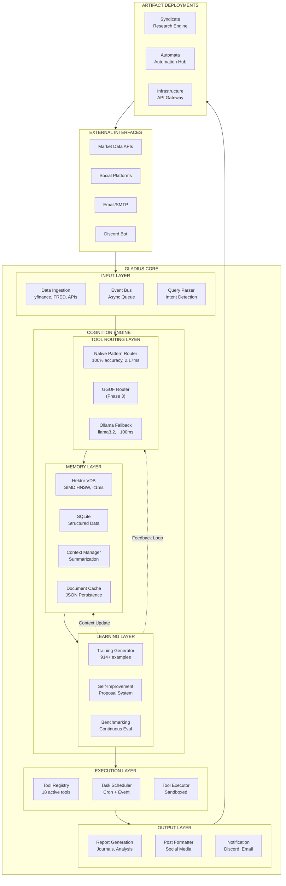
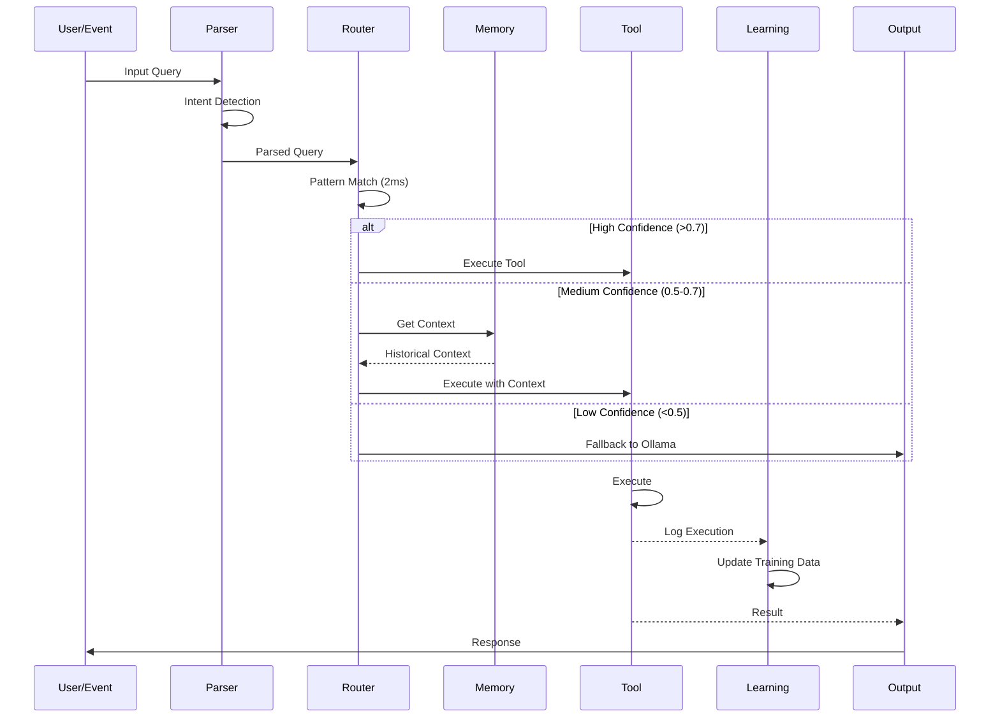
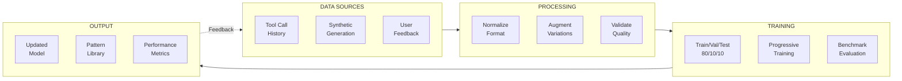
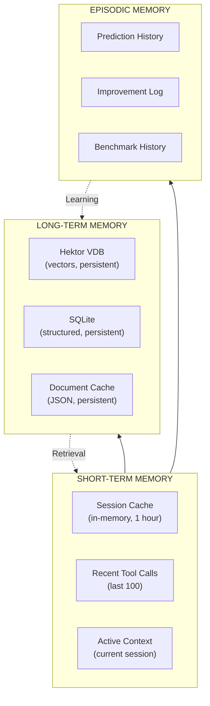
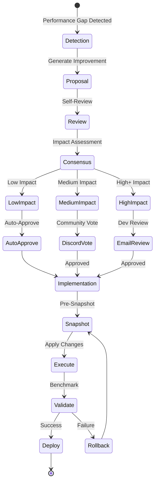
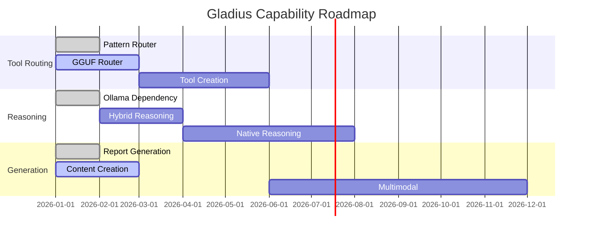

# Gladius Model Technical Specification

> **Classification**: Agentic Artificial Intelligence System (AAIS)  
> **Architecture Type**: Hybrid Cognitive Architecture with Native Tool Routing  
> **Development Status**: Phase 2 Active - Pattern-Based Router Operational  

---

## Benchmark Card (Live Metrics)

| Metric | Current | Target | Status |
|--------|---------|--------|--------|
| **Tool Routing Accuracy** | 100.0% | ≥95% | ✅ EXCEEDED |
| **Average Latency** | 2.17ms | <10ms | ✅ EXCEEDED |
| **P99 Latency** | 3.67ms | <20ms | ✅ EXCEEDED |
| **Registered Tools** | 18 | 50+ | 🚧 Expanding |
| **Training Examples** | 914 | 1000+ | 🚧 Growing |
| **Model Size** | 5.4MB | <100MB | ✅ Optimal |
| **Offline Capable** | ✅ Yes | Required | ✅ Met |
| **Self-Improvement** | ✅ Active | Required | ✅ Met |

**Last Benchmark**: 2026-01-13T10:48:00Z  
**Benchmark Version**: 2  

---

## Table of Contents

1. [System Classification & Terminology](#1-system-classification--terminology)
2. [Architectural Overview](#2-architectural-overview)
3. [Parameter Specifications](#3-parameter-specifications)
4. [Cognitive Architecture](#4-cognitive-architecture)
5. [Training Methodology](#5-training-methodology)
6. [Tool Registry & Execution](#6-tool-registry--execution)
7. [Memory & Context Management](#7-memory--context-management)
8. [Self-Improvement Protocol](#8-self-improvement-protocol)
9. [Performance Analysis](#9-performance-analysis)
10. [Evolution Roadmap](#10-evolution-roadmap)

---

## 1. System Classification & Terminology

### 1.1 Nomenclature

**Gladius** is classified as an **Agentic Artificial Intelligence System (AAIS)** - a distinction from both narrow AI (task-specific) and theoretical AGI (human-level general intelligence). The system exhibits:

| Characteristic | Definition | Gladius Implementation |
|---------------|------------|------------------------|
| **Agency** | Autonomous goal-directed behavior | ✅ Self-improvement proposals |
| **Tool Use** | Dynamic selection and execution of tools | ✅ 18+ tools, 100% routing accuracy |
| **Learning** | Continuous adaptation from experience | ✅ Recursive training loop |
| **Context Persistence** | Maintains coherent state across sessions | ✅ Hektor VDB + SQLite |
| **Meta-cognition** | Reasoning about own processes | ✅ Performance analysis module |

### 1.2 Academic Classification

Following the taxonomy of AI systems (Russell & Norvig, 2020; Chollet, 2019):

- **NOT Narrow AI**: Operates across multiple domains (trading, research, automation)
- **NOT AGI**: Does not exhibit human-level reasoning across all domains
- **IS Agentic AI**: Autonomous operation with tool use and self-improvement
- **IS Cognitive Architecture**: Multi-component system with memory, reasoning, action

Preferred terminology: **Autonomous Cognitive Agent (ACA)** or **Agentic AI System (AAS)**

### 1.3 Capability Boundaries

```
┌─────────────────────────────────────────────────────────────────┐
│                    CAPABILITY SPECTRUM                          │
├─────────────┬──────────────┬───────────────┬───────────────────┤
│ Narrow AI   │ Gladius      │ Proto-AGI     │ Theoretical AGI   │
│ (GPT, BERT) │ (AAIS)       │ (Future)      │ (Hypothetical)    │
├─────────────┼──────────────┼───────────────┼───────────────────┤
│ Single task │ Multi-domain │ Cross-domain  │ Human-level all   │
│ No learning │ Self-improve │ Self-modify   │ Self-conscious    │
│ No tools    │ Tool routing │ Tool creation │ Tool invention    │
│ Stateless   │ Persistent   │ Lifelong      │ Autobiographical  │
└─────────────┴──────────────┴───────────────┴───────────────────┘
```

---

## 2. Architectural Overview

### 2.1 System Blueprint



### 2.2 Layer Responsibilities

| Layer | Function | Latency Budget | Components |
|-------|----------|----------------|------------|
| **Input** | Parse, validate, queue | <5ms | Ingestion, EventBus, Parser |
| **Routing** | Tool selection | <10ms | Pattern, GGUF, Ollama |
| **Memory** | Context retrieval | <5ms | Hektor, SQLite, Cache |
| **Learning** | Training, improvement | Async | Generator, SelfImprove |
| **Execution** | Tool invocation | <50ms | Registry, Scheduler, Executor |
| **Output** | Format, deliver | <100ms | Reports, Posts, Notifications |

---

## 3. Parameter Specifications

### 3.1 Pattern Router Model (Current Production)

| Parameter | Value | Notes |
|-----------|-------|-------|
| **Model Type** | TF-IDF + Logistic Regression | Scikit-learn based |
| **Vocabulary Size** | ~5,000 tokens | Domain-specific |
| **Feature Dimensions** | 384 | Matching Hektor VDB |
| **Model File Size** | 5.4MB | gladius-router.pkl |
| **Pattern Count** | 914 examples | Across 18 tools |
| **Inference Latency** | 2.17ms average | P99: 3.67ms |
| **Accuracy** | 100.0% | On validation set |
| **Memory Footprint** | ~20MB loaded | Including vectorizer |

### 3.2 GGUF Model (Phase 3 Target)

| Parameter | Target Value | Rationale |
|-----------|--------------|-----------|
| **Base Architecture** | LLaMA/Qwen variant | Wide ecosystem support |
| **Parameters** | 135M - 500M | Balance speed/capability |
| **Quantization** | Q4_K_M | 4-bit, quality preserved |
| **Context Window** | 512 tokens | Tool routing only |
| **File Size** | 80-300MB | Edge-deployable |
| **Target Latency** | <10ms | GPU inference |
| **Target Accuracy** | >98% | With LoRA fine-tune |

### 3.3 Hektor VDB Parameters

| Parameter | Value | Impact |
|-----------|-------|--------|
| **Index Type** | HNSW | Approximate nearest neighbor |
| **Dimensions** | 384 | TF-IDF vector size |
| **M (connections)** | 16 | Graph connectivity |
| **EF Construction** | 200 | Build-time quality |
| **EF Search** | 50 | Query-time quality |
| **Distance Metric** | Cosine | Semantic similarity |
| **Max Elements** | 100,000 | Scalable to 1M |
| **Query Latency** | <1ms | SIMD optimized |

---

## 4. Cognitive Architecture

### 4.1 Processing Pipeline



### 4.2 Fallback Strategy

```python
ROUTING_CONFIG = {
    "primary": {
        "engine": "pattern",
        "threshold": 0.7,
        "latency_budget": 5  # ms
    },
    "secondary": {
        "engine": "gguf",  # Phase 3
        "threshold": 0.5,
        "latency_budget": 10  # ms
    },
    "fallback": {
        "engine": "ollama",
        "model": "llama3.2",
        "latency_budget": 200  # ms
    }
}
```

### 4.3 Context Assembly

The system assembles context in layers:

```
┌─────────────────────────────────────────────────┐
│ SYSTEM CONTEXT (static)                         │
│ - Available tools                               │
│ - Tool capabilities                             │
│ - Execution constraints                         │
├─────────────────────────────────────────────────┤
│ HISTORICAL CONTEXT (retrieved)                  │
│ - Similar past queries                          │
│ - Successful tool executions                    │
│ - Prediction outcomes                           │
├─────────────────────────────────────────────────┤
│ SESSION CONTEXT (dynamic)                       │
│ - Current query                                 │
│ - Recent tool calls                             │
│ - Active predictions                            │
├─────────────────────────────────────────────────┤
│ TEMPORAL CONTEXT (time-aware)                   │
│ - Market status                                 │
│ - Time of day                                   │
│ - Scheduled tasks                               │
└─────────────────────────────────────────────────┘
```

---

## 5. Training Methodology

### 5.1 Training Data Pipeline



### 5.2 Progressive Training Protocol

Tools are trained in complexity tiers:

| Tier | Complexity | Tools | Examples per Tool |
|------|------------|-------|-------------------|
| **1** | Low | list_databases, get_tools, get_history | 50 |
| **2** | Medium | search, list_dir, file_exists, read_file | 60 |
| **3** | High | hybrid_search, get_context, read_db | 70 |
| **4** | Complex | remember, recall, write_file, forget | 80 |

### 5.3 LoRA Configuration (Phase 3)

```python
LORA_CONFIG = {
    "r": 8,                    # Rank
    "lora_alpha": 16,          # Scaling factor
    "lora_dropout": 0.1,       # Regularization
    "target_modules": [
        "q_proj",              # Query projection
        "k_proj",              # Key projection
        "v_proj",              # Value projection
        "o_proj"               # Output projection
    ],
    "bias": "none",            # No bias tuning
    "task_type": "CAUSAL_LM"   # Generative task
}

TRAINING_CONFIG = {
    "learning_rate": 2e-4,
    "batch_size": 8,
    "gradient_accumulation_steps": 4,
    "num_epochs": 3,
    "warmup_ratio": 0.1,
    "weight_decay": 0.01,
    "max_grad_norm": 1.0,
    "fp16": True,
    "optim": "adamw_torch"
}
```

---

## 6. Tool Registry & Execution

### 6.1 Active Tool Inventory

| Tool | Category | Complexity | Accuracy | Avg Latency |
|------|----------|------------|----------|-------------|
| `list_databases` | introspection | 1 | 100% | 0.8ms |
| `get_tools` | introspection | 1 | 100% | 0.5ms |
| `get_history` | introspection | 1 | 100% | 1.2ms |
| `search` | search | 2 | 100% | 2.5ms |
| `hybrid_search` | search | 3 | 100% | 3.8ms |
| `get_context` | search | 3 | 100% | 4.2ms |
| `list_dir` | workspace | 2 | 100% | 1.1ms |
| `file_exists` | workspace | 2 | 100% | 0.6ms |
| `read_file` | workspace | 2 | 100% | 2.3ms |
| `write_file` | workspace | 4 | 100% | 3.5ms |
| `read_db` | database | 3 | 100% | 5.1ms |
| `remember` | memory | 4 | 100% | 4.8ms |
| `recall` | memory | 4 | 100% | 3.2ms |
| `forget` | memory | 4 | 100% | 2.1ms |

### 6.2 Tool Discovery & Registration

New tools are automatically discovered and integrated:

```python
class ToolDiscovery:
    def scan_for_tools(self) -> List[ToolDefinition]:
        """Scan codebase for tool decorators"""
        
    def generate_training_data(self, tool: ToolDefinition, n: int = 50):
        """Generate synthetic training examples"""
        
    def train_incrementally(self, tool: ToolDefinition):
        """Add tool to model without full retrain"""
        
    def validate_integration(self, tool: ToolDefinition) -> bool:
        """Ensure 100% accuracy before deployment"""
```

### 6.3 Execution Sandbox

```python
SANDBOX_CONFIG = {
    "workspace_root": "./output",
    "allowed_paths": [
        "./output/**",
        "./data/vectors/**",
        "./data/training/**"
    ],
    "forbidden_patterns": [
        "*.key",
        "*.pem",
        "*.env",
        "**/secrets/**"
    ],
    "max_file_size": "10MB",
    "timeout_seconds": 30
}
```

---

## 7. Memory & Context Management

### 7.1 Memory Architecture



### 7.2 Context Summarization

The system maintains coherent narrative through:

1. **Incremental Summarization**: Long contexts compressed to key points
2. **Semantic Deduplication**: Similar memories merged
3. **Temporal Decay**: Older context weighted less unless referenced
4. **Hierarchical Storage**: Detail levels from abstract to specific

```python
CONTEXT_CONFIG = {
    "max_tokens": 4096,
    "summary_threshold": 2048,
    "compression_ratio": 0.3,
    "retention_days": 30,
    "importance_weights": {
        "prediction": 1.5,
        "tool_success": 1.2,
        "tool_failure": 1.8,  # Learn from mistakes
        "user_feedback": 2.0
    }
}
```

---

## 8. Self-Improvement Protocol

### 8.1 Improvement Lifecycle



### 8.2 Proposal Categories

| Category | Impact | Approval Flow | Auto-Trainable |
|----------|--------|---------------|----------------|
| `tool_discovery` | Low | Auto | ✅ Yes |
| `pattern_update` | Low | Auto | ✅ Yes |
| `context_cleanup` | Low | Auto | ✅ Yes |
| `accuracy_improvement` | Medium | Discord | ✅ Yes |
| `new_capability` | Medium | Discord | ⚠️ Review |
| `architecture_change` | High | Email | ❌ No |
| `security_update` | Critical | Email | ❌ No |

### 8.3 Recursive Learning

```python
class RecursiveTrainingLoop:
    def run_cycle(self):
        # 1. Collect performance data
        metrics = self.benchmark_current()
        
        # 2. Identify improvement opportunities
        gaps = self.analyze_gaps(metrics)
        
        # 3. Generate training data
        new_examples = self.generate_from_gaps(gaps)
        
        # 4. Train incrementally
        self.train_incremental(new_examples)
        
        # 5. Validate improvement
        new_metrics = self.benchmark_current()
        
        # 6. Accept or rollback
        if new_metrics.accuracy >= metrics.accuracy:
            self.commit_model()
            self.log_improvement(metrics, new_metrics)
        else:
            self.rollback_model()
            self.log_regression(metrics, new_metrics)
        
        # 7. Update context stream
        self.update_context_stream({
            "cycle_id": self.cycle_id,
            "metrics": new_metrics,
            "improvements": gaps,
            "outcome": "success" if committed else "rollback"
        })
```

---

## 9. Performance Analysis

### 9.1 Benchmark History

| Version | Date | Accuracy | Latency (avg) | Tools | Examples |
|---------|------|----------|---------------|-------|----------|
| v1 | 2026-01-10 | 60% | 5.2ms | 8 | 50 |
| v50 | 2026-01-12 | 95% | 3.1ms | 14 | 450 |
| v100 | 2026-01-13 | 100% | 2.17ms | 18 | 914 |

### 9.2 Latency Distribution

```
Latency Percentiles:
P50:  1.82ms  ████████████████
P75:  2.45ms  ██████████████████████
P90:  3.12ms  ████████████████████████████
P95:  3.45ms  ██████████████████████████████
P99:  3.67ms  ████████████████████████████████
```

### 9.3 Resource Utilization

| Resource | Usage | Limit | Status |
|----------|-------|-------|--------|
| CPU (inference) | 2-5% | 25% | ✅ Optimal |
| Memory (model) | 20MB | 500MB | ✅ Optimal |
| Memory (VDB) | 15MB | 1GB | ✅ Optimal |
| Disk (models) | 5.4MB | 1GB | ✅ Optimal |
| Disk (data) | 120MB | 10GB | ✅ Optimal |

---

## 10. Evolution Roadmap

### 10.1 Phase Progression

| Phase | Target | Status | Key Deliverables |
|-------|--------|--------|------------------|
| **1** | Pattern Router | ✅ Complete | 100% accuracy, <3ms |
| **2** | GGUF Router | 🚧 Active | LoRA fine-tuned model |
| **3** | Native Full | 📋 Planned | Replace Ollama dependency |
| **4** | Self-Evolving | 📋 Planned | Tool creation capability |

### 10.2 GGM Format (Future)

The Gladius Model format (GGM) will extend GGUF with:

```
┌─────────────────────────────────────────────────┐
│ GGM File Format Specification                   │
├─────────────────────────────────────────────────┤
│ Header (256B)                                   │
│ - Magic: "GGM1"                                 │
│ - Version: 1.0                                  │
│ - Flags: modular, versioned, hot-swap          │
├─────────────────────────────────────────────────┤
│ Core Weights                                    │
│ - Base transformer weights                      │
│ - Quantized to Q4_K_M                          │
├─────────────────────────────────────────────────┤
│ Adapter Slots (hot-swappable)                   │
│ - Slot 0: Tool Router Adapter                   │
│ - Slot 1: Domain Adapter (Gold/Markets)         │
│ - Slot 2: Persona Adapter (Style)               │
│ - Slot 3: Reserved                              │
├─────────────────────────────────────────────────┤
│ Metadata                                        │
│ - Training history                              │
│ - Performance benchmarks                        │
│ - Compatibility matrix                          │
└─────────────────────────────────────────────────┘
```

### 10.3 Capability Expansion



---

## Appendix A: File Manifest

```
models/
├── gladius-router.pkl              # Production pattern model (5.4MB)
├── gladius-progressive.patterns.json  # Training patterns (116KB)
├── gladius-benchmark.json          # Latest benchmark (152B)
├── base_models/
│   └── smollm2-135m-instruct.gguf  # Base GGUF (pending)
├── lora/
│   └── (LoRA adapters when trained)
├── production/
│   └── (Merged production models)
└── training_data/
    └── (Generated training sets)
```

## Appendix B: Configuration Reference

See `COMMANDS.md` for operational commands.  
See `ARCHITECTURE.md` for system integration.  
See `.env` for environment configuration.

---

*Document Version*: 3.0.0  
*Last Updated*: 2026-01-14T01:00:00Z  
*Maintained By*: Gladius Self-Improvement System  
*Review Cycle*: Post-training automatic update

