# Gladius Model Architecture

> Native AI Model Strategy: From Tool Router to Full Autonomous Intelligence

---

## Vision

Gladius aims to evolve from using external models to running **fully native AI** that:
1. Routes tools with sub-10ms latency
2. Performs reasoning without external APIs
3. Generates analysis and content autonomously
4. Learns from its own operation history
5. Eventually replaces both tiny routers AND large language models

---

## Model Evolution Path

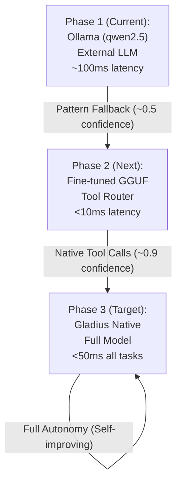

---

## Current Architecture

### Layer 1: Tool Routing (Implemented)

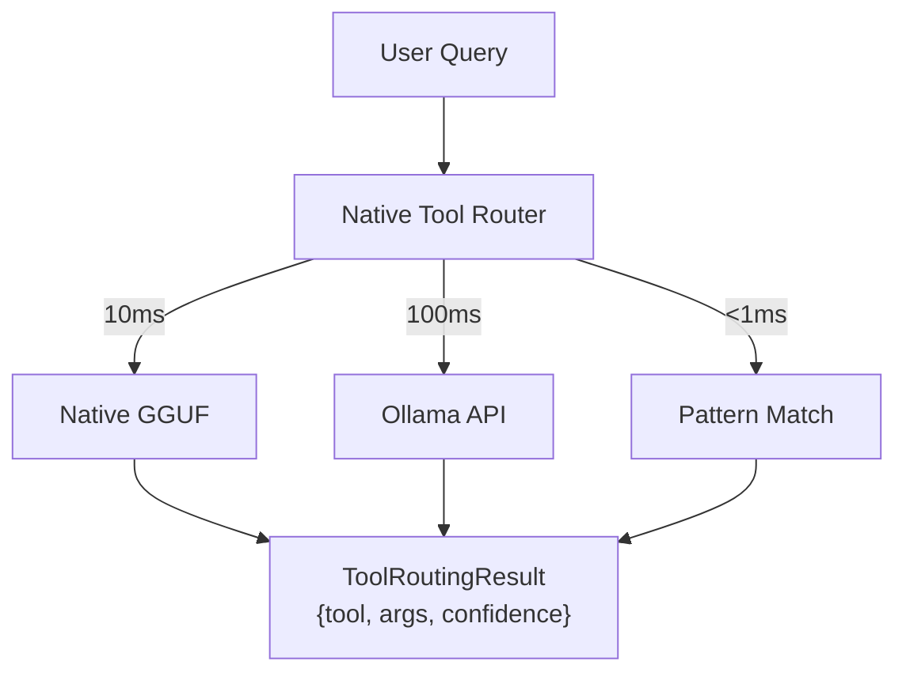

### Layer 2: Reasoning (Ollama via Main Pipeline)

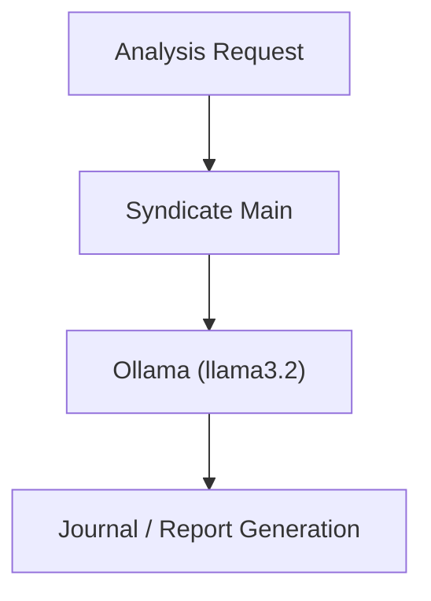

### Layer 3: Embeddings (Hektor/TF-IDF)

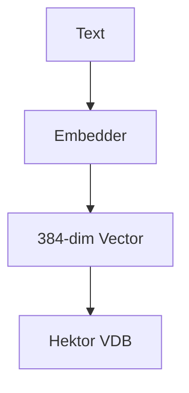

---

## Target Model Specifications

### Tool Router Model (Phase 2)

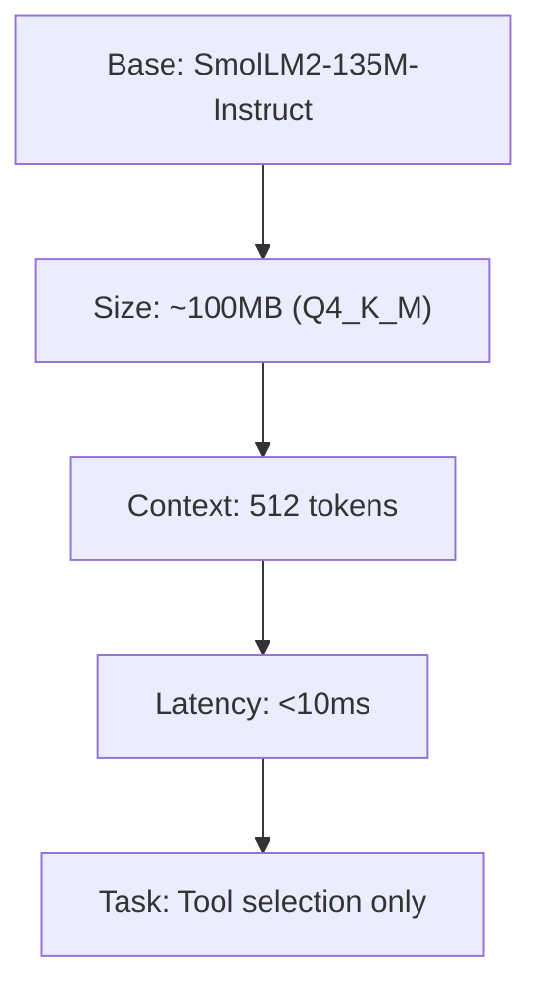

### Full Model (Phase 3 - Gladius Native)

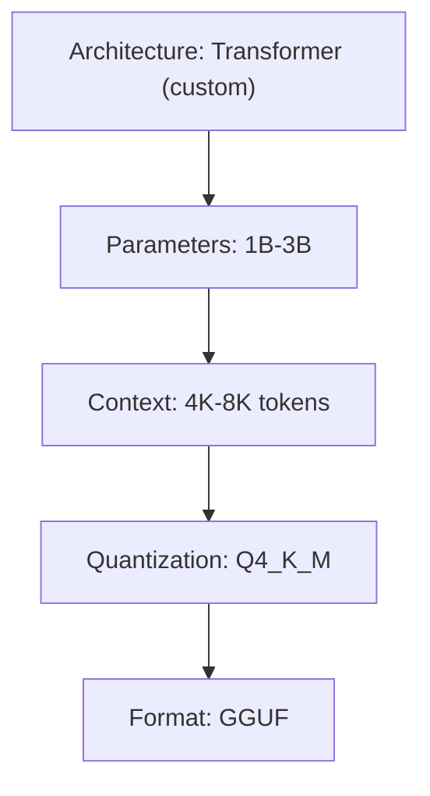

---

## LoRA vs Full Fine-tune: Analysis

### For Tool Router (Recommended: LoRA)

```mermaid
flowchart TD
    LoRA["LoRA"]
    FullFineTune["Full Fine-tune"]

    LoRA -- "Pros: Fast training, Small adapter, Easy to iterate" --> LoRA_Pros[""]
    LoRA -- "Cons: Slightly lower quality" --> LoRA_Cons[""]

    FullFineTune -- "Pros: Maximum quality" --> FullFineTune_Pros[""]
    FullFineTune -- "Cons: Slow, Large output, Hard to iterate" --> FullFineTune_Cons[""]
```

### For Full Model (Recommended: Full Fine-tune + LoRA layers)

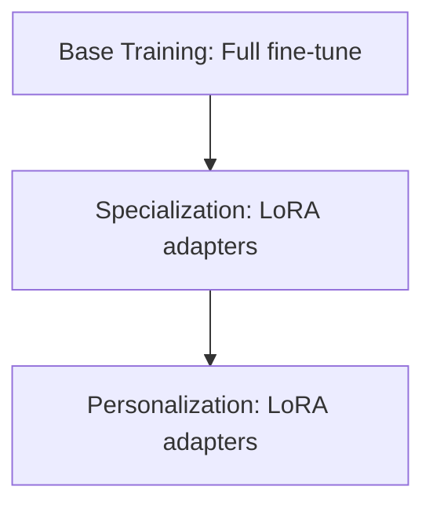

---

## Training Pipeline

### 1. Data Collection

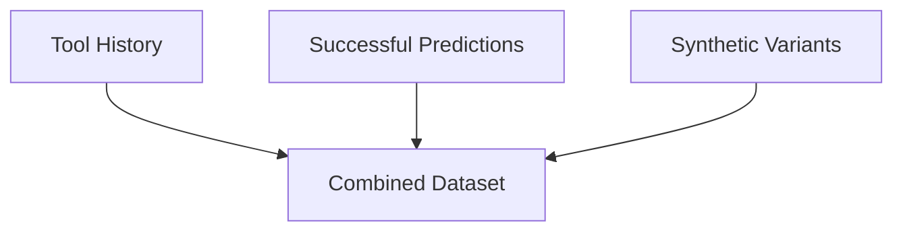

### 2. Fine-tuning

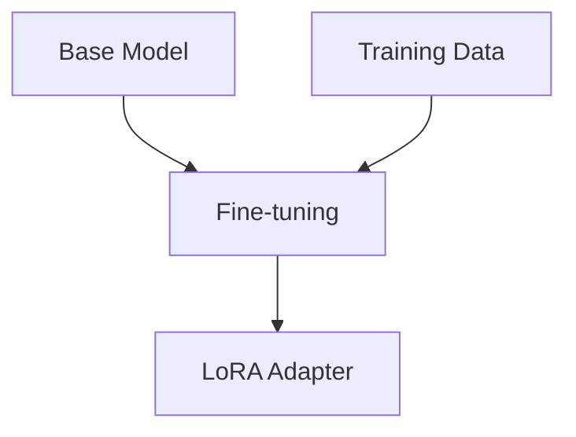

### 3. Quantization

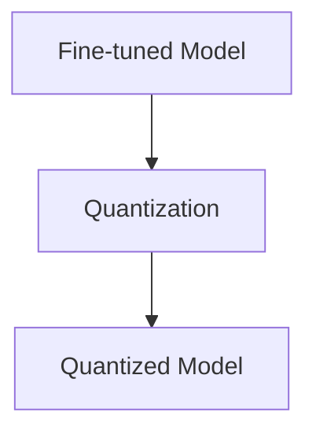

### 4. Validation

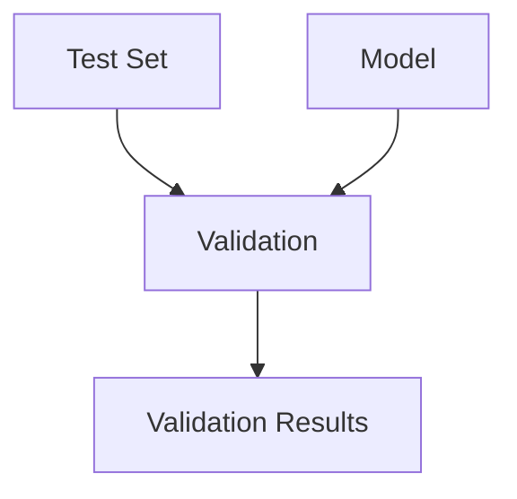

---

## Model Files Structure

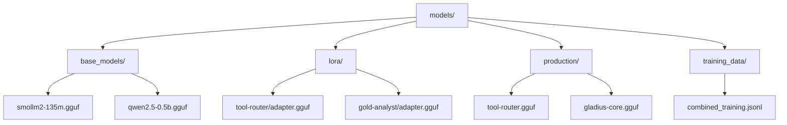

---

*Last updated: 2026-01-13*  
*Document version: 1.0.0*

