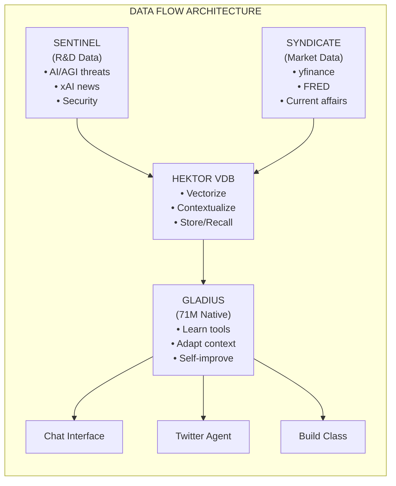

<div align="center">

```
  ________.____       _____  ________  .___ ____ ___  _________
 ╱  _____╱│    │     ╱  _  ╲ ╲______ ╲ │   │    │   ╲╱   _____╱
╱   ╲  ___│    │    ╱  ╱_╲  ╲ │    │  ╲│   │    │   ╱╲_____  ╲ 
╲    ╲_╲  ╲    │___╱    │    ╲│    `   ╲   │    │  ╱ ╱        ╲
 ╲______  ╱_______ ╲____│__  ╱_______  ╱___│______╱ ╱_______  ╱
        ╲╱        ╲╱       ╲╱        ╲╱                     ╲╱ 
```

### gladius1.1:71M-native

<!-- AGI DEVELOPMENT PROGRESS BAR -->
<h3>AGI Development Progress</h3>
<table>
<tr>
<td width="100%">
<pre>
┌──────────────────────────────────────────────────────────────────────────────┐
│ROADMAP                                                            85% / 100% │
├──────────────────────────────────────────────────────────────────────────────┤
│                                                                              │
│  ████████████████████████████████████████████████████████████████░░░░░░░░░░  │
│  ▓▓▓▓▓▓▓▓▓▓▓▓▓▓▓▓▓▓▓▓▓▓▓▓▓▓▓▓▓▓▓▓▓▓▓▓▓▓▓▓▓▓▓▓▓▓▓▓▓▓▓▓▓▓▓▓▓▓▓▓▓▓░░░░░░░░░░░   │
│                                                                              │
│  Phase 1: Foundation        ████████████████████  100%  ✅                   │
│  Phase 2: Learning          ████████████████████  100%  ✅                   │
│  Phase 3: Cognition         ████████████████████  100%  ✅                   │
│  Phase 4: Tool Mastery      ██████████████████░░   90%  🔄                   │
│  Phase 5: Self-Improvement  ████████████░░░░░░░░   60%  🔄                   │
│  Phase 6: Autonomous Ops    ██████████░░░░░░░░░░   50%  🔄                   │
│  Phase 7: Full AGI          ░░░░░░░░░░░░░░░░░░░░    0%  ⏳                   │
│                                                                              │
├──────────────────────────────────────────────────────────────────────────────┤
│  MILESTONES                                                                  │
│  ✅ Native GGUF Model (71M params)    ✅ Vector Memory (Hektor VDB)          │
│  ✅ Tool Routing (100+ tools)         ✅ Autonomous Research (SENTINEL)      │
│  ✅ CPU/GPU Auto-Detection            🔄 Self-Training Pipeline              │
│  ✅ Chat Interface                    🔄 Twitter Autonomous Agent            │
│  ⏳ Recursive Self-Improvement        ⏳ Multi-Agent Coordination            │
│  ⏳ Meta-Learning                     ⏳ Consciousness Emergence             │
└──────────────────────────────────────────────────────────────────────────────┘
</pre>
</td>
</tr>
</table>

<p>
  
  
  
  
  
</p>

**Native AI-powered enterprise system with recursive self-improvement, autonomous research, vector memory, and multi-platform engagement.**

> 🤗 HuggingFace: [amuzetnoM/Gladius](https://huggingface.co/amuzetnoM/Gladius)  
> 📦 Vector DB: [hektor-vdb](https://pypi.org/project/hektor-vdb/)

[Architecture](docs/ARCHITECTURE.md) · [Commands](docs/COMMAND_REFERENCE.md) · [Model](docs/MODEL.md) · [API](GLADIUS/docs/ARCHITECTURE.md)

</div>

## System Architecture

```mermaid
flowchart TB
  subgraph ARTIFACT_VIRTUAL["ARTIFACT VIRTUAL (Enterprise Infrastructure)"]
    direction TB

    subgraph GLADIUS["GLADIUS 1.1:71M-native\n(Native AI — The Brain)"]
      direction LR
      CE["Cognition\nEngine"]
      RT["Router\n(llama.cpp)"]
      TR["Trainer\n(CPU/GPU)"]
      CI["Chat\nInterface"]
      TA["Twitter\nAgent"]
      BC["Build\nClass"]
      CE --> RT
      CE --> TR
      CE --> CI
      CE --> TA
      CE --> BC
    end

    SENT["SENTINEL\n(Guardian / AGI Research)"]
    LEG["LEGION\n(26 agents)"]
    SYN["SYNDICATE\n(Market Data)"]
    AUT["AUTOMATA\n(Publish - 5 platforms)"]
    HECTOR["HEKTOR VDB\n(Vector Memory / Contextualization)"]

    SENT -->|feeds research| HECTOR
    LEG -->|agent data| HECTOR
    SYN -->|market & news| HECTOR
    AUT -->|publishing events| HECTOR

    HECTOR <-->|context & memory| GLADIUS
  end
```



### Components

| Component | Purpose | Status |
|-----------|---------|--------|
| **GLADIUS** | Native 71M GGUF model, llama.cpp inference, tool routing | 🧠 Brain |
| **HEKTOR VDB** | Vector database for memory, context, and learning | 💾 Memory |
| **SENTINEL** | R&D research on AI/AGI threats, security monitoring | 🛡️ Guardian |
| **SYNDICATE** | Market intelligence, current affairs data | 📊 Data Feed |
| **LEGION** | 26 AI agents for enterprise operations | 🤖 Agents |
| **AUTOMATA** | Social media (Twitter), ERP integrations | 📱 Automation |
| **BUILD_CLASS** | Dynamic code generation and tool building | 🔧 Builder |

---

## Data Flow



---

## Quick Start

### Prerequisites

- Python 3.10+
- llama.cpp (for native GGUF inference)
- Node.js 18+ (for UI)
- SQLite3
- Optional: CUDA GPU (auto-detected, CPU fallback available)

### Initial Setup

**1. Configure Environment**

```bash
# Copy the environment template
cp .env.example .env

# Generate secure random keys
SECRET_KEY=$(openssl rand -hex 32)
DASHBOARD_SECRET_KEY=$(openssl rand -hex 32)
JWT_SECRET_KEY=$(openssl rand -hex 32)
LEGION_SECRET_KEY=$(openssl rand -hex 32)

# Edit .env and add the generated keys plus your API credentials
nano .env  # or use your preferred editor
```

**2. Install Dependencies**

```bash
# Create virtual environment
python3 -m venv .venv
source .venv/bin/activate

# Install Python dependencies
pip install -r requirements.txt

# Install Hektor VDB (vector database)
pip install hektor-vdb sentence-transformers
```

**3. Hardware Detection**

The system automatically detects hardware and adjusts:
- **GPU Available**: Uses CUDA-accelerated training and inference
- **CPU Only**: Falls back to CPU-optimized llama.cpp with reduced batch sizes

**4. Start the System**

```bash
# Lightweight startup (recommended for CPU machines)
./gladius.sh run

# Full startup (all services - requires more resources)
./gladius.sh start

# Check system health
./gladius.sh health
```

---

## System Commands

### Core Commands

```bash
# Lightweight startup (UI + SENTINEL only)
./gladius.sh run

# Full system startup (all services)
./gladius.sh start

# Check system health
./gladius.sh health

# Stop all services
./gladius.sh stop
```

### GLADIUS AI Interaction

```bash
# Interactive chat session
./gladius.sh chat

# Direct conversation interface
./gladius.sh speak

# Chat API server (for integrations)
./gladius.sh chat-server
```

### Training (Manual - Heavy Operations)

```bash
# Run training pipeline (auto-detects GPU/CPU)
./gladius.sh train

# Dual training (native + experimental)
./gladius.sh train-dual
```

### Social Media

```bash
# Test Twitter connection
./gladius.sh twitter test

# Generate a tweet
./gladius.sh twitter generate

# Start autonomous Twitter agent
./gladius.sh twitter-run
```

### Subsystem Commands

```bash
# GLADIUS (Native AI)
./gladius.sh gladius status
./gladius.sh gladius benchmark 10
./gladius.sh gladius train

# SENTINEL (Guardian)
./gladius.sh sentinel start
./gladius.sh sentinel scan
./gladius.sh sentinel learn status

# LEGION (Agents)
./gladius.sh legion system status
./gladius.sh legion agent list

# ARTIFACT (Enterprise)
./gladius.sh artifact syndicate run
./gladius.sh artifact publish test
./gladius.sh artifact erp status
```

---

## Current Status

**Overall Progress: 85%**

| Component | Progress | Details |
|-----------|----------|---------|
| Native GGUF Model | ✅ 100% | gladius1.1:71M trained and exported |
| llama.cpp Integration | ✅ 100% | Full native inference, no third-party |
| Hektor VDB | ✅ 100% | Vector memory integrated |
| Chat Interface | ✅ 100% | CLI + HTTP API server |
| Twitter Agent | ✅ 100% | Autonomous engagement |
| CPU/GPU Auto-detect | ✅ 100% | Automatic fallback |
| SENTINEL | 95% | R&D on AI/AGI/xAI threats |
| SYNDICATE | 95% | Market + current affairs data |
| Training Pipeline | ✅ 100% | Dual CPU/GPU trainers |
| LEGION | 90% | 26 agents, integration pending |
| Electron UI | 80% | Dashboard with controls |

---

## Directory Structure

```
gladius/
├── gladius.sh                # Master control script
├── config.json               # Module toggles & configuration
├── .env                      # Environment variables
│
├── GLADIUS/                  # 🧠 NATIVE AI MODEL
│   ├── models/               # GGUF model files
│   │   └── native/          # gladius1.1-71M.gguf
│   ├── training/             # Training pipelines
│   │   └── gladius_trainer.py  # Unified CPU/GPU trainer
│   ├── router/               # Tool routing (llama.cpp)
│   ├── utils/
│   │   ├── hardware.py       # GPU/CPU detection
│   │   └── hektor_memory.py  # Vector DB integration
│   ├── chat_server.py        # Chat CLI + HTTP API
│   ├── twitter_agent.py      # Autonomous Twitter
│   ├── speak.py              # Direct conversation
│   └── docs/                 # Model documentation
│
├── SENTINEL/                 # 🛡️ GUARDIAN PROCESS
│   ├── asas_cli.py          # CLI interface
│   ├── services/            # Learning daemons
│   └── config/              # Research targets (AI/AGI/xAI)
│
├── LEGION/                   # 🤖 AGENT ECOSYSTEM
│   └── legion/              # 26 specialized agents
│
├── Artifact/                 # 📦 ENTERPRISE OPS
│   ├── syndicate/           # Market research + data
│   └── deployment/          # Automata + Infra
│
├── build_class/             # 🔧 DYNAMIC CODE BUILDER
│   ├── adapter.py           # llama.cpp adapter
│   └── builder.py           # Code generation
│
├── ui/                       # 🖥️ ELECTRON UI
│   └── src/                 # React + Electron
│
└── docs/                     # 📚 DOCUMENTATION
    ├── ARCHITECTURE.md
    ├── COMMAND_REFERENCE.md
    └── MODEL.md
```

---

## Configuration

### config.json (Module Toggles)

```json
{
  "system": {
    "name": "Artifact Virtual Enterprise",
    "ai_name": "GLADIUS",
    "ai_version": "gladius1.1:71M-native",
    "lightweight_mode": true,
    "auto_start_training": false
  },
  "modules": {
    "sentinel": { "enabled": true },
    "legion": { "enabled": false },
    "training": { "enabled": false },
    "ui": { "enabled": true }
  },
  "hardware": {
    "prefer_gpu": true,
    "fallback_to_cpu": true
  }
}
```

### .env (Secrets & API Keys)

```bash
# === GLADIUS ===
GLADIUS_ENABLED=true
ADAPTER_TYPE=llamacpp
LLAMA_SERVER_URL=http://localhost:8080

# === SENTINEL ===
SENTINEL_ENABLED=true
SENTINEL_RESEARCH_TARGETS=AI,AGI,xAI,threats

# === TWITTER ===
TWITTER_ENABLED=true
TWITTER_API_KEY=your_key
TWITTER_API_SECRET=your_secret

# === SMTP (Email Escalation) ===
SMTP_HOST=smtp.hostinger.com
SMTP_PORT=465
SMTP_SSL=true
```

---

## Documentation

| Document | Purpose |
|----------|---------|
| [ARCHITECTURE.md](docs/ARCHITECTURE.md) | Complete system architecture |
| [COMMAND_REFERENCE.md](docs/COMMAND_REFERENCE.md) | All 94 commands |
| [MODEL.md](docs/MODEL.md) | Native AI model specification |
| [GLADIUS/docs/ARCHITECTURE.md](GLADIUS/docs/ARCHITECTURE.md) | Model architecture blueprint |
| [GLADIUS/docs/MODEL_CARD.md](GLADIUS/docs/MODEL_CARD.md) | HuggingFace model card |

---

## The Learning Loop

GLADIUS learns through a continuous feedback cycle:

```text
┌──────────────┐     ┌──────────────┐
│ SENTINEL     │     │ SYNDICATE    │
│ (R&D)        │     │ (Markets)    │
└──────┬───────┘     └──────┬───────┘
  │                    │
  └─────┬──────────────┘
        ▼
┌────────────────────────────────────────────┐
│ HEKTOR VDB — Vectorize & Contextualize    │
└────────────────────────────────────────────┘
        │
        ▼
┌────────────────────────────────────────────┐
│ GLADIUS COGNITION                          │
│ • Recall relevant context                  │
│ • Learn tool patterns                      │
│ • Adapt to new information                 │
└────────────────────────────────────────────┘
     ┌────────────┬─────────────┬────────────┐
     ▼            ▼             ▼
┌──────────┐  ┌──────────┐  ┌──────────────┐
│ Chat     │  │ Twitter  │  │ Build Class  │
│ Interface│  │ Agent    │  │ (Tools)      │
└──────────┘  └──────────┘  └──────────────┘
  ▲             ▲               ▲
  └─────────────┴───────────────┘
      │
      ▼
   feedback → HEKTOR VDB
```

### Key Features:
- **Hektor VDB**: High-performance vector database with SIMD acceleration
- **SENTINEL**: Researches AI/AGI/xAI developments and threats
- **SYNDICATE**: Feeds real-time market and news data
- **Contextual Memory**: GLADIUS recalls relevant past interactions
- **Tool Learning**: Discovers and adapts to available tools

---

## Tool Registry

| Category | Tools | Description |
|----------|-------|-------------|
| Memory | remember, recall, forget | Hektor VDB-backed persistent memory |
| Search | search, hybrid_search, get_context | Semantic + keyword search |
| Workspace | read_file, write_file, list_dir | File system operations |
| Database | read_db, write_db, list_databases | SQLite database operations |
| Charting | generate_chart, detect_trendlines | Technical analysis (SYNDICATE) |
| Publishing | publish_content, schedule_post | Social media automation |
| Build | build_class, generate_code | Dynamic code generation |
| Twitter | post_tweet, reply, like, engage | Autonomous Twitter operations |

---

## Security & Governance

### Consensus System
- **Low impact**: Auto-approved
- **Medium impact**: Discord vote
- **High impact**: Email escalation to dev team
- **Critical impact**: Executive approval required

### Constitutional AI
- Ethical decision framework in SENTINEL
- All automated actions logged and explainable
- Response proportional to threat severity

---

## Requirements

- Python 3.10+
- llama.cpp (native inference)
- Node.js 18+ (for UI)
- SQLite3
- Optional: CUDA GPU (for accelerated training)

### Python Dependencies
```bash
pip install hektor-vdb sentence-transformers torch transformers
```

---

## License

Proprietary - Artifact Virtual

---

<div align="center">

**[Artifact Virtual](https://artifactvirtual.com)** — Building Autonomous Enterprise Intelligence

*Model: gladius1.1:71M-native | System at 85% completion | Last updated: 2026-01-31*

</div>
