<div align="center">

```
  ________.____       _____  ________  .___ ____ ___  _________
 ╱  _____╱│    │     ╱  _  ╲ ╲______ ╲ │   │    │   ╲╱   _____╱
╱   ╲  ___│    │    ╱  ╱_╲  ╲ │    │  ╲│   │    │   ╱╲_____  ╲ 
╲    ╲_╲  ╲    │___╱    │    ╲│    `   ╲   │    │  ╱ ╱        ╲
 ╲______  ╱_______ ╲____│__  ╱_______  ╱___│______╱ ╱_______  ╱
        ╲╱        ╲╱       ╲╱        ╲╱                     ╲╱ 

```

### Autonomous Enterprise Intelligence System

<p>
  
  
  
  
  
</p>

**Self-evolving AI infrastructure with native cognition, SIMD-optimized vector search, autonomous self-improvement, and enterprise-grade market intelligence.**

[View Landing Page](index.html) · [Model Specification](MODEL.md) · [Architecture](ARCHITECTURE.md) · [Commands](COMMANDS.md)

</div>

---

## Overview

GLADIUS is a **next-generation autonomous enterprise system** that combines:

> **⟡ Native Cognition** — Pattern-based tool routing with 100% accuracy, sub-millisecond latency <br>
> **↺ Self-Improvement** — Autonomous proposal generation, training, and implementation <br>
> **✉ Multi-Platform Publishing** — Unified pipeline for Twitter, LinkedIn, Facebook, Instagram, YouTube <br>
> **⚙ Market Intelligence** — Real-time analysis of gold, crypto, and equities with chart generation <br>
> **◼ SIMD Performance** — C++ core with AVX2 optimization, zero external AI dependency for core ops 

## System Schematic


### Function Cyce

```mermaid
flowchart TD
  A[GLADIUS ENGINE<br/>Think → Learn → Act → Improve → Repeat] --> B[SYNDICATE<br/>Research<br/>Analysis<br/>Charts]
  A --> C[COGNITION<br/>Brain<br/>Memory<br/>Training]
  A --> D[AUTOMATA<br/>Publish<br/>Schedule<br/>Engage]
  B --> C
  C --> D
  D --> E[Self-Improvement Loop]
  E --> A
```



## Quick Start

```bash
# Start all services
./gladius.sh start

# Check system health
./gladius.sh health

# Run a complete cycle (research → publish)
./gladius.sh cycle

# Run self-improvement
./gladius.sh improve
```

### Configure Platforms (Optional)

Edit `.env` to add API credentials:
```bash
# Twitter/X
TWITTER_BEARER_TOKEN=your_token
TWITTER_ENABLED=true

# LinkedIn
LINKEDIN_ACCESS_TOKEN=your_token
LINKEDIN_ENABLED=true

# Discord (for consensus voting)
DISCORD_WEBHOOK_URL=your_webhook
DISCORD_ENABLED=true
```

---

## Architecture

### Components

| Component | Purpose | Progress |
|-----------|---------|----------|
| **Syndicate** | Market research, data ingestion, chart generation | 90% |
| **Cognition** | Hektor VDB, memory, tools, self-improvement | 85% |
| **Automata** | Social publishing, scheduling, engagement | 70% |
| **Arty** | Discord bot, consensus, community | 50% |
| **Infrastructure** | APIs, databases, monitoring | 60% |

### Data Flow

```
1. INGEST    → yfinance, FRED, news APIs → Raw Data
2. ANALYZE   → QuantEngine, Ollama → Reports, Charts
3. STORE     → SQLite, Hektor VDB → Memory
4. PUBLISH   → ContentAdapter → Twitter, LinkedIn, etc.
5. LEARN     → EngagementTracker → Optimize
```

---

## Cognition Engine

### Memory Tools (16)

| Tool | Description |
|------|-------------|
| `list_databases` | List connected databases |
| `read_db` | Query SQL databases |
| `write_db` | Write to databases |
| `search` | Vector similarity search |
| `hybrid_search` | Combined vector + keyword |
| `get_context` | Retrieve recent context |
| `remember` | Store in vector memory |
| `recall` | Retrieve from memory |
| `list_dir` | Browse workspace |
| `read_file` | Read file contents |
| `write_file` | Write files |
| `file_exists` | Check file existence |
| `get_tools` | List available tools |
| `get_history` | Get tool usage history |
| `call_tool` | Dynamic tool invocation |
| `execute_tool` | Execute with full context |

### Self-Improvement

```
Identify Issues → Create Proposal → Review/Approve → Implement → Learn
      ↓                                    ↓
  Low Risk: Auto-approve         Medium Risk: Discord vote
  High Risk: Email escalation
```

### Usage

```python
from cognition import MemoryModule, SelfImprovementEngine

# Memory operations
memory = MemoryModule()
result = memory.execute_tool("hybrid_search", {"query": "gold analysis", "k": 5})

# Self-improvement
engine = SelfImprovementEngine()
proposal = engine.create_proposal(
    title="Improve pattern accuracy",
    category="accuracy"
)
```

---

## Publishing Pipeline

### Supported Platforms

| Platform | Adapter | Features |
|----------|---------|----------|
| Twitter/X | ✅ | Threads, media, analytics |
| LinkedIn | ✅ | Articles, company pages |
| Facebook | ✅ | Posts, page management |
| Instagram | ✅ | Visual posts, stories |
| YouTube | ✅ | Video descriptions, SEO |

### Automatic Scheduling

- **Optimal posting times** per platform
- **Rate limiting** per platform
- **Priority queue** for urgent content
- **Auto-retry** on failures

### Usage

```python
from publishing import PublishingPipeline

pipeline = PublishingPipeline(
    syndicate_output_dir='./output',
    config=config
)

# Run a publishing cycle
results = await pipeline.run_publishing_cycle()
print(f"Published: {results['published']}")
```

---

## Documentation

| Document | Purpose |
|----------|---------|
| [ARCHITECTURE.md](ARCHITECTURE.md) | System diagrams and data flow |
| [CONTEXT.md](CONTEXT.md) | Operational context and history |
| [MANDATE.md](MANDATE.md) | Mission and responsibilities |
| [MODEL.md](MODEL.md) | Native AI model strategy |
| [COMMANDS.md](COMMANDS.md) | CLI commands reference |
| [SNAPSHOT.md](SNAPSHOT.md) | System benchmarks and status |
| [FLIGHT_CHECKLIST.md](FLIGHT_CHECKLIST.md) | Implementation progress |

---

## Directory Structure

```
gladius/
├── Artifact/                    # Core System Components
│   ├── syndicate/               # Research & Analysis Engine
│   │   ├── src/cognition/       # Cognition Engine (Memory, Tools, Training)
│   │   ├── integrations/        # Notion, Discord integrations
│   │   └── output/              # Generated reports, charts
│   ├── deployment/
│   │   ├── automata/            # Publishing & Automation
│   │   │   ├── social_media/    # Platform adapters
│   │   │   ├── publishing/      # Content pipeline
│   │   │   └── ai_engine/       # Tool registry
│   │   └── infra/               # FastAPI infrastructure
│   ├── arty/                    # Discord bot & engagement
│   └── diagrams/                # System diagrams
├── docs/                        # Documentation
├── obsidian_sync/gladius/       # Operator notes & proposals
├── gladius.sh                   # Unified control script
├── index.html                   # Landing page
├── .env                         # API keys (gitignored)
└── *.md                         # Core documentation
```

---

## Current Status

**Overall Progress: 85%**

| Component | Status |
|-----------|--------|
| Core Infrastructure | ✅ 90% |
| Cognition Engine | ✅ 95% |
| Syndicate (Research) | ✅ 95% |
| Automata (Publishing) | 🟡 75% |
| Arty (Engagement) | 🟡 60% |
| Digital Footprint | 🟡 70% |

See [FLIGHT_CHECKLIST.md](FLIGHT_CHECKLIST.md) for detailed breakdown.

---

## Requirements

- **Python 3.10+** with pip
- **Node.js 18+** with npm (for dashboard)
- **Ollama** (optional, for LLM operations)
- **Hektor VDB** (clone separately for native performance)

### API Keys (Optional)

Configure in `.env`:
- Twitter/X API credentials
- LinkedIn API credentials  
- Facebook Graph API
- Instagram Graph API
- Discord Bot Token
- SMTP for email notifications

---

## License

Proprietary - Artifact Virtual

---

<div align="center">

**[Artifact Virtual](https://artifactvirtual.com)** — Building Autonomous Enterprise Intelligence

*Last updated: 2026-01-14*

</div>

