<br>

<p align="center">
  
  
  
  
  
  
  
  
</p>

---

## Overview

Gladius is an **Autonomous Enterprise Operating System** with a fully native AI stack—no external API dependencies. It manages multiple business artifacts through unified cognition, native vectorization, and semantic memory. Core features include a native C++ vector database (Hektor), native tool routing, and autonomous learning.

---

## Architecture

```mermaid
flowchart TD
    A["GLADIUS<br/>(Autonomous Enterprise Manager)"]
    subgraph Core
        B["Hektor VDB<br/>SIMD/HNSW"]
        C["Native Router<br/>(tool <10ms)"]
        D["Memory Module<br/>(16 tools)"]
    end
    E["MODEL STACK<br/>Native GGUF (<10ms) → Ollama (~100ms) → Fallback"]
    F1["ALPHA<br/>Syndicate<br/>Research"]
    F2["BETA<br/>Cthulu<br/>Trading"]
    F3["THETA<br/>(Future)<br/>Publishing"]

    A --> Core
    Core --> E
    E --> F1
    E --> F2
    E --> F3
```



---

## Native AI Model Stack

```mermaid
flowchart LR
    A["Tool Routing<br/>Native GGUF<br/>&lt;10ms<br/>🚧 Training ready"]
    B["Fallback<br/>Pattern Match<br/>&lt;1ms<br/>✅ Working"]
    C["Reasoning<br/>Ollama<br/>~100ms<br/>✅ Production"]
    D["Embeddings<br/>TF-IDF + Hektor<br/>&lt;5ms<br/>✅ Production"]

    subgraph ModelStack
        A
        B
        C
        D
    end
```



**Evolution Path:**


---

## Core Systems


---

## Roadmap


---

## 🏗️ Architecture

```mermaid
flowchart TD
    subgraph GLADIUS [GLADIUS (Autonomous Enterprise Manager)]
        Hektor["Hektor VDB<br/>SIMD/HNSW"]
        Router["Native Router<br/>(tool <10ms)"]
        Memory["Memory Module<br/>(16 tools)"]
        ModelStack["MODEL STACK<br/>Native GGUF (<10ms) → Ollama (~100ms) → Fallback"]
    end
    GLADIUS -->|Manages| Alpha["ALPHA<br/>Syndicate<br/>Research"]
    GLADIUS -->|Manages| Beta["BETA<br/>Cthulu<br/>Trading"]
    GLADIUS -->|Manages| Theta["THETA<br/>(Future)<br/>Publishing"]
```

---

## 🧠 Native AI Model Stack

```mermaid
flowchart TB
    ToolRouting["Tool Routing<br/>Native GGUF<br/><10ms<br/>🚧 Training ready"]
    Fallback["Fallback<br/>Pattern Match<br/><1ms<br/>✅ Working"]
    Reasoning["Reasoning<br/>Ollama<br/>~100ms<br/>✅ Production"]
    Embeddings["Embeddings<br/>TF-IDF + Hektor<br/><5ms<br/>✅ Production"]

    ToolRouting --> Fallback
    ToolRouting --> Reasoning
    ToolRouting --> Embeddings
```



**Evolution Path:**


---

