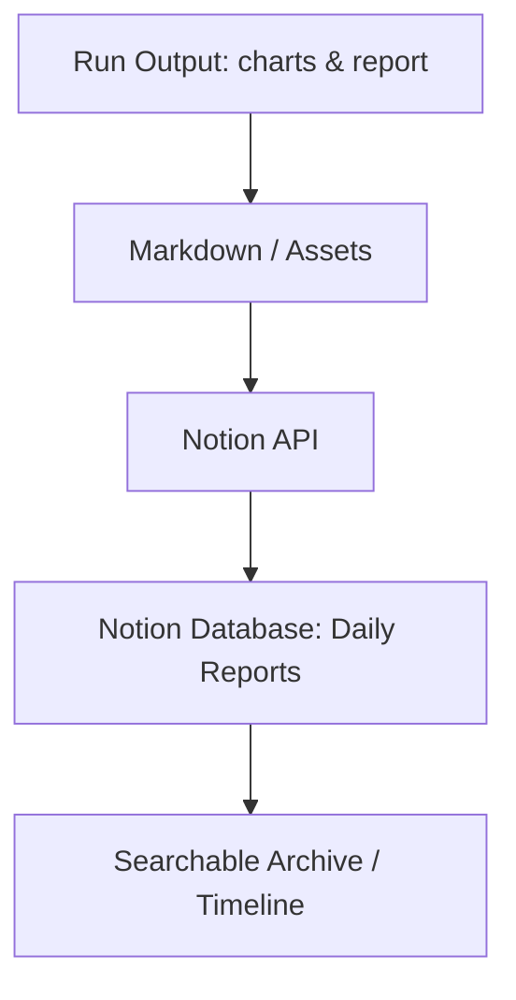
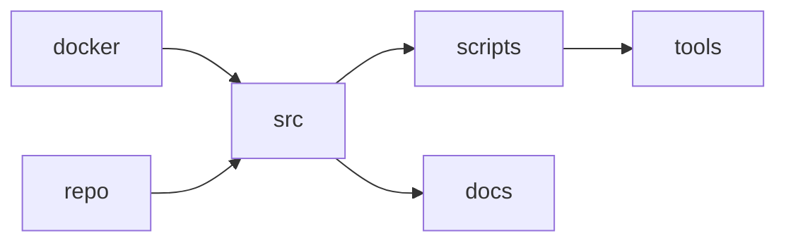

# GOLD STANDARD
> A SYSTEM THAT REFUSES TO LIE.

**One-line summary:** A continuous, evidence-driven market memory that records and preserves market state for disciplined decision-making.

**Disclaimer:** Not financial advice. This documentation explains system behavior and is not investment guidance.

---

**Contents**

- [T0: Before the system existed](#t0-before-the-system-existed)
- [T1: The first rule](#t1-the-first-rule)
- [T2: Infrastructure choice](#t2-infrastructure-choice)
- [T3: What Gold Standard actually does](#t3-what-gold-standard-actually-does)
- [T4: Charts](#t4-charts)
- [T5: Reports](#t5-reports)
- [T6: Journaling in Notion](#t6-journaling-in-notion)
- [T7: The repository](#t7-the-repository)
- [T8: Automation & continuity](#t8-automation--continuity)
- [T9: What this system is NOT](#t9-what-this-system-is-not)
- [T10: Who this is for](#t10-who-this-is-for)
- [T11: Why I’m sharing this publicly](#t11-why-im-sharing-this-publicly)
- [T12: What happens next](#t12-what-happens-next)

---

**At a glance:**

- Runs unattended on a dedicated VM; stores every run permanently in Notion and on disk.
- Produces six reproducible charts and a concise written report each run.
- Provides deterministic evidence for human review; does not make trading calls.
- Integrates with `Herald`, the execution agent under development; VM is the canonical runtime.

---

## T0. Before the system existed

*(Context matters)*

I didn’t start with a thesis.

I started with frustration.

Markets felt readable when I was alone with them.

The moment analysis was shared, it decayed.

Screenshots replaced context.

Narratives replaced structure.

Confidence replaced accuracy.

So I stopped trying to be “right”

and started trying to **preserve reality**.

Gold Standard was not designed to predict.

It was designed to **remember**.

---

## T1. The first rule

*(Design constraint, not a feature)*

> Nothing is allowed to depend on my attention.
> 

If a system needs me to:

- run it manually
- interpret it live
- decide when it matters

…it’s already compromised.

So Gold Standard had one non-negotiable rule:

**It runs whether I’m watching or not.**

Design imperative: unattended, repeatable, auditable runs with persistent state.

No prompts.

No buttons.

No moods.

---

## T2. Infrastructure choice

*(Why a dedicated VM, not a laptop or cloud abstraction)*

To enforce that rule, I deployed a **dedicated virtual machine**.

Not serverless.

Not notebook-based.

Not ephemeral.

A quiet machine that:

- stays on
- has state
- has memory
- has history

This VM exists for one purpose only:
to observe markets continuously and without bias.

**VM Architecture (overview):**

```mermaid
graph TD
  subgraph VM[Dedicated VM]
    A[Systemd / Scheduler / Cron] --> B[Gold Standard (gost)]
    B --> C[SQLite Data Volume]
    B --> D[Charts & Reports]
    B --> E[Notion Sync]
    B --> F[Herald (executor) - optional container]
  end
  subgraph External
    G[Exchanges / APIs]
    H[Developer workstation]
  end
  B -->|Push/Fetch| G
  H -->|SSH / Deploy| B
```

**VM note:** The VM is the persistent runtime and source-of-truth for runs and logs; `Herald` is the trading-execution agent trained on `BTCUSD` (in development) and is deployed from the VM or the executor container.

This matters because:

- market behavior doesn’t align with human schedules
- insight often appears when no one is watching
- automation removes selective attention

---

## T3. What Gold Standard actually does

*(At the core, stripped of narrative)*

Gold Standard is a **market analysis pipeline**.

Pipeline in one line: ingest → normalize → analyze → chart → report → archive.

Each run follows the same flow:

1. Pull market data
2. Normalize and structure it
3. Analyze price behavior (not predictions)
4. Generate charts
5. Generate written reports
6. Store everything permanently

No step depends on the outcome of the previous one “looking good”.

**Image placeholder:**

`[ High-level pipeline diagram ]`

---

## T4. Charts: how the system sees the market

*(This is not TA as content)*

Charts are not decoration here.

They are **evidence**.

Each chart exists to answer a specific question:

- Is price compressing or expanding?
- Is volatility increasing or decaying?
- Is structure intact or breaking?
- Is risk asymmetric or balanced?

They are generated the same way every time.
No tweaking for aesthetics.
No removing “ugly” results.

**Charts (generated each run):**


*Figure: Price structure with local bands.*


*Figure: Observed volatility over time.*


*Figure: Rolling range indicating expansion vs contraction.*


*Figure: Multi-timeframe views for structural context.*


*Figure: Returns distribution and risk profile.*


*Figure: Comparative asset behavior snapshots.*

Six charts. Every run. No exceptions.

```mermaid
graph LR
  A[Raw market data] --> B[Ingest]
  B --> C[Normalization]
  C --> D[Indicator & Signal Library]
  D --> E[Chart Generator]
  E --> F[Report Writer]
  F --> G[Archive (Notion / Disk)]
```

---

## T5. Reports: turning structure into language

*(So humans can think, not react)*

After charts, the system writes.

Not opinions.
Not calls.
Not hype.

It writes **descriptions of state**.

What changed.

What didn’t.

What matters now.

What is fragile.

What is stable.

These reports are intentionally boring.
Because boring survives time.

**Sample report snippet:**

> **Summary (automated):** Structure is weakening on the 1H timeframe; volatility is increasing; support at 98.2 held during the run. No asymmetric risk detected that warrants immediate action. See charts above for evidence and the full report in Notion.

---

## T6. Journaling in Notion

*(Why Notion, and why everything lives there)*

All outputs are archived in Notion:

- daily reports
- charts
- system notes
- run metadata

Notion acts as:

- a time machine
- a research log
- a memory bank

Nothing is overwritten.
Each entry is timestamped.
Each run is preserved.

**Notion journal flow:**



**Single entry view:**

- Timestamped report
- Attached charts and metrics
- Run metadata and reproducible inputs

You can scroll backwards and see:

- what the market looked like
- what the system said
- what was unknowable at the time

---

## T7. The repository

*(What the code actually represents)*

The GitHub repository is not a “product repo”.
It’s a **research instrument**.

Inside it you will find:

- data pipelines
- analysis modules
- chart generators
- report writers
- automation logic

**Repository layout (key paths):**

```text
gold_standard/
  ├─ src/                      # core modules (notion_publisher, runner)
  ├─ scripts/                  # utilities: pipeline audit, executor_daemon
  ├─ docker/                   # docker/compose and images
  ├─ docs/                     # documentation and built HTML
  └─ tools/                    # helper scripts and reports
```



**Note:** `Herald` (trading executor) is developed under `scripts/` and deploys from the VM or executor container. The VM is the stateful runtime that holds the SQLite data and persistent artifacts.

---

## T8. Automation & continuity

*(Why this is not a one-off system)*

Gold Standard runs:

- on schedule
- without prompts
- without confirmation

If the market exists, it runs.
If the market is quiet, it runs.
If I’m asleep, it runs.

This removes:

- selective memory
- emotional filtering
- hindsight bias

**Run scheduling and logs:**

```mermaid
gantt
    dateFormat  HH:mm
    title Run schedule
    section Schedules
    Daily: done, 06:00, 24h
    Hourly: active, 06:30, 1h
```



**Log snapshot:**

- `2025-12-14T06:00:01Z` — Run started
- `2025-12-14T06:00:03Z` — Ingest complete
- `2025-12-14T06:00:08Z` — Reports generated
- `2025-12-14T06:00:09Z` — Notion sync succeeded

---

## T9. What this system is NOT

*(Important clarity)*

Gold Standard is not:

- a signal service
- an alert engine
- a prediction machine
- a strategy seller

It does not tell you:

- when to enter
- when to exit
- what to buy

It tells you:

- what the market is doing
- how risky it is
- how structure is changing
- what has historically mattered in similar states

---

## T10. Who this is for

*(And who should ignore it)*

This is for:

- traders who value process over outcome
- analysts who hate hindsight
- builders who respect systems
- people who want fewer opinions and more records

This is not for:

- dopamine trading
- instant certainty
- social proof
- loud confidence

---

## T11. Why I’m sharing this publicly

*(The real reason)*

Most systems like this live in silence.
Behind funds.
Behind NDAs.
Behind dashboards no one explains.

I think that’s wrong.

The edge isn’t secrecy.
It’s **how truth is handled**.

So this page exists as:

- documentation
- confession
- record
- invitation

Not to follow.
To observe.

---

## T12. What happens next

*(Without promises)*

This system will evolve.
Every change will be logged.
Every mistake will stay visible.

**Near-term work:** continue `Herald` training on BTCUSD (execution agent); improve SLM inference latency; formalize Notion schemas and runbook automation.

Nothing here is final.
That’s the point.

---

### END BROADCAST