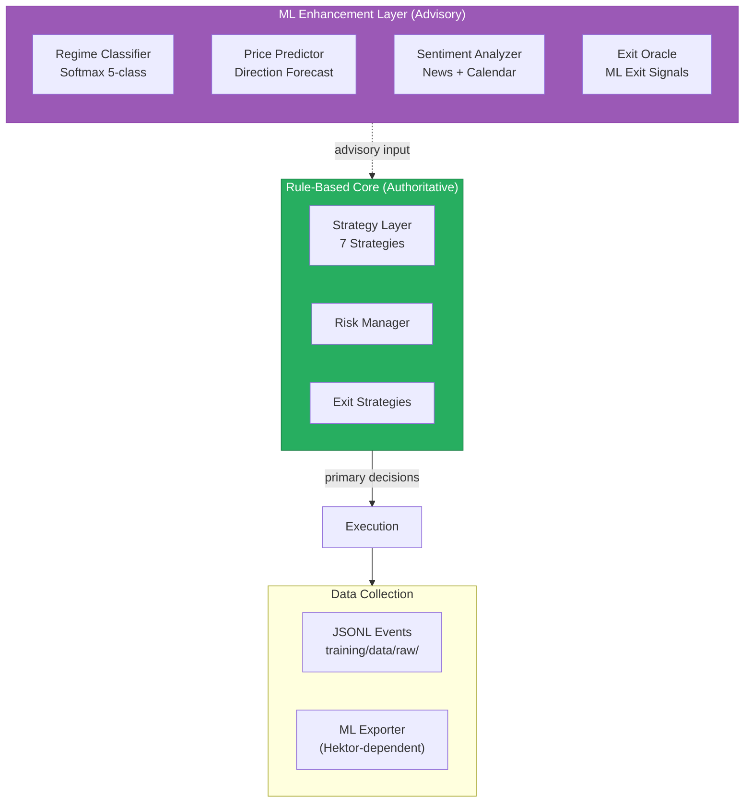
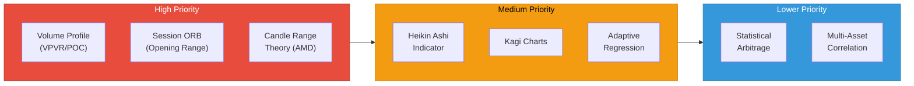
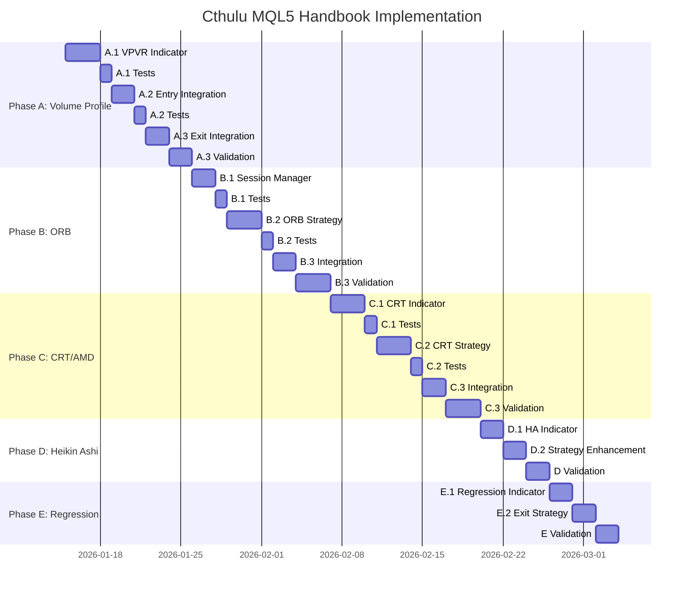

# Cthulu ML Implementation Analysis & MQL5 Handbook Gap Analysis

**Created:** 2026-01-10  
**Status:** Active Reference Document

---

## Part 1: Current ML Implementation (Hektor-Independent)

### Overview

Cthulu v5.2.0 has a **rule-based + lightweight ML** architecture. The ML layer (`cognition/`) provides signal enhancement but does NOT control trading decisions. The rule-based strategies remain authoritative.



### Active ML Components

| Module | File | Function | Status |
|--------|------|----------|--------|
| **CognitionEngine** | `cognition/engine.py` | Central orchestrator | ✅ Active |
| **RegimeClassifier** | `cognition/regime_classifier.py` | Bull/Bear/Sideways/Volatile/Choppy | ✅ Active |
| **PricePredictor** | `cognition/price_predictor.py` | Softmax direction forecast | ✅ Active |
| **SentimentAnalyzer** | `cognition/sentiment_analyzer.py` | News/calendar sentiment | ✅ Active |
| **ExitOracle** | `cognition/exit_oracle.py` | ML-enhanced exit signals | ✅ Active |
| **EntryConfluence** | `cognition/entry_confluence.py` | Entry quality gate | ✅ Active |
| **StructureDetector** | `cognition/structure_detector.py` | BOS/ChoCH detection | ✅ Active |
| **PatternRecognition** | `cognition/pattern_recognition.py` | 16 chart patterns | ⚠️ Hektor-dependent |

### ML Data Collection (Hektor-Independent)

```
training/
├── instrumentation.py    # MLDataCollector - JSONL event writer
├── data/
│   └── raw/              # Gzipped JSONL files
│       └── events.*.jsonl.gz
└── tier_optimizer.py     # Profit tier analysis
```

**Event Types Collected:**
- `order_request` - Pre-trade signal data
- `execution` - Post-trade execution data
- `market_snapshot` - Position state over time
- `news_event` / `calendar_event` - External data

### Regime Classifier Details

**Input Features (6):**
1. `trend_strength` - ADX-based
2. `price_momentum` - Rate of change
3. `volatility_ratio` - ATR/price
4. `volume_trend` - Volume MA ratio
5. `structure_score` - Higher highs/lower lows
6. `range_bound_score` - Bollinger %B variance

**Output:** Softmax over 5 regimes: `BULL, BEAR, SIDEWAYS, VOLATILE, CHOPPY`

### Price Predictor Details

**Input Features (12):**
- Momentum (3 timeframes)
- ATR ratio (volatility)
- RSI normalized
- Volume ratio
- Range position
- EMA relationships
- Higher highs/lows count
- Candle patterns

**Output:** Softmax over 3 directions: `LONG, SHORT, NEUTRAL`

### What's NOT Using ML (Rule-Based)

- All 7 trading strategies (SMA, EMA, Momentum, Scalping, Mean Reversion, Trend Following, RSI)
- Risk management (position sizing, exposure limits)
- All exit strategies (trailing, profit target, time-based)
- Order execution
- SL/TP calculation

---

## Part 2: MQL5 Handbook Gap Analysis

### Handbook Coverage Summary

| Phase | Topic | Articles | Cthulu Status |
|-------|-------|----------|---------------|
| **Phase 1** | API/WebRequest | 3 | ✅ MT5 Python API |
| **Phase 1** | Logging | 1 | ✅ Structured logging |
| **Phase 1** | Moving Average Deep Dive | 1 | ✅ SMA/EMA strategies |
| **Phase 1** | Signal Library | 2 | ✅ Strategy base class |
| **Phase 2** | Risk Management | 2 | ✅ RiskEvaluator |
| **Phase 2** | Exit Strategies | 1 | ✅ 6 exit strategies |
| **Phase 2** | Heikin Ashi | 2 | ❌ **GAP** |
| **Phase 3** | BOS/ChoCH | 1 | ✅ market_structure.py |
| **Phase 3** | Volume Profile/VPVR | 1 | ❌ **GAP** |
| **Phase 3** | ORB (Opening Range Breakout) | 2 | ❌ **GAP** |
| **Phase 3** | Kagi Charts | 1 | ❌ **GAP** |
| **Phase 3** | Statistical Arbitrage | 1 | ❌ **GAP** |
| **Phase 3** | Adaptive Regression | 1 | ⚠️ Partial (momentum only) |
| **Phase 3** | CRT (Candle Range Theory) | 1 | ❌ **GAP** |

### Identified Gaps (Priority Ordered)



---

## Part 3: Linear Implementation Path

Each step must be **tested and validated** before proceeding to the next.

### Phase A: Volume Profile (VPVR) - HIGH PRIORITY

**Why:** Institutional-grade analysis of where volume actually traded. Identifies support/resistance from liquidity, not just price levels.

**Implementation Steps:**

```
Step A.1: Volume Profile Indicator
├── Create indicators/volume_profile.py
├── Implement:
│   ├── Point of Control (POC) - highest volume price
│   ├── Value Area High/Low (VAH/VAL) - 70% volume range
│   ├── High Volume Nodes (HVN) - support/resistance
│   └── Low Volume Nodes (LVN) - breakout zones
├── Test: Unit tests with synthetic volume data
└── Validate: Backtest on 6 months EURUSD/GOLD

Step A.2: VPVR Integration with Entry Confluence
├── Modify cognition/entry_confluence.py
├── Add level_score component for POC/VAH/VAL proximity
├── Test: Entry quality improves near POC
└── Validate: A/B test entries with/without VPVR

Step A.3: VPVR Exit Integration
├── Modify exit/confluence_exit_manager.py
├── Add exit trigger when price reaches opposite VAH/VAL
├── Test: Exit timing improves with VPVR
└── Validate: Compare P&L with/without VPVR exits
```

### Phase B: Opening Range Breakout (ORB) - HIGH PRIORITY

**Why:** Session-based strategy for high-probability breakout trades. Perfect for London/NY opens.

**Implementation Steps:**

```
Step B.1: Session Manager
├── Create core/session_manager.py
├── Implement:
│   ├── Session definitions (Sydney, Tokyo, London, NY)
│   ├── Opening range capture (first N minutes)
│   ├── Range high/low tracking
│   └── Session overlap detection
├── Test: Session boundaries accurate across timezones
└── Validate: Manual verification of session times

Step B.2: ORB Strategy
├── Create strategy/orb_strategy.py
├── Implement:
│   ├── Range formation detection
│   ├── Breakout confirmation (close above/below)
│   ├── Multi-bar confirmation option
│   └── Dynamic SL/TP based on range size
├── Test: Unit tests for breakout detection
└── Validate: Backtest on 3 months London session

Step B.3: ORB Integration with StrategySelector
├── Add ORB to config.json strategies list
├── Configure regime-based activation (use ORB in ranging markets)
├── Test: Dynamic selection includes ORB appropriately
└── Validate: 1 week forward test on demo account
```

### Phase C: Candle Range Theory (CRT/AMD) - HIGH PRIORITY

**Why:** Smart Money Concepts - understanding Accumulation, Manipulation, Distribution phases.

**Implementation Steps:**

```
Step C.1: CRT Indicator
├── Create indicators/crt_amd.py
├── Implement:
│   ├── Accumulation range detection (tight consolidation)
│   ├── Manipulation detection (false breakout + rejection)
│   ├── Distribution entry (reversal confirmation)
│   └── Phase state machine
├── Test: Unit tests for each phase detection
└── Validate: Visual verification on chart

Step C.2: CRT Strategy
├── Create strategy/crt_strategy.py
├── Implement:
│   ├── Wait for accumulation
│   ├── Enter after manipulation rejection
│   ├── Target opposite side of range
│   └── Stop behind manipulation wick
├── Test: Backtest with clearly defined phases
└── Validate: 50+ trade sample forward test

Step C.3: CRT Integration with Structure Detector
├── Connect CRT phases to BOS/ChoCH signals
├── CRT manipulation often aligns with ChoCH
├── Test: Cross-validation of signals
└── Validate: Improved win rate on structure trades
```

### Phase D: Heikin Ashi - MEDIUM PRIORITY

**Why:** Noise reduction, cleaner trend identification.

**Implementation Steps:**

```
Step D.1: Heikin Ashi Indicator
├── Create indicators/heikin_ashi.py
├── Implement:
│   ├── HA OHLC calculation
│   ├── Trend identification (consecutive same-color candles)
│   ├── Reversal detection (doji patterns in HA)
│   └── Integration with existing indicators
├── Test: Compare HA signals vs standard candles
└── Validate: Visual chart verification

Step D.2: HA-Enhanced Strategies
├── Add HA option to existing strategies
├── Replace standard close with HA close for signals
├── Test: Reduced whipsaw trades
└── Validate: A/B test strategies with/without HA
```

### Phase E: Adaptive Regression Channel - MEDIUM PRIORITY

**Why:** Dynamic support/resistance that adapts to volatility.

**Implementation Steps:**

```
Step E.1: Linear Regression Channel Indicator
├── Create indicators/regression_channel.py
├── Implement:
│   ├── Rolling linear regression line
│   ├── ATR-based channel width
│   ├── Adaptive period based on volatility
│   └── Channel boundary touches detection
├── Test: Channel contains 70%+ of price action
└── Validate: Backtest mean reversion entries at boundaries

Step E.2: Regression-Based Exit Strategy
├── Create exit/regression_exit.py
├── Exit when price reaches opposite channel boundary
├── Test: Improved profit capture
└── Validate: Compare vs fixed ATR exits
```

### Phase F: Kagi Charts - LOWER PRIORITY

**Why:** Alternative price representation that filters noise.

**Implementation Steps:**

```
Step F.1: Kagi Chart Indicator
├── Create indicators/kagi.py
├── Implement:
│   ├── Reversal amount calculation (ATR-based)
│   ├── Yang (thick) / Yin (thin) line detection
│   ├── Shoulder and waist level tracking
│   └── Trend change signals
├── Test: Kagi signals align with major reversals
└── Validate: Visual verification on multiple timeframes
```

---

## Part 4: Validation Framework

Each implementation step must pass:

### Unit Tests
```python
# Example: Volume Profile
def test_poc_calculation():
    """POC should be price level with highest volume"""
    df = create_test_data_with_known_poc()
    vp = VolumeProfile(df)
    assert vp.poc == expected_poc

def test_value_area_contains_70_percent():
    """Value area should contain ~70% of total volume"""
    df = create_test_data()
    vp = VolumeProfile(df)
    va_volume = vp.value_area_volume
    total_volume = df['volume'].sum()
    assert 0.68 <= va_volume / total_volume <= 0.72
```

### Integration Tests
```python
# Example: ORB + StrategySelector
def test_orb_activated_in_ranging_market():
    """ORB strategy should be selected when ADX < 20"""
    selector = StrategySelector(strategies=[orb, ema, scalping])
    regime = RegimeState(regime=MarketRegime.SIDEWAYS)
    selected = selector.select_strategy(regime)
    assert selected.name == 'orb'
```

### Backtest Validation
```yaml
# Minimum criteria before live deployment
backtest_requirements:
  sample_size: 100+ trades
  profit_factor: > 1.2
  win_rate: > 45%
  max_drawdown: < 20%
  sharpe_ratio: > 0.5
```

### Forward Test Validation
```yaml
# Demo account forward test
forward_test_requirements:
  duration: 1 week minimum
  no_code_errors: true
  signals_fire_correctly: visual verification
  slippage_acceptable: < 2 pips average
```

---

## Part 5: Implementation Roadmap



---

## Part 6: Success Metrics

After full implementation, measure:

| Metric | Current | Target |
|--------|---------|--------|
| Win Rate | ~50% | 55-60% |
| Profit Factor | ~1.3 | 1.5+ |
| Max Drawdown | ~15% | <12% |
| Sharpe Ratio | ~0.8 | 1.0+ |
| Entry Quality Score | ~65% | 75%+ |
| Signal Diversity | 7 strategies | 10+ strategies |

---

*This document should be updated as each phase is completed.*
