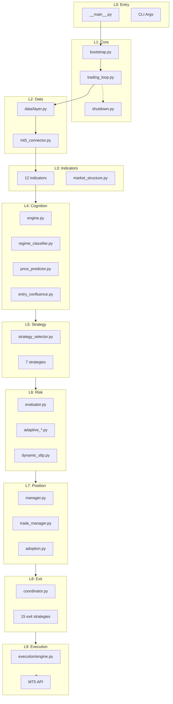

# Cthulu System Map v2.0 Design Specification

**Status:** 🎯 PLANNING PHASE  
**Created:** 2026-01-10  
**Goal:** Single source of truth for entire system architecture

---

## Vision

Create an **exhaustive, interactive HTML system map** that:
1. Maps every file, class, function, and trigger in the codebase
2. Visualizes execution frequency with heat mapping
3. Identifies dead code, race conditions, and bottlenecks
4. Serves as the definitive blueprint for development and debugging

---

## Architecture Layers (Top-Level)

```
┌─────────────────────────────────────────────────────────────────────────────┐
│                           CTHULU SYSTEM LAYERS                              │
├─────────────────────────────────────────────────────────────────────────────┤
│ L0 │ ENTRY       │ __main__.py, Cthulu.py, wizard.py, CLI               │
├────┼─────────────┼──────────────────────────────────────────────────────────┤
│ L1 │ CORE        │ bootstrap.py, trading_loop.py, shutdown.py            │
├────┼─────────────┼──────────────────────────────────────────────────────────┤
│ L2 │ STRATEGY    │ 9 strategy files, strategy_selector, selector_adapter │
├────┼─────────────┼──────────────────────────────────────────────────────────┤
│ L3 │ INDICATORS  │ 12 indicator files, market_structure.py               │
├────┼─────────────┼──────────────────────────────────────────────────────────┤
│ L4 │ COGNITION   │ 12 cognition files (ML enhancement layer)             │
├────┼─────────────┼──────────────────────────────────────────────────────────┤
│ L5 │ RISK        │ 10 risk files, evaluator, adaptive_*, dynamic_sltp    │
├────┼─────────────┼──────────────────────────────────────────────────────────┤
│ L6 │ POSITION    │ 8 position files, trade_manager, lifecycle            │
├────┼─────────────┼──────────────────────────────────────────────────────────┤
│ L7 │ EXIT        │ 16 exit strategy files, coordinator                    │
├────┼─────────────┼──────────────────────────────────────────────────────────┤
│ L8 │ EXECUTION   │ execution/engine.py, connector/mt5_connector.py       │
├────┼─────────────┼──────────────────────────────────────────────────────────┤
│ L9 │ PERSISTENCE │ database.py, training/instrumentation.py              │
├────┼─────────────┼──────────────────────────────────────────────────────────┤
│ L10│ OBSERV      │ 8 observability files, monitoring, metrics            │
├────┼─────────────┼──────────────────────────────────────────────────────────┤
│ L11│ INTEGRATIONS│ 7 integration files (Hektor, LLM, vectorDB)           │
├────┼─────────────┼──────────────────────────────────────────────────────────┤
│ L12│ NEWS        │ 9 news adapter files                                   │
├────┼─────────────┼──────────────────────────────────────────────────────────┤
│ L13│ CONFIG      │ config_schema.py, loader.py, mindsets.py, wizard.py   │
├────┼─────────────┼──────────────────────────────────────────────────────────┤
│ L14│ UTILS       │ 7 utility files (cache, circuit_breaker, retry, etc.) │
├────┼─────────────┼──────────────────────────────────────────────────────────┤
│ L15│ UI          │ desktop.py, sentinel/, gui/                            │
└────┴─────────────┴──────────────────────────────────────────────────────────┘
```

---

## File Registry (Complete Inventory)

### Core Files (~10)
| File | Purpose | Trigger | Heat |
|------|---------|---------|------|
| `core/bootstrap.py` | System init | Startup | 🔴 HOT |
| `core/trading_loop.py` | Main loop | Every poll | 🔴 HOT |
| `core/shutdown.py` | Graceful exit | Shutdown | 🟡 WARM |
| `core/strategy_factory.py` | Strategy creation | Startup | 🔵 COLD |
| `core/indicator_loader.py` | Indicator init | Startup | 🔵 COLD |
| `core/exit_loader.py` | Exit strategy init | Startup | 🔵 COLD |
| `core/exceptions.py` | Custom exceptions | On error | 🔵 COLD |

### Strategy Files (~12)
| File | Purpose | Trigger | Heat |
|------|---------|---------|------|
| `strategy/base.py` | Strategy ABC | Import | 🔵 COLD |
| `strategy/sma_crossover.py` | SMA strategy | on_bar | 🔴 HOT |
| `strategy/ema_crossover.py` | EMA strategy | on_bar | 🔴 HOT |
| `strategy/momentum_breakout.py` | Breakout | on_bar | 🔴 HOT |
| `strategy/scalping.py` | Scalping | on_bar | 🔴 HOT |
| `strategy/mean_reversion.py` | Mean rev | on_bar | 🔴 HOT |
| `strategy/trend_following.py` | Trend | on_bar | 🔴 HOT |
| `strategy/rsi_reversal.py` | RSI | on_bar | 🔴 HOT |
| `strategy/strategy_selector.py` | Dynamic select | on_bar | 🔴 HOT |
| `strategy/selector_adapter.py` | Wraps selector | on_bar | 🔴 HOT |

### Indicator Files (~12)
| File | Purpose | Trigger | Heat |
|------|---------|---------|------|
| `indicators/base.py` | Indicator ABC | Import | 🔵 COLD |
| `indicators/rsi.py` | RSI calculation | calculate() | 🔴 HOT |
| `indicators/atr.py` | ATR calculation | calculate() | 🔴 HOT |
| `indicators/adx.py` | ADX calculation | calculate() | 🔴 HOT |
| `indicators/macd.py` | MACD calculation | calculate() | 🟡 WARM |
| `indicators/bollinger.py` | Bollinger Bands | calculate() | 🟡 WARM |
| `indicators/stochastic.py` | Stochastic | calculate() | 🟡 WARM |
| `indicators/supertrend.py` | Supertrend | calculate() | 🟡 WARM |
| `indicators/vwap.py` | VWAP | calculate() | 🟡 WARM |
| `indicators/volume_indicators.py` | Volume | calculate() | 🟡 WARM |
| `indicators/market_structure.py` | BOS/ChoCH | calculate() | 🟡 WARM |

### Cognition Files (~12)
| File | Purpose | Trigger | Heat |
|------|---------|---------|------|
| `cognition/engine.py` | ML orchestrator | Every signal | 🟡 WARM |
| `cognition/regime_classifier.py` | Regime detect | Every bar | 🟡 WARM |
| `cognition/price_predictor.py` | Direction pred | Every bar | 🟡 WARM |
| `cognition/sentiment_analyzer.py` | News sentiment | Periodic | 🔵 COLD |
| `cognition/exit_oracle.py` | ML exits | Every position | 🟡 WARM |
| `cognition/entry_confluence.py` | Entry quality | Every signal | 🟡 WARM |
| `cognition/structure_detector.py` | BOS/ChoCH | Every bar | 🟡 WARM |
| `cognition/pattern_recognition.py` | Chart patterns | Hektor | ⚫ DISABLED |
| `cognition/instrumentation.py` | ML data collect | Every trade | 🟡 WARM |
| `cognition/training_logger.py` | Training data | On close | 🔵 COLD |
| `cognition/tier_optimizer.py` | Profit tiers | Analysis | 🔵 COLD |

### Risk Files (~10)
| File | Purpose | Trigger | Heat |
|------|---------|---------|------|
| `risk/manager.py` | Risk limits | Pre-trade | 🔴 HOT |
| `risk/evaluator.py` | Trade approval | Every signal | 🔴 HOT |
| `risk/adaptive_account_manager.py` | Phase sizing | On trade | 🔴 HOT |
| `risk/adaptive_drawdown.py` | DD protection | On trade | 🔴 HOT |
| `risk/dynamic_sltp.py` | SL/TP adjust | Every position | 🔴 HOT |
| `risk/equity_curve_manager.py` | Equity protect | Periodic | 🟡 WARM |
| `risk/liquidity_trap_detector.py` | Trap detect | Every signal | 🟡 WARM |
| `risk/unified_manager.py` | Unified risk | | 🔵 COLD |

### Position Files (~8)
| File | Purpose | Trigger | Heat |
|------|---------|---------|------|
| `position/manager.py` | Position track | Every loop | 🔴 HOT |
| `position/trade_manager.py` | Trade mgmt | Every loop | 🔴 HOT |
| `position/lifecycle.py` | State machine | On event | 🟡 WARM |
| `position/adoption.py` | External adopt | Every loop | 🟡 WARM |
| `position/tracker.py` | Track positions | Every loop | 🔴 HOT |
| `position/profit_scaler.py` | Partial profits | On profit | 🟡 WARM |
| `position/risk_manager.py` | Position risk | On modify | 🟡 WARM |

### Exit Files (~16)
| File | Purpose | Trigger | Heat |
|------|---------|---------|------|
| `exit/base.py` | Exit ABC | Import | 🔵 COLD |
| `exit/coordinator.py` | Exit orchestrate | Every position | 🔴 HOT |
| `exit/confluence_exit_manager.py` | Multi-ind exit | Every position | 🔴 HOT |
| `exit/trailing_stop.py` | Trailing SL | On profit | 🔴 HOT |
| `exit/profit_target.py` | TP check | Every position | 🔴 HOT |
| `exit/time_based.py` | Time exit | Every position | 🟡 WARM |
| `exit/adverse_movement.py` | Adverse exit | Every position | 🟡 WARM |
| `exit/stop_loss.py` | SL management | Every position | 🔴 HOT |
| `exit/take_profit.py` | TP management | Every position | 🔴 HOT |
| `exit/micro_account_protection.py` | Small acct | On risk | 🔵 COLD |
| `exit/adaptive_loss_curve.py` | Non-linear loss | On loss | 🟡 WARM |
| `exit/profit_scaling.py` | Scale profits | On profit | 🟡 WARM |
| `exit/multi_rrr.py` | Multi R:R | Experimental | ⚫ DISABLED |
| `exit/multi_rrr_manager.py` | Multi R:R mgr | Experimental | ⚫ DISABLED |
| `exit/exit_manager.py` | Exit mgmt | Legacy | 🔵 COLD |

### Execution Files (~2)
| File | Purpose | Trigger | Heat |
|------|---------|---------|------|
| `execution/engine.py` | Order execution | On signal | 🔴 HOT |
| `connector/mt5_connector.py` | MT5 API | Every call | 🔴 HOT |

### Persistence Files (~3)
| File | Purpose | Trigger | Heat |
|------|---------|---------|------|
| `persistence/database.py` | SQLite WAL | On write | 🔴 HOT |
| `training/instrumentation.py` | ML JSONL | On event | 🟡 WARM |
| `training/tier_optimizer.py` | Tier analysis | Manual | 🔵 COLD |

### Observability Files (~8)
| File | Purpose | Trigger | Heat |
|------|---------|---------|------|
| `observability/logger.py` | Logging | Every log | 🔴 HOT |
| `observability/metrics.py` | Metrics | Periodic | 🟡 WARM |
| `observability/prometheus.py` | Prometheus | HTTP | 🔵 COLD |
| `observability/service.py` | Obs service | Startup | 🔵 COLD |
| `observability/comprehensive_collector.py` | Full collect | Periodic | 🟡 WARM |
| `observability/integration.py` | Integration | Setup | 🔵 COLD |
| `observability/suit.py` | Obs suite | | 🔵 COLD |
| `observability/telemetry.py` | Telemetry | | 🔵 COLD |

### Monitoring Files (~4)
| File | Purpose | Trigger | Heat |
|------|---------|---------|------|
| `monitoring/trade_monitor.py` | Trade watch | Periodic | 🟡 WARM |
| `monitoring/indicator_collector.py` | Ind metrics | Periodic | 🟡 WARM |
| `monitoring/system_health_collector.py` | Health | Periodic | 🟡 WARM |
| `monitoring/service.py` | Mon service | Startup | 🔵 COLD |

### Integration Files (~7)
| File | Purpose | Trigger | Heat |
|------|---------|---------|------|
| `integrations/vector_studio.py` | Hektor client | ⚫ DISABLED |
| `integrations/embedder.py` | Embeddings | ⚫ DISABLED |
| `integrations/retriever.py` | Vector search | ⚫ DISABLED |
| `integrations/data_layer.py` | Data adapter | ⚫ DISABLED |
| `integrations/ml_exporter.py` | ML export | ⚫ DISABLED |
| `integrations/performance_analyzer.py` | Perf analysis | Manual | 🔵 COLD |

### News Files (~9)
| File | Purpose | Trigger | Heat |
|------|---------|---------|------|
| `news/base.py` | News ABC | Import | 🔵 COLD |
| `news/manager.py` | News orchestrate | Periodic | 🟡 WARM |
| `news/rss_adapter.py` | RSS feed | Fetch | 🟡 WARM |
| `news/newsapi_adapter.py` | NewsAPI | Fetch | 🔵 COLD |
| `news/fred_adapter.py` | FRED data | Fetch | 🔵 COLD |
| `news/tradingeconomics_adapter.py` | Calendar | Fetch | 🟡 WARM |
| `news/ingest.py` | News ingest | Periodic | 🟡 WARM |
| `news/cache.py` | News cache | On fetch | 🟡 WARM |

### Config Files (~4)
| File | Purpose | Trigger | Heat |
|------|---------|---------|------|
| `config_schema.py` | Pydantic schema | Startup | 🔵 COLD |
| `config/loader.py` | Config load | Startup | 🔵 COLD |
| `config/mindsets.py` | Mindset defs | Config | 🔵 COLD |
| `config/wizard.py` | Setup wizard | On request | 🔵 COLD |

### Utility Files (~7)
| File | Purpose | Trigger | Heat |
|------|---------|---------|------|
| `utils/cache.py` | Caching | On cache | 🟡 WARM |
| `utils/circuit_breaker.py` | Circuit break | On error | 🟡 WARM |
| `utils/retry.py` | Retry logic | On retry | 🟡 WARM |
| `utils/rate_limiter.py` | Rate limit | On call | 🔵 COLD |
| `utils/health_monitor.py` | Health check | Periodic | 🟡 WARM |
| `utils/indicator_calculator.py` | Ind calc | On calc | 🔴 HOT |

---

## Execution Flow Diagram



---

## Heat Map Color Scheme

| Color | Code | Frequency | Description |
|-------|------|-----------|-------------|
| 🔴 | HOT | Every loop/signal | Core path, always executed |
| 🟡 | WARM | Conditional | Frequently triggered but conditional |
| 🔵 | COLD | Rare | Startup, config, or infrequent |
| ⚫ | DISABLED | Never | Feature flagged off or dead code |
| 🟢 | NEW | Untested | Recently added, needs validation |

---

## Race Condition Matrix

| Module A | Module B | Conflict Type | Resolution |
|----------|----------|---------------|------------|
| `dynamic_sltp` | `trailing_stop` | SL modification | trailing tracks in-memory, sltp does MT5 |
| `trade_manager` | `adoption` | Position ownership | magic_number check |
| `trade_manager` | `persistence` | DB write | WAL mode + locking |
| `profit_scaler` | `exit_coordinator` | Exit decision | scaler runs before coordinator |
| `entry_confluence` | `execution` | Order timing | confluence is gate, not override |

---

## Dead Code Candidates

Files that may not be actively triggered:

1. `exit/multi_rrr.py` - Experimental, not in config
2. `exit/multi_rrr_manager.py` - Experimental
3. `integrations/*` (5 files) - Hektor disabled
4. `cognition/pattern_recognition.py` - Hektor dependent
5. `risk/unified_manager.py` - Possible unused
6. `observability/telemetry.py` - Unknown trigger
7. `sentinel/*` (6 files) - Separate GUI app

---

## Configuration Binding

| Config Key | Bound To | Effect |
|------------|----------|--------|
| `hektor.enabled` | `integrations/*`, `pattern_recognition.py` | Disables vector features |
| `strategy.type = dynamic` | `strategy_selector.py` | Enables multi-strategy |
| `mindset` | `risk/evaluator.py` | Changes position size/limits |
| `exit_strategies[].enabled` | `exit/*.py` | Enables/disables exit types |
| `cognition.enabled` | `cognition/*.py` | ML enhancement layer |
| `advisory.mode` | `execution/engine.py` | Advisory vs live trading |

---

## Next Steps to Build Full Map

1. **Generate AST scan** - Parse all .py files for class/function definitions
2. **Trace imports** - Build dependency graph
3. **Instrument logging** - Add counters to measure execution frequency
4. **Build interactive HTML** - Collapsible tree with search
5. **Add heat overlay** - Color nodes by execution count
6. **Add checklist section** - Track feature completion
7. **Add MQL5 gaps** - Cross-reference with handbook

---

*This specification defines what the exhaustive system map should contain. Implementation is a multi-session effort.*
