# System Checklist

> **Generated**: 2026-01-13T05:46:35Z  
> **Purpose**: Top-to-bottom system sweep across all modules and departments

```mermaid
flowchart TB
    subgraph GLADIUS["🎯 GLADIUS ENTERPRISE SYSTEM"]
        direction TB
        
        subgraph CORE["📦 CORE INFRASTRUCTURE"]
            direction LR
            C1["✅ gladius.sh startup script"]
            C2["✅ Health check endpoints"]
            C3["✅ Status monitoring"]
            C4["✅ Log management"]
            C5["✅ PID tracking"]
            C6["⬜ systemd service files"]
        end
        
        subgraph COGNITION["🧠 COGNITION ENGINE"]
            direction TB
            
            subgraph HEKTOR["Hektor VDB"]
                H1["✅ Native C++ build"]
                H2["✅ Python bindings (pyvdb)"]
                H3["✅ ONNX Runtime enabled"]
                H4["✅ SIMD optimization"]
                H5["✅ add_vector fix applied"]
                H6["✅ Document cache persistence"]
            end
            
            subgraph MEMORY["Memory Module"]
                M1["✅ SQLite connections"]
                M2["✅ JSON storage"]
                M3["✅ Vector store integration"]
                M4["✅ 16 native tools"]
                M5["✅ Operation history"]
                M6["✅ Sandbox workspace"]
            end
            
            subgraph LEARNING["Learning Loop"]
                L1["✅ Report ingestion"]
                L2["✅ Training data generation"]
                L3["✅ Prediction tracking"]
                L4["✅ Pattern success rates"]
                L5["✅ Benchmarking"]
                L6["⬜ Recursive self-training"]
            end
            
            subgraph TOOLCALL["Native Tool Router"]
                T1["✅ Pattern-based routing"]
                T2["✅ TF-IDF embeddings"]
                T3["✅ Tool registry (15 tools)"]
                T4["✅ OpenAI schema export"]
                T5["⬜ Tiny GGUF model"]
                T6["⬜ Fine-tuned router"]
            end
            
            subgraph SELFIMPROVE["Self-Improvement"]
                S1["✅ Proposal lifecycle"]
                S2["✅ Snapshot system"]
                S3["✅ Audit trail"]
                S4["⬜ Context refactoring"]
                S5["⬜ Discord consensus"]
                S6["⬜ Email escalation"]
            end
        end
        
        subgraph SYNDICATE["📊 SYNDICATE (Market Intelligence)"]
            direction TB
            
            subgraph DATA["Data Pipeline"]
                D1["✅ yfinance integration"]
                D2["✅ FRED adapter"]
                D3["✅ Multi-asset support"]
                D4["✅ Chart generation"]
                D5["✅ QuantEngine (RSI/MACD/ATR)"]
                D6["✅ RANSAC trendlines"]
            end
            
            subgraph ANALYSIS["AI Analysis"]
                A1["✅ Ollama integration"]
                A2["✅ llama3.2 model"]
                A3["✅ Journal generation"]
                A4["✅ Pre-market plan"]
                A5["✅ Catalyst watchlist"]
                A6["✅ Institutional matrix"]
            end
            
            subgraph PUBLISH["Publishing"]
                P1["✅ Notion sync"]
                P2["✅ Discord notifications"]
                P3["⬜ Email reports"]
                P4["⬜ Web dashboard"]
            end
            
            subgraph CORTEX["Cortex Memory"]
                X1["✅ Win/loss tracking"]
                X2["✅ Bias history"]
                X3["✅ Price tracking"]
                X4["✅ JSON persistence"]
            end
        end
        
        subgraph AUTOMATA["🤖 AUTOMATA (Enterprise Automation)"]
            direction TB
            
            subgraph AI_ENGINE["AI Engine"]
                AI1["✅ Multi-provider support"]
                AI2["✅ Ollama backend"]
                AI3["⬜ Anthropic integration"]
                AI4["⬜ OpenAI integration"]
                AI5["⬜ Cohere integration"]
            end
            
            subgraph SOCIAL["Social Media"]
                SO1["✅ Twitter/X automation"]
                SO2["✅ LinkedIn posting"]
                SO3["✅ Facebook integration"]
                SO4["✅ Instagram automation"]
                SO5["✅ YouTube integration"]
                SO6["✅ Unified scheduler"]
            end
            
            subgraph ERP["ERP Integrations"]
                E1["⬜ SAP connector"]
                E2["⬜ Odoo integration"]
                E3["⬜ NetSuite API"]
                E4["⬜ Dynamics 365"]
                E5["⬜ Salesforce sync"]
            end
            
            subgraph SCHEDULER["Smart Scheduler"]
                SC1["✅ Priority queue"]
                SC2["✅ Optimal timing"]
                SC3["✅ Auto-retry"]
                SC4["✅ Rate limiting"]
            end
            
            subgraph DASHBOARD["Dashboard"]
                DB1["✅ Flask backend"]
                DB2["✅ JWT auth"]
                DB3["⬜ React frontend build"]
                DB4["⬜ Real-time updates"]
                DB5["⬜ Grafana integration"]
            end
        end
        
        subgraph ARTY["🎨 ARTY (Autonomous Research)"]
            direction TB
            
            subgraph DISCORD_BOT["Discord Bot"]
                DC1["✅ 15 commands"]
                DC2["✅ Context-aware responses"]
                DC3["⬜ Research-driven engagement"]
                DC4["⬜ Auto-moderation"]
                DC5["⬜ Economy system"]
            end
            
            subgraph LINKEDIN["LinkedIn"]
                LI1["⬜ Automated posting"]
                LI2["⬜ Advanced scheduling"]
                LI3["⬜ Analytics tracking"]
            end
            
            subgraph INGEST["Ingest Bot"]
                IN1["✅ yfinance adapter"]
                IN2["✅ FRED adapter"]
                IN3["✅ manifest.json output"]
                IN4["✅ POST to Infra API"]
            end
            
            subgraph RESEARCH_ENGINE["Research Engine"]
                RE1["⬜ Self-guided extraction"]
                RE2["⬜ Multi-iteration cycles"]
                RE3["⬜ Cost-optimized batching"]
            end
        end
        
        subgraph INFRA["🏗️ INFRASTRUCTURE"]
            direction TB
            
            subgraph API["Infra API"]
                AP1["✅ FastAPI server"]
                AP2["✅ Markets service"]
                AP3["✅ Assets service"]
                AP4["✅ Portfolio service"]
                AP5["✅ SQLite repositories"]
                AP6["⬜ API authentication"]
            end
            
            subgraph DOCKER["Containerization"]
                DO1["✅ Dockerfile"]
                DO2["✅ docker-compose"]
                DO3["✅ Grafana container"]
                DO4["✅ Prometheus config"]
                DO5["⬜ Production hardening"]
            end
            
            subgraph MONITORING["Monitoring"]
                MO1["⬜ Prometheus metrics"]
                MO2["⬜ Grafana dashboards"]
                MO3["⬜ Alerting rules"]
                MO4["⬜ Log aggregation"]
            end
        end
        
        subgraph PROJECTS["📁 PROJECTS"]
            direction LR
            
            subgraph GOLDMAX["GoldMax"]
                G1["✅ Market analysis"]
                G2["✅ Chart generation"]
                G3["✅ Notion sync"]
            end
            
            subgraph HERALD["Herald"]
                HR1["⬜ BTCUSD training"]
                HR2["⬜ Execution rules"]
                HR3["⬜ Circuit breakers"]
            end
            
            subgraph CTHULU["Cthulu"]
                CT1["⬜ MQL5 strategies"]
                CT2["⬜ GCP deployment"]
                CT3["⬜ MT5 integration"]
            end
        end
        
        subgraph TRAINING["🎓 MODEL TRAINING"]
            direction TB
            TR1["✅ Training data generation"]
            TR2["✅ LLaMA format export"]
            TR3["⬜ LoRA fine-tuning"]
            TR4["⬜ GGUF conversion"]
            TR5["⬜ Native tool model"]
            TR6["⬜ Replace Ollama"]
        end
        
        subgraph FOOTPRINT["🌐 DIGITAL FOOTPRINT"]
            direction TB
            FP1["⬜ artifactvirtual.com"]
            FP2["⬜ /alpha subdomain"]
            FP3["⬜ /beta subdomain"]
            FP4["⬜ Blockchain tokens"]
            FP5["⬜ SBT implementation"]
        end
    end
    
    %% Connections
    CORE --> COGNITION
    COGNITION --> SYNDICATE
    COGNITION --> AUTOMATA
    SYNDICATE --> ARTY
    AUTOMATA --> ARTY
    INFRA --> SYNDICATE
    INFRA --> AUTOMATA
    PROJECTS --> SYNDICATE
    TRAINING --> COGNITION
    FOOTPRINT --> AUTOMATA
    
    %% Styling
    classDef complete fill:#22c55e,stroke:#16a34a,color:#fff
    classDef partial fill:#eab308,stroke:#ca8a04,color:#000
    classDef pending fill:#ef4444,stroke:#dc2626,color:#fff
    classDef section fill:#3b82f6,stroke:#2563eb,color:#fff
    
    class C1,C2,C3,C4,C5,H1,H2,H3,H4,H5,H6,M1,M2,M3,M4,M5,M6,L1,L2,L3,L4,L5,T1,T2,T3,T4,S1,S2,S3 complete
    class D1,D2,D3,D4,D5,D6,A1,A2,A3,A4,A5,A6,P1,X1,X2,X3,X4 complete
    class AI1,AI2,DB1,DB2,DC1,DC2,IN1,IN2,IN3,IN4,AP1,AP2,AP3,AP4,AP5,DO1,DO2,DO3,DO4 complete
    class G1,G2,G3,TR1,TR2 complete
```

---

## Summary Statistics

### By Department

| Department | Complete | Partial | Pending | Total | Progress |
|------------|----------|---------|---------|-------|----------|
| **Core Infrastructure** | 5 | 0 | 1 | 6 | 83% |
| **Cognition Engine** | 24 | 0 | 6 | 30 | 80% |
| **Syndicate** | 18 | 0 | 2 | 20 | 90% |
| **Automata** | 14 | 0 | 6 | 20 | 70% |
| **Arty** | 6 | 0 | 6 | 12 | 50% |
| **Infrastructure** | 9 | 0 | 6 | 15 | 60% |
| **Projects** | 3 | 0 | 6 | 9 | 33% |
| **Training** | 2 | 0 | 4 | 6 | 33% |
| **Digital Footprint** | 0 | 0 | 5 | 5 | 0% |
| **TOTAL** | **80** | **0** | **43** | **123** | **65%** |

---

## Priority Queue

### 🔴 Critical Path (Blocking)
1. **API Keys Configuration** - Add platform credentials to `.env`
2. **Discord Bot Activation** - Consensus system endpoint
3. **Context Refactoring** - Self-improvement coherence

### 🟡 High Priority
4. **Native Tool Model** - Fine-tuned GGUF router
5. **Grafana Dashboards** - Monitoring visibility
6. **Email Escalation** - High-impact proposals

### 🟢 Medium Priority
7. **React Frontend Build** - Dashboard completion
8. **API Authentication** - Infra security
9. **Herald Development** - BTCUSD execution

### ⚪ Future
10. **Digital Footprint** - Web presence
11. **ERP Integrations** - Enterprise connectors
12. **Replace Ollama** - Full native inference

---

## Recommended Next Steps

Based on the checklist analysis:

1. **Configure Platform Credentials** (priority)
   - Add API keys to `.env`
   - Test platform connections
   - Enable publishing for at least 1 platform

2. **Publishing Pipeline** (90% complete → target 100%)
   - ✅ Social media adapters built
   - ✅ Content formatting per platform
   - ✅ Engagement tracking
   - ⬜ API keys configuration

3. **Self-Improvement v2**
   - Context refactoring module
   - Discord consensus endpoint
   - Email escalation for high-impact

---

## Legend

| Symbol | Meaning |
|--------|---------|
| ✅ | Complete and tested |
| ⬜ | Pending implementation |
| 🟡 | Partial/In progress |

