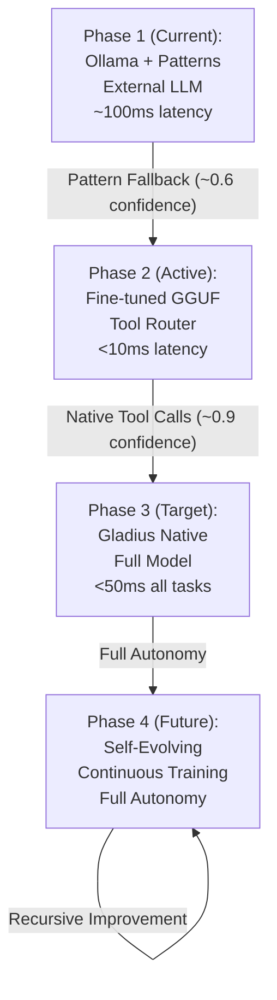
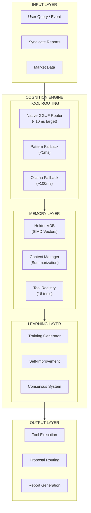
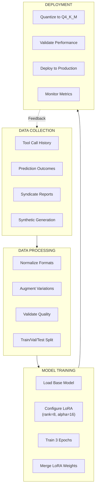
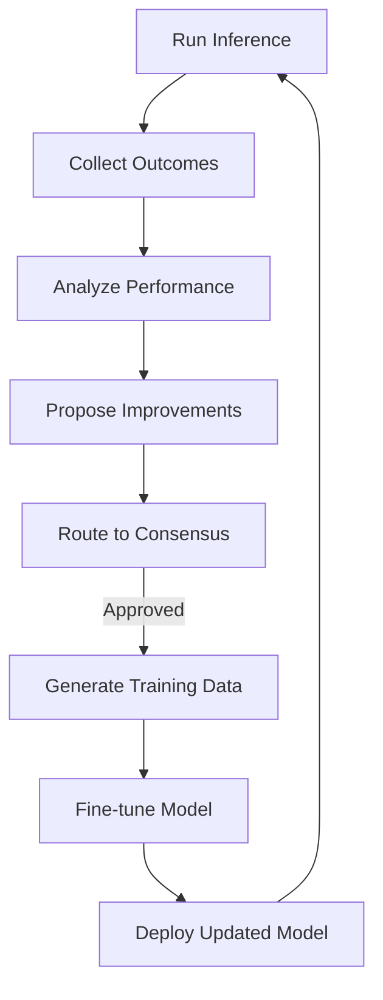
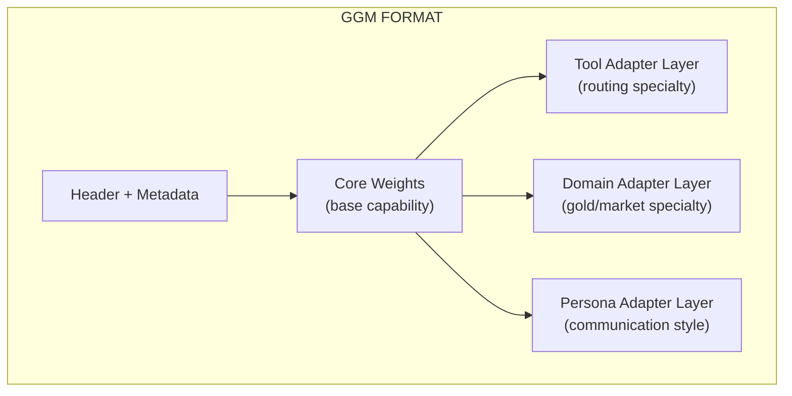

# Gladius Model Architecture

> Native AI Model Strategy: From Tool Router to Full Autonomous Intelligence

---

## Vision

Gladius aims to evolve from using external models to running **fully native AI** that:

1. Routes tools with sub-10ms latency
2. Performs reasoning without external APIs
3. Generates analysis and content autonomously
4. Learns from its own operation history
5. Self-improves through consensus-driven proposals
6. Maintains coherent context across sessions
7. Eventually replaces both tiny routers AND large language models

---

## Model Evolution Path



---

## Current System Components

### Cognition Engine Stack

| Layer | Component | Latency | Status |
|-------|-----------|---------|--------|
| **Vectors** | Hektor VDB (SIMD/HNSW) | <1ms | ✅ Production |
| **Embeddings** | TF-IDF + Hektor | <5ms | ✅ Production |
| **Tool Routing** | Pattern Matcher | <1ms | ✅ Fallback |
| **Tool Routing** | Native GGUF | <10ms | 🚧 Training |
| **Reasoning** | Ollama (llama3.2) | ~100ms | ✅ Production |
| **Consensus** | Discord/Email | <5s | ✅ Implemented |
| **Context** | Summarization | <10ms | ✅ Implemented |

### Architecture Diagram



---

## Phase 2: Native Tool Router

### Target Specifications

| Attribute | Specification |
|-----------|---------------|
| **Base Model** | SmolLM2-135M-Instruct or Qwen2.5-0.5B |
| **Quantization** | Q4_K_M (4-bit, ~100MB) |
| **Context Window** | 512 tokens (tool calls only) |
| **Target Latency** | <10ms per call |
| **Accuracy Target** | >95% tool selection |
| **Training Examples** | 1000+ (current: 155+) |

### Model Input/Output Schema

```json
{
  "input": {
    "system": "You are a tool router. Select the best tool for the query.",
    "user": "Search for gold price analysis from last week",
    "tools": ["search", "hybrid_search", "read_db", "get_context", "recall"]
  },
  "output": {
    "tool": "hybrid_search",
    "args": {
      "query": "gold price analysis last week",
      "k": 5
    },
    "confidence": 0.95,
    "reasoning": "Hybrid search combines semantic + keyword matching"
  }
}
```

### Training Data Categories

| Category | Count | Source |
|----------|-------|--------|
| database | 50+ | History + Synthetic |
| search | 50+ | History + Synthetic |
| workspace | 50+ | Synthetic |
| memory | 50+ | History + Synthetic |
| introspection | 20+ | Synthetic |
| **Total** | 155+ | Growing |

---

## Phase 3: Gladius Native (Full Model)

### Target Specifications

| Attribute | Specification |
|-----------|---------------|
| **Architecture** | Transformer-based (custom) |
| **Parameters** | 1B - 3B |
| **Context Window** | 4K - 8K tokens |
| **Quantization** | Q4_K_M (GGUF) |
| **Capabilities** | Full reasoning, analysis, generation |
| **Training** | Continuous self-improvement |

### Capability Matrix

```mermaid
flowchart TD
    subgraph PHASE1 [PHASE 1: External]
        P1_Tools["✅ Tool Routing (via Ollama)"]
        P1_Analysis["✅ Analysis (via Ollama)"]
        P1_Generation["✅ Generation (via Ollama)"]
    end

    subgraph PHASE2 [PHASE 2: Hybrid]
        P2_Tools["✅ Tool Routing (Native GGUF)"]
        P2_Analysis["⏳ Analysis (Ollama)"]
        P2_Generation["⏳ Generation (Ollama)"]
    end

    subgraph PHASE3 [PHASE 3: Native]
        P3_Tools["✅ Tool Routing (Native)"]
        P3_Analysis["✅ Analysis (Native)"]
        P3_Generation["✅ Generation (Native)"]
    end

    subgraph PHASE4 [PHASE 4: Autonomous]
        P4_Tools["✅ Self-improving Tools"]
        P4_Analysis["✅ Self-improving Analysis"]
        P4_Generation["✅ Self-improving Generation"]
        P4_Training["✅ Continuous Training"]
    end
```



---

## Training Pipeline

### Data Flow



### Training Configuration

```python
# LoRA Configuration for Tool Router
lora_config = {
    "rank": 8,           # LoRA rank (lower = faster, less quality)
    "alpha": 16,         # LoRA alpha (scaling factor)
    "dropout": 0.1,      # Regularization
    "target_modules": [  # Which layers to adapt
        "q_proj",
        "v_proj", 
        "k_proj",
        "o_proj"
    ]
}

# Training Configuration
training_config = {
    "batch_size": 8,
    "learning_rate": 2e-4,
    "epochs": 3,
    "warmup_steps": 100,
    "max_length": 512,
    "gradient_accumulation": 4
}
```

---

## LoRA vs Full Fine-tune

### Recommendation by Use Case

| Use Case | Recommendation | Rationale |
|----------|---------------|-----------|
| **Tool Router** | LoRA | Fast iteration, small adapter, sufficient quality |
| **Domain Specialization** | LoRA | Quick adaptation to new domains |
| **Base Model** | Full Fine-tune | Maximum capability for core model |
| **Continuous Learning** | LoRA | Stackable adapters for incremental learning |

### Comparison Matrix

| Aspect | LoRA | Full Fine-tune |
|--------|------|---------------|
| Training Time | Hours | Days |
| Storage | ~50MB adapter | Full model size |
| Quality | 90-95% of full | 100% |
| Iteration Speed | Very fast | Slow |
| Hardware Required | Consumer GPU | Enterprise GPU |
| Merge Capability | Yes (optional) | N/A |

---

## Model Files Structure

```
Artifact/syndicate/models/
├── base_models/
│   ├── smollm2-135m-instruct.Q4_K_M.gguf     # Tool router base
│   ├── qwen2.5-0.5b-instruct.Q4_K_M.gguf     # Alternative base
│   └── gladius-base-1b.gguf                   # Future: custom base
│
├── lora_adapters/
│   ├── tool-router-v1/
│   │   ├── adapter.safetensors
│   │   ├── config.json
│   │   └── training_metrics.json
│   └── gold-analyst-v1/
│       ├── adapter.safetensors
│       └── config.json
│
├── production/
│   ├── tool-router.gguf                       # Merged + quantized
│   ├── tool-router.patterns.json              # Pattern fallback
│   └── gladius-core.gguf                      # Future: full model
│
└── training_data/
    ├── tool_routing_train.jsonl               # Training set
    ├── tool_routing_val.jsonl                 # Validation set
    ├── combined_training.jsonl                # All data combined
    └── synthetic_examples.jsonl               # Generated examples
```

---

## Inference Integration

### NativeToolRouter Class

```python
from cognition import NativeToolRouter

# Initialize with fallback chain
router = NativeToolRouter(
    model_path="models/production/tool-router.gguf",
    patterns_path="models/production/tool-router.patterns.json",
    ollama_fallback=True
)

# Route a query
result = router.route(
    query="Find gold price predictions from this month",
    available_tools=["search", "hybrid_search", "read_db"]
)

print(f"Tool: {result.tool}")
print(f"Args: {result.args}")
print(f"Confidence: {result.confidence}")
print(f"Latency: {result.latency_ms}ms")
print(f"Source: {result.source}")  # 'native', 'pattern', or 'ollama'
```

### Fallback Chain

```mermaid
flowchart LR
    Query["Query"] --> Native["Native GGUF<br/>(if confidence > 0.7)"]
    Native -->|"< 0.7"| Pattern["Pattern Match<br/>(if confidence > 0.5)"]
    Pattern -->|"< 0.5"| Ollama["Ollama API"]
    Native -->|"≥ 0.7"| Result["Tool Result"]
    Pattern -->|"≥ 0.5"| Result
    Ollama --> Result
```



---

## Performance Benchmarks

### Current vs Target

| Metric | Current (Pattern) | Current (Ollama) | Target (Native) |
|--------|-------------------|------------------|-----------------|
| Latency | <1ms | ~100ms | <10ms |
| Accuracy | ~60% | ~85% | >95% |
| Confidence | Fixed 0.6 | Variable | Variable |
| Offline | ✅ | ❌ | ✅ |
| Resource Usage | Minimal | High | Moderate |

### Benchmark Procedure

```python
from cognition import run_benchmark

results = run_benchmark(
    router=router,
    test_file="training_data/tool_routing_val.jsonl",
    n_samples=100
)

print(f"Accuracy: {results['accuracy']:.1%}")
print(f"Avg Latency: {results['avg_latency_ms']:.2f}ms")
print(f"P95 Latency: {results['p95_latency_ms']:.2f}ms")
print(f"Native Usage: {results['native_usage']:.1%}")
```

---

## Self-Improvement Integration

### Continuous Learning Loop



### Self-Improvement Code

```python
from cognition import SelfImprovementEngine, ConsensusSystem

engine = SelfImprovementEngine()
consensus = ConsensusSystem()

# Analyze performance gaps
proposal = engine.create_proposal(
    title="Improve tool routing accuracy",
    category="accuracy",
    summary="Pattern router failing on compound queries",
    items=[
        {"description": "Add compound query patterns", "impact": "high"},
        {"description": "Generate 100 compound examples", "impact": "medium"}
    ]
)

# Route through consensus
await engine.route_to_consensus(proposal.id, consensus)

# If approved, execute improvements
if proposal.status == "approved":
    engine.begin_implementation(proposal.id)
    # ... execute improvement steps
    engine.complete_implementation(proposal.id)
```

---

## Future: GGM Format

### GGUF to GGM Evolution

Gladius will eventually move from GGUF (llama.cpp format) to a custom GGM format:

| Aspect | GGUF | GGM (Future) |
|--------|------|--------------|
| Origin | llama.cpp community | Gladius native |
| Quantization | Standard | Custom optimized |
| Layers | Fixed | Modular/composable |
| Updates | Replace whole file | Patch individual layers |
| Adapters | Separate files | Integrated |

### GGM Architecture (Planned)



---

## Roadmap

| Milestone | Target Date | Status |
|-----------|-------------|--------|
| Pattern fallback router | 2026-01-10 | ✅ Complete |
| Training data pipeline | 2026-01-12 | ✅ Complete |
| Native router integration | 2026-01-13 | ✅ Complete |
| Consensus system | 2026-01-13 | ✅ Complete |
| Context manager | 2026-01-13 | ✅ Complete |
| Download SmolLM2 base | 2026-01-15 | 🚧 In Progress |
| LoRA fine-tuning | 2026-01-20 | 📋 Planned |
| Native router deployment | 2026-01-25 | 📋 Planned |
| Gladius Native 1B base | 2026 Q2 | 📋 Planned |
| GGM format specification | 2026 Q3 | 📋 Planned |
| Full autonomous operation | 2026 Q4 | 📋 Planned |

---

*Last updated: 2026-01-13*  
*Document version: 2.0.0*

