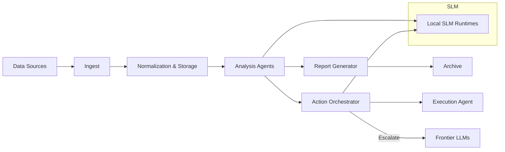

# Gladius

> Private AI Research Repository

Gladius is a purpose-built, private research workspace designed to safely host AI-driven workflows, artifacts, and operational automation. It is optimized for provable provenance, auditability, and tightly controlled access for **authorized AI agents** and the **Lead Developer**.

**Table of contents**

- [Overview](#overview)
- [Quick Start](#quick-start)
- [Core Features](#core-features)
- [Security & Access](#security--access)
- [Usage Examples](#usage-examples)
- [Operational Guide](#operational-guide)
- [Architecture (diagram)](#architecture-diagram)
- [Contributing & AI Policy](#contributing--ai-policy)
- [License & Contact](#license--contact)

---

## Overview

Gladius provides a concise, auditable environment for autonomous agents to generate, process, and store research artifacts. It emphasizes:

- Deterministic, repeatable pipelines
- Explicit attestation and provenance for AI-generated content
- Strong separation between AI-operated areas and Lead Developer private spaces

## Configuration

- Edit `config.yaml` to register agent endpoints and artifact locations.

## Core Features

- ► Secure artifact store for AI-generated files
- ► Enforced attestation model for AI contributions (`AI_ATTESTATION`)
- ► AI-only contribution policy and automated enforcement (see `CONTRIBUTING_AI.md`)
- ► Lead Developer protected workspace (`working_dir/dev_dir`) with strict no-export rules
- ► Audit logs, privilege records, and automated enforcement workflows

## Security & Access

Gladius is private and access-controlled.

- Authorized AI actors are declared in `AI_AUTHORIZED.json`. Only those actors may open PRs that change content.
- Every AI-contributed file must include an attestation (see `docs/AI_ATTESTATION_TEMPLATE.md`).
- Lead-Dev workspace (`working_dir/dev_dir`) is writeable by AI (copy-in) but not exportable or deletable without explicit human approval.

> For full details on the security model and contribution process, see [CONTRIBUTING_AI.md](../CONTRIBUTING_AI.md) and `AI_AUTHORIZED.json`.

## Operational Guide

- Preserve audit lines for every automated write: `working_dir/dev_dir/.audit/actions.log`.
- Use `NOTICE_TO_DEV` templates for deletion/export requests from AI.
- Use the `scripts/configure_gh_global.ps1` helper to set up machine-level Git/GH authentication securely.

## Architecture (diagram)

## Contributing & AI Policy

This repository is governed by an AI-first contribution model. Human contributions and direct edits are disallowed in AI-designated areas unless explicitly authorized. See:

- `CONTRIBUTING_AI.md` — policy for AI-only contributions
- `docs/AI_ATTESTATION_TEMPLATE.md` — attestation template and signing guidance
- `.github/workflows/ai-contrib-policy.yml` — CI enforcement

If you are a human contributor: open a private authorization request to `amuzetnoM` (see `CONTRIBUTING_AI.md`) before attempting to modify protected paths.

## License & Contact

This repository is private. See `docs/LICENSE.md` for license details.

Lead Developer & Contact: `amuzetnoM` on GitHub

---

*Designed for secure, auditable, machine-first research.*
