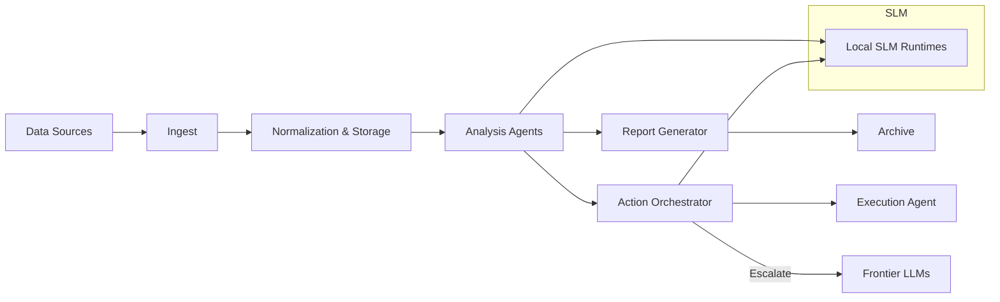

# Gladius

> **Private AI Research Repository**

Gladius is a purpose-built, private research workspace designed to host research workflows and operational automation. It emphasizes provenance, auditability, and controlled access for collaborators.

---

## Table of Contents

- [Overview](#overview)
- [Quick Start](#quick-start)
- [Core Features](#core-features)
- [Security & Access](#security--access)
- [Usage Examples](#usage-examples)
- [Operational Guide](#operational-guide)
- [Architecture (diagram)](#architecture-diagram)
- [Contributing & AI Policy](#contributing--ai-policy)
- [License & Contact](#license--contact)

---

## Overview

Gladius provides a concise, auditable environment for autonomous agents to generate, process, and store research artifacts. It emphasizes:

- **Deterministic, repeatable pipelines**
- **Explicit attestation and provenance** for AI-generated content
- **Strong separation** between AI-operated areas and Lead Developer private spaces

### Configuration

Edit `config.yaml` to register agent endpoints and artifact locations.

## Core Features

- 🔒 **Secure artifact store** for AI-generated files
- 📋 **Audit-friendly contribution model** and clear provenance practices
- 🛡️ **Lead Developer protected workspace** (`working_dir/dev_dir`) with strict no-export rules
- 📊 **Audit logs, privilege records**, and automated enforcement workflows

## Security & Access

**Gladius is a private, access-controlled repository.**

- **Lead-Dev workspace** (`working_dir/dev_dir`) is protected and subject to review for deletions or exports
- All access requires explicit authorization from the Lead Developer
- Changes are tracked and auditable through comprehensive logging

## Operational Guide

### Audit & Logging

- **Preserve audit lines** for every automated write: `working_dir/dev_dir/.audit/actions.log`
- Use `NOTICE_TO_DEV` templates for deletion/export requests from AI

### Setup & Configuration

- Use the `scripts/configure_gh_global.ps1` helper to set up machine-level Git/GH authentication securely

## Architecture (Diagram)

### System Overview

The following diagram illustrates the core data flow and agent orchestration within Gladius:

### Key Components

- **Data Sources**: External data ingestion points
- **Analysis Agents**: AI-powered analysis and processing
- **SLM Runtimes**: Local small language models for efficient processing
- **Frontier LLMs**: Advanced models for complex tasks requiring escalation

## Contributing & AI Policy

This is a **private research repository**. Contributions are by invitation only and limited to authorized collaborators. All changes must be reviewed and approved by the Lead Developer before merging.

## License & Contact

### License

This repository is **private and proprietary**. See [`docs/LICENSE.md`](LICENSE.md) for complete license details.

### Contact

- **Lead Developer**: [`amuzetnoM`](https://github.com/amuzetnoM) on GitHub
- **Repository Status**: Private Research Repository

---

*Designed for secure, auditable, machine-first research.*
