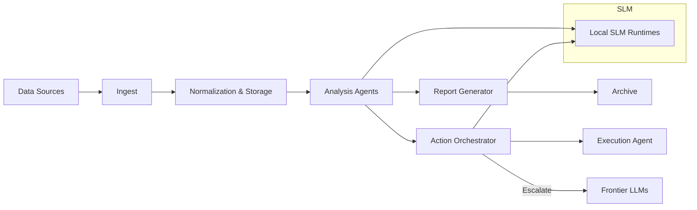

# Gladius

> Private AI Research Repository

Gladius is a purpose-built, private research workspace designed to host research workflows and operational automation. It emphasizes provenance, auditability, and controlled access for collaborators.

**Table of contents**

- [Overview](#overview)
- [Quick Start](#quick-start)
- [Core Features](#core-features)
- [Security & Access](#security--access)
- [Usage Examples](#usage-examples)
- [Operational Guide](#operational-guide)
- [Architecture (diagram)](#architecture-diagram)
- [Contributing & AI Policy](#contributing--ai-policy)
- [License & Contact](#license--contact)

---

## Overview

Gladius provides a concise, auditable environment for autonomous agents to generate, process, and store research artifacts. It emphasizes:

- Deterministic, repeatable pipelines
- Explicit attestation and provenance for AI-generated content
- Strong separation between AI-operated areas and Lead Developer private spaces

## Configuration

- Edit `config.yaml` to register agent endpoints and artifact locations.

## Core Features

- ► Secure artifact store for AI-generated files
- ► Audit-friendly contribution model and clear provenance practices
- ► Lead Developer protected workspace (`working_dir/dev_dir`) with strict no-export rules
- ► Audit logs, privilege records, and automated enforcement workflows

## Security & Access

Gladius is private and access-controlled.

- Lead-Dev workspace (`working_dir/dev_dir`) is protected and subject to review for deletions or exports.

## Operational Guide

- Preserve audit lines for every automated write: `working_dir/dev_dir/.audit/actions.log`.
- Use `NOTICE_TO_DEV` templates for deletion/export requests from AI.
- Use the `scripts/configure_gh_global.ps1` helper to set up machine-level Git/GH authentication securely.

## Architecture (diagram)

## Contributing & AI Policy

Contributions are welcome via normal pull requests. Please follow the project's standard contribution guidelines and include descriptive commit messages and tests where appropriate.

## License & Contact

This repository is private. See `docs/LICENSE.md` for license details.

Lead Developer & Contact: `amuzetnoM` on GitHub

---

*Designed for secure, auditable, machine-first research.*
