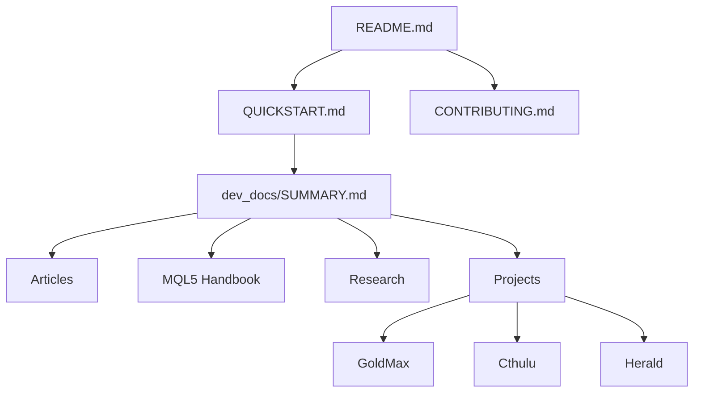
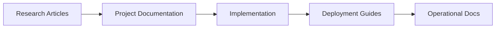

# Gladius Navigation Map

> Visual guide to navigating the repository structure

This document provides a hierarchical view of the repository structure with descriptions and links to help you find what you need.

---

## 🗺️ Repository Overview

```
gladius/
├── 📘 README.md                    Main repository documentation
├── 🚀 QUICKSTART.md               Quick start guide for new users
├── 🤝 CONTRIBUTING.md             Contributing guidelines
├── 📁 docs/                       Official documentation & license
├── 📁 dev_docs/                   Development docs & research
├── 📁 projects/                   Active projects (GoldMax, Cthulu, Herald)
├── 📁 dev_dir/                    Lead developer workspace
└── 📁 working_dir/                Active work directory
```

---

## 📘 Core Documentation

### Repository Root
| File | Purpose | Audience |
|------|---------|----------|
| [README.md](obsidian_sync/README.md) | Main repository overview | Everyone |
| [QUICKSTART.md](QUICKSTART.md) | Getting started guide | New users |
| [CONTRIBUTING.md](CONTRIBUTING.md) | Contribution guidelines | Contributors |

### Official Documentation (`docs/`)
| File | Purpose | Audience |
|------|---------|----------|
| [readme.md](docs/readme.md) | Formal project documentation | All users |
| [LICENSE.md](LICENSE.md) | Proprietary license terms | Legal/Compliance |

---

## 📁 Development Documentation (`dev_docs/`)

### Main Index
- **[SUMMARY.md](INDEX.md)** - Complete documentation table of contents

### Research Articles (`dev_docs/articles/`)
60+ articles on AI/ML systems, trading, and infrastructure

| Category | Articles | Description |
|----------|----------|-------------|
| **Philosophy** | 1-10 | Core concepts and design principles |
| **Model Ops** | 11-15 | Local SLM deployment and operations |
| **RAG & Vectors** | 16-20 | Retrieval-augmented generation |
| **Data Engineering** | 21-25 | Data pipelines and processing |
| **Trading Execution** | 26-30 | Herald agent and live trading |
| **Observability** | 31-35 | Monitoring and incident response |
| **Compliance** | 36-40 | Legal and regulatory considerations |
| **Security** | 41-45 | System hardening and threat models |
| **DevOps** | 46-50 | CI/CD and testing practices |
| **Advanced** | 51-58 | Specialized topics and workflows |

**👉 [Browse Articles](dev_docs/articles/)**  
**👉 [Article Index](00_article_index.md)**

### MQL5 Handbook (`dev_docs/mql5_handbook/`)
Trading strategy implementation documentation

| Phase | Focus | Description |
|-------|-------|-------------|
| **Phase 1** | Foundations | Classic strategies and basic implementations |
| **Phase 2** | Risk Management | Position sizing, stops, exits |
| **Phase 3** | Advanced | ORB, linear regression, price action |

**👉 [MQL5 Handbook](obsidian_sync/dev_docs/mql5_handbook/README.md)**  
**👉 [Strategy Manifest](obsidian_sync/dev_docs/mql5_handbook/manifest.md)**

### Research Materials (`dev_docs/research/`)
Technical research and algorithms

| Document | Topic | Audience |
|----------|-------|----------|
| [hnsw_algorithm.md](hnsw_algorithm.md) | HNSW vector search | ML Engineers |
| [vector_space_theory.md](vector_space_theory.md) | Vector mathematics | Researchers |
| [papers/](dev_docs/research/papers/) | Academic papers | Researchers |
| [references/](dev_docs/research/references/) | Reference materials | All |

**👉 [Research Directory](dev_docs/research/)**

### Infrastructure (`dev_docs/virtual_machine/`)
VM setup and deployment documentation

| Document | Purpose | Audience |
|----------|---------|----------|
| [vm_access.md](vm_access.md) | VM access guide | Operators |
| [ssh_setup_guide.md](ssh_setup_guide.md) | SSH configuration | Operators |
| [DEV_SECRETS.md](DEV_SECRETS.md) | Credentials (private) | Authorized only |

**👉 [VM Documentation](dev_docs/virtual_machine/)**

### Other Directories
| Directory | Contents | Purpose |
|-----------|----------|---------|
| `_build/` | Cthulu & Herald builds | Project build documentation |
| `docs/` | Architecture & technical | System architecture specs |
| `github/` | Release management | Release processes |
| `notes/` | Research notes | System reports and notes |
| `scripts/` | Utility scripts | Deployment & automation |

---

## 🚀 Projects (`projects/`)

### Active Projects
| Project | Status | Description | Key Files |
|---------|--------|-------------|-----------|
| **[GoldMax](projects/goldmax/)** | ✅ Active | Market analysis system | [README](projects/goldmax/README.md), [Architecture](projects/goldmax/Architecture.md) |
| **[Cthulu](projects/cthulu/)** | 🚧 Deployed | MQL5 trading system | [README](projects/cthulu/README.md), [Review](projects/cthulu/review/) |
| **[Herald](projects/herald/)** | 🚧 In Dev | Execution agent | [README](projects/herald/README.md), [Config](projects/herald/config/) |

**👉 [Projects Overview](projects/README.md)**

### GoldMax - Market Analysis
```
projects/goldmax/
├── README.md              Project overview
├── Architecture.md        System design
├── Blueprint.md           Implementation plan
├── Foundation.md          Core principles
├── Thesis.md             Philosophy
└── argmax-syndrome_article.md
```

**Main Documentation**: [dev_docs/broadcast.md](broadcast.md)

### Cthulu - MQL5 Trading
```
projects/cthulu/
├── README.md                     Project overview
├── SUBPROGRAM_RECOMMENDATIONS.md Module recommendations
├── gcp_accesscontrol.md         GCP setup
└── review/                      System review docs
    ├── EXECUTIVE_SUMMARY.md
    ├── COMPREHENSIVE_SYSTEM_REVIEW.md
    └── ...
```

**Current Status**: [working_dir/cthulu_node_AC.md](cthulu_node_AC.md)

### Herald - Execution Agent
```
projects/herald/
├── README.md         Project overview
└── config/
    └── wizard.py     Configuration wizard
```

---

## 📊 Quick Reference Tables

### By Role

| Role | Start Here | Key Directories |
|------|-----------|-----------------|
| **New User** | [QUICKSTART.md](QUICKSTART.md) | Everything |
| **AI/ML Engineer** | [Articles 1-20](dev_docs/articles/) | `articles/`, `research/` |
| **Trader** | [MQL5 Handbook](dev_docs/mql5_handbook/) | `mql5_handbook/`, `projects/` |
| **DevOps** | [VM Docs](dev_docs/virtual_machine/) | `virtual_machine/`, `scripts/` |
| **Compliance** | [Articles 36-40](dev_docs/articles/) | `articles/` |
| **Researcher** | [Research](dev_docs/research/) | `research/`, `articles/` |

### By Task

| Task | Documentation | Location |
|------|--------------|----------|
| **Access VM** | [SSH Setup](ssh_setup_guide.md) | `virtual_machine/` |
| **Deploy System** | [VM Access](vm_access.md) | `virtual_machine/`, `scripts/` |
| **Add Strategy** | [MQL5 Handbook](dev_docs/mql5_handbook/) | `mql5_handbook/` |
| **Write Article** | [Contributing](CONTRIBUTING.md) | `articles/` |
| **Configure Herald** | [Herald Config](projects/herald/config/wizard.py) | `projects/herald/` |
| **Review GoldMax** | [Broadcast](broadcast.md) | `projects/goldmax/` |

### By Topic

| Topic | Primary Location | Related |
|-------|-----------------|---------|
| **AI/ML Systems** | [Articles](dev_docs/articles/) | [Research](dev_docs/research/) |
| **Trading Strategies** | [MQL5 Handbook](dev_docs/mql5_handbook/) | [Projects](projects/) |
| **System Architecture** | [Docs](dev_docs/docs/) | [VM](dev_docs/virtual_machine/) |
| **Vector Search** | [Research](dev_docs/research/) | [Articles 16-20](dev_docs/articles/) |
| **Security** | [Articles 41-45](dev_docs/articles/) | [VM](dev_docs/virtual_machine/) |
| **Compliance** | [Articles 36-40](dev_docs/articles/) | [License](LICENSE.md) |

---

## 🔍 Finding What You Need

### Search Strategies

#### 1. By File Type
```bash
# Find all markdown files
find . -name "*.md"

# Find Python scripts
find . -name "*.py"

# Find shell scripts
find . -name "*.sh"
```

#### 2. By Content
```bash
# Search for a term in all files
grep -r "search term" .

# Search in markdown files only
grep -r "search term" --include="*.md" .
```

#### 3. By Index
- **[Documentation Index](INDEX.md)** - Complete table of contents
- **[Article Index](00_article_index.md)** - All articles listed
- **[MQL5 Manifest](obsidian_sync/dev_docs/mql5_handbook/manifest.md)** - Strategy catalog

---

## 📚 Document Cross-References

### Documentation Relationships


### Content Flow


---

## 🎯 Common Navigation Paths

### Learn About the System
1. [README.md](obsidian_sync/README.md) - Repository overview
2. [QUICKSTART.md](QUICKSTART.md) - Getting started
3. [dev_docs/broadcast.md](broadcast.md) - GoldMax system overview
4. [Projects](projects/README.md) - Active projects

### Implement a Trading Strategy
1. [MQL5 Handbook](obsidian_sync/dev_docs/mql5_handbook/README.md) - Strategy guide
2. [Phase 3 Articles](dev_docs/mql5_handbook/phase3/) - Advanced strategies
3. [Cthulu Project](projects/cthulu/) - Implementation platform
4. [VM Setup](dev_docs/virtual_machine/) - Deployment environment

### Research AI/ML Systems
1. [Article Index](00_article_index.md) - Browse articles
2. [Research Directory](dev_docs/research/) - Technical papers
3. [Vector Theory](vector_space_theory.md) - Foundations
4. [HNSW Algorithm](hnsw_algorithm.md) - Implementation

### Deploy Infrastructure
1. [VM Access Guide](vm_access.md) - Access setup
2. [SSH Setup](ssh_setup_guide.md) - SSH config
3. [Scripts Directory](dev_docs/scripts/) - Automation scripts
4. [Architecture Docs](architectural_mandate.md) - System design

---

## 📞 Need Help?

- **Can't find something?** Check the [Documentation Index](INDEX.md)
- **Lost in the structure?** Start with [QUICKSTART.md](QUICKSTART.md)
- **Need access?** Contact [`amuzetnoM`](https://github.com/amuzetnoM)
- **Want to contribute?** Read [CONTRIBUTING.md](CONTRIBUTING.md)

---

*This navigation map is updated as the repository evolves. Last updated: 2026-01-06*
