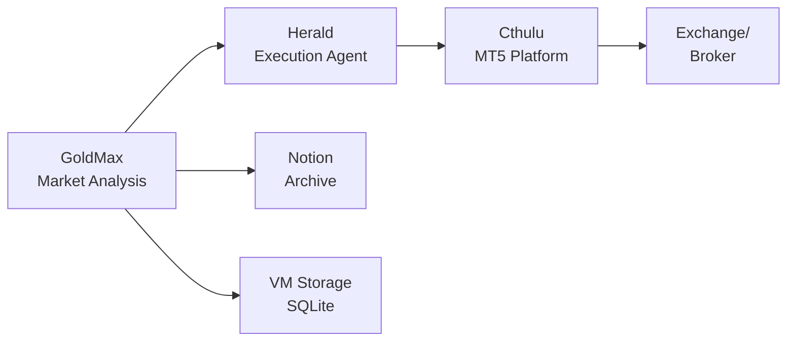

# Projects

> Active trading systems and research projects

This directory contains the main projects developed and documented in the Gladius repository.

---

## 🚀 Active Projects

### 1. GoldMax - Market Analysis System
**Status**: ✅ Active Development

A continuous, evidence-driven market memory system that records and preserves market state for disciplined decision-making.

- **Directory**: [`goldmax/`](goldmax/)
- **Main Documentation**: [dev_docs/broadcast.md](broadcast.md)
- **Purpose**: Unattended market analysis with automated reporting
- **Output**: Daily charts, reports, and Notion journal entries
- **Infrastructure**: Dedicated VM with persistent storage

**Key Features:**
- 6 charts per run (price structure, volatility, range, risk profile, etc.)
- Written reports describing market state
- Notion integration for persistent memory
- Deterministic, reproducible analysis

👉 **[Read More](projects/goldmax/README.md)**

---

### 2. Cthulu - MQL5 Trading System
**Status**: 🚧 Deployed, Configuration In Progress

MQL5/MetaTrader 5 trading system with GCP VM deployment.

- **Directory**: [`cthulu/`](cthulu/)
- **Platform**: MetaTrader 5 (MQL5)
- **Infrastructure**: GCP n2-standard-2 VM (Ubuntu + Windows 11)
- **Purpose**: Algorithmic trading strategy execution
- **Integration**: Works with GoldMax and Herald

**Key Features:**
- VM-based persistent runtime
- MetaTrader 5 platform integration
- Remote development with VS Code Server
- Comprehensive system review documentation

👉 **[Read More](projects/cthulu/README.md)**

---

### 3. Herald - Execution Agent
**Status**: 🚧 In Development

Automated trading execution agent trained on BTCUSD.

- **Directory**: [`herald/`](herald/)
- **Training**: BTCUSD focused
- **Purpose**: Automated trade execution based on GoldMax analysis
- **Deployment**: VM or executor container
- **Safety**: Built with circuit breakers, position limits, and human oversight

**Key Features:**
- Integration with GoldMax market analysis
- Configurable risk parameters
- Dry run and simulation modes
- Comprehensive execution logging

👉 **[Read More](projects/herald/README.md)**

---

## 🔄 Project Relationships

### Integration Flow
1. **GoldMax** continuously analyzes market data and generates reports
2. **Herald** makes execution decisions based on GoldMax analysis
3. **Cthulu** executes trades via MetaTrader 5 platform
4. All operations logged and archived for audit

---

## 📚 Supporting Documentation

### MQL5 Development
- [MQL5 Handbook](obsidian_sync/dev_docs/mql5_handbook/README.md) - Strategy development guide
- 60+ articles on trading strategies and implementation

### Research Articles
- [Article Index](00_article_index.md) - Complete listing
- 60+ articles on AI/ML systems, trading, compliance, and infrastructure

### Infrastructure
- [Virtual Machine Documentation](../dev_docs/virtual_machine/) - VM setup and access
- [Scripts & Utilities](../dev_docs/scripts/) - Deployment automation
- [Architecture Documentation](architectural_mandate.md)

---

## 🎯 Design Philosophy

All projects follow these core principles:

### 1. Unattended Operation
Systems run continuously without human intervention, removing dependency on attention and mood.

### 2. Evidence Over Narrative
Focus on reproducible evidence and deterministic behavior, not predictions or opinions.

### 3. Persistent Memory
Nothing is overwritten. Every run, every decision, every output is preserved for audit.

### 4. Safety First
Built-in circuit breakers, position limits, dry run modes, and human oversight mechanisms.

### 5. Auditability
Comprehensive logging, traceability, and compliance with financial regulations.

---

## 🔒 Security & Access

- **Private Repository**: All projects are part of a private research repository
- **Access Control**: Restricted to authorized collaborators
- **Secrets Management**: Credentials stored securely (see `dev_docs/virtual_machine/DEV_SECRETS.md`)
- **Audit Trail**: All operations logged and tracked

---

## 🛠️ Development Workflow

### Local Development
1. Clone repository
2. Review project-specific README
3. Follow setup instructions in documentation
4. Use provided scripts for automation

### VM Deployment
1. Access GCP VM via SSH (see [ssh_setup_guide.md](ssh_setup_guide.md))
2. Deploy using startup scripts
3. Configure project-specific settings
4. Monitor and maintain via remote access

### Testing
- Use dry run modes for safe testing
- Replay historical data for validation
- Integration tests before live deployment
- Continuous monitoring in production

---

## 📈 Roadmap

### Near Term
- Complete Herald BTCUSD training
- Finalize Cthulu MT5 configuration
- Improve GoldMax SLM inference latency
- Formalize Notion schemas and runbook automation

### Future
- Multi-asset support for Herald
- Advanced execution algorithms (TWAP, VWAP)
- Enhanced risk management features
- Real-time performance analytics dashboard

---

## ⚠️ Disclaimer

**These are experimental research projects.**

- Not financial advice
- Use at your own risk
- Thoroughly test before any live deployment
- Ensure compliance with all applicable regulations
- Maintain appropriate human oversight

---

## 📞 Contact

For questions or access requests, contact: [`amuzetnoM`](https://github.com/amuzetnoM)

---

*Part of the Gladius research repository*
