# Cthulu Model Architecture Proposal

**Status:** 🔮 FUTURE VISION - NOT IN SCOPE  
**Created:** 2026-01-10  
**Classification:** Design Speculation / Research Notes

---

## Overview

This document explores the concept of transforming Cthulu from a **rule-based autonomous trading system** into a **self-contained GGUF model** (or similar architecture) that embodies the system's decision-making capabilities in a single, deployable neural artifact.

The vision: A real-time, autonomous trading intelligence that processes incoming market data, news, and system state to generate trading decisions—all within a compact, quantized model that can run locally without external dependencies.

---

## Why This Feels AGI-Adjacent

Cthulu already exhibits several characteristics that align with autonomous intelligence:

| Characteristic | Current Implementation | Model-Native Vision |
|----------------|----------------------|---------------------|
| **Multi-modal input** | OHLCV, indicators, news, calendar | Unified embedding space |
| **Context awareness** | Market regime detection, session tracking | Transformer attention over context window |
| **Adaptive behavior** | Dynamic strategy selection | Learned policy network |
| **Risk-aware decisions** | Rule-based risk manager | Embedded risk priors in weights |
| **Continuous operation** | 24/7 trading loop | Streaming inference |
| **Self-correction** | Exit strategies, drawdown protection | Learned loss aversion |

---

## Proposed Architecture

### Option A: GGUF Trading Model (Quantized Transformer)

### Option B: State Space Model (Mamba-style)

For real-time streaming with O(1) inference per timestep:

```mermaid
flowchart LR
    subgraph INPUT["Input Stream"]
        BAR["bar_t"]
        NEWST["news_t"]
        STATET["state_t"]
    end
    
    SSM["SSM Block<br/>(Selective State Space)<br/>━━━━━━━━━━━━━<br/>Recurrent State<br/>No Attention Needed"]
    
    POLICY["Action Policy<br/>━━━━━━━━━━━━━<br/>BUY/SELL/HOLD<br/>+ Parameters"]
    
    INPUT --> SSM
    SSM --> POLICY
    
    style SSM fill:#e74c3c,stroke:#c0392b,color:#fff
    style POLICY fill:#27ae60,stroke:#1e8449,color:#fff
```

### Option C: Mixture of Experts (MoE) Trading Model

Route to specialized sub-models based on detected regime:

```mermaid
flowchart TB
    INPUT["Market Data Input"]
    
    ROUTER["🎯 Router<br/>(Regime Detection)<br/>━━━━━━━━━━━━━<br/>ADX + Volatility Analysis"]
    
    subgraph EXPERTS["Specialized Experts"]
        TREND["📈 Trending Expert<br/>Trend-Following<br/>EMA/SMA Crossover"]
        RANGE["↔️ Ranging Expert<br/>Mean Reversion<br/>Bollinger/RSI"]
        VOLATILE["⚡ Volatile Expert<br/>Scalping<br/>Fast EMA + Momentum"]
    end
    
    OUTPUT["Combined Output<br/>(Weighted by Router)"]
    
    INPUT --> ROUTER
    ROUTER -->|"Trending Market"| TREND
    ROUTER -->|"Ranging Market"| RANGE
    ROUTER -->|"Volatile Market"| VOLATILE
    TREND --> OUTPUT
    RANGE --> OUTPUT
    VOLATILE --> OUTPUT
    
    style ROUTER fill:#f39c12,stroke:#d68910,color:#000
    style EXPERTS fill:#3498db,stroke:#2980b9,color:#fff
```

---

## Training Pipeline

---

## Input Tokenization

---

## Inference Pipeline

### Latency Targets
- Tokenization: <1ms
- Model inference: <10ms (quantized, GPU) / <100ms (CPU)
- End-to-end decision: <50ms

---

## Model Variants

| Variant | Params | Quantization | Use Case |
|---------|--------|--------------|----------|
| cthulu-nano | 125M | Q4_K_M | Edge/mobile, ultra-fast |
| cthulu-small | 350M | Q5_K_M | Local CPU inference |
| cthulu-base | 1.3B | Q4_K_S | Balanced performance |
| cthulu-large | 7B | Q4_0 | Maximum capability |

---

## Key Challenges

---

## Integration with Current Cthulu

The `RiskManager` and `ExecutionEngine` remain as hard-coded safety layers.

---

## Research Questions

1. **Tokenization**: How to best encode continuous market data for transformer input?
2. **Sequence length**: How much history should the model see? (1 hour? 1 day? 1 week?)
3. **Multi-asset**: Single model for all symbols or symbol-specific fine-tuning?
4. **Real-time adaptation**: Online learning during live trading?
5. **Uncertainty quantification**: Can the model express confidence in its decisions?

---

## Next Steps (When In Scope)

- [ ] Design tokenizer for market data + indicators
- [ ] Collect and format training dataset from Cthulu history
- [ ] Prototype small transformer on historical decisions
- [ ] Evaluate against rule-based baseline
- [ ] Iterate on architecture based on results

---

## References

- Decision Transformer (Chen et al., 2021)
- Mamba: Linear-Time Sequence Modeling (Gu & Dao, 2023)
- GGUF format specification (llama.cpp)
- Alpaca/FinGPT financial LLM approaches
- Reinforcement Learning for Trading (various)

---

*This document is a thought experiment. Implementation is NOT in current scope.*
