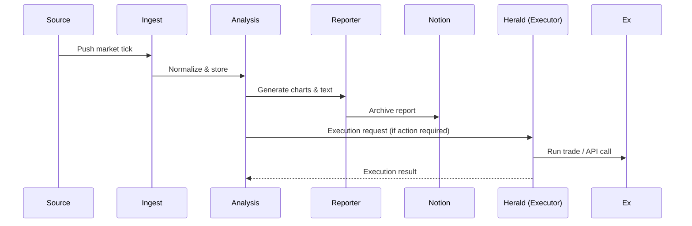

# The Mandate

> Building Resilient and Compliant Autonomy for Financial Services

**Executive TL;DR:** Gold Standard's architectural mandate balances high-performance autonomy with strict controls for safety, auditability, and regulatory compliance. Adopt a hybrid, SLM-first deployment for deterministic tasks, reserve frontier LLMs for escalation, and enforce human-in-the-loop gates and idempotent state machines for any high-risk financial action.

**Quick actions:** see `docs/mandate/ROADMAP.md` for owners, deadlines, and acceptance criteria.

## Architecture Diagrams

### Component Diagram

**Repo mappings:**

| Area | Relevant files / directories |
|---|---|
| Notion publishing & sync | `src/notion_publisher.py`, `scripts/notion_*`, `docs/` |
| Pipeline audit & cleanup | `scripts/pipeline_audit.py`, `tools/report_summary.py`, `db_manager.py` |
| Task execution / executor | `scripts/executor_daemon.py`, `run.py`, `docker-compose.yml` |
| SLM and LLM integration | `scripts/local_llm.py`, `scripts/metrics_server.py`, `docs/LLM_PROVIDERS.md` |
| Docker & CI | `Dockerfile`, `.github/workflows/*`, `docker/` |
| Observability | `docker/`, `scripts/metrics_server.py`, `docs/` |

(Use the table above to quickly find implementations and update work items.)

### Data Flow (Sequence)

```mermaid
graph TD
  A[Data Sources] -->|market data| B[Ingest + Normalizer]
  B --> C[Storage (SQLite / Data Volume)]
  C --> D[Analysis Agent]
  D --> E[Report Generator]
  E --> F[Notion Archive]
  D --> G[Action Orchestrator]
  G --> H[Execution Agent (Herald)]
  G --> I[External APIs / Exchanges]
  subgraph Edge
    J[SLM Runtime (local)]
    J --> D
    J --> G
  end
  subgraph Cloud
    K[LLM Escalation (Frontier LLMs)]
    G -->|escalate| K
  end
```

### Data Flow (Sequence)



(Exportable SVGs and PNGs can be generated from these Mermaid diagrams as part of the docs build.)

## I. Executive Synthesis: The Architectural Mandate for Resilient Fintech AI

### 1.1. The AI-Fintech Execution Trilemma: Autonomy, Latency, and Regulatory Compliance

The adoption of artificial intelligence in financial services is evolving rapidly, moving beyond static data analysis toward truly autonomous, agentic systems capable of multi-step decision-making and execution. This architectural shift promises substantial productivity leaps for financial institutions. However, integrating this level of autonomy into high-stakes environments like fintech necessitates resolving a complex "Execution Trilemma": the simultaneous satisfaction of operational speed (latency), functional autonomy, and stringent regulatory compliance.

The competitive imperative in finance demands extremely low latency. Yet, the increasing complexity of multi-agent orchestration introduces substantial operational risk. Autonomous AI systems are identified by a significant proportion of industry participants (44%) as the primary source of AI-related systemic risk. This heightened risk profile arises from the systems' increasing ability to autonomously pursue goals through multi-step decision-making and specialized tool utilization. Uncontrolled autonomy risks amplifying market volatility and creating correlated behaviors, a threat that must be countered by strong architectural controls.

The architectural mandate, therefore, requires that the competitive advantage of AI is balanced against the absolute requirement for controlled autonomy. This balance necessitates strong risk governance processes, including mandatory "human-in-the-loop" standards for decisions categorized as high-risk. It is established that as agent systems transition from simple, deterministic chains to complex, autonomous coordination structures, the associated regulatory burden increases significantly. This is a crucial design-time constraint, not a post-deployment feature, driven by frameworks like the EU AI Act, which will likely categorize certain financial applications (e.g., evaluating creditworthiness) as "high-risk". Consequently, architectural failures in governance translate directly into regulatory liability and potential systemic financial instability.

Bottom line: design-time governance and enforced human oversight are non-negotiable for any production agentic system.

### 1.2. Key Architectural Shifts: Agentic AI, Hybrid Inference, and the Compliance Imperative

Despite widespread industry enthusiasm—with 38% of organizations piloting agentic solutions—only 11% are actively using these systems in production. This "agentic reality gap" is largely due to fundamental infrastructure obstacles. Legacy enterprise systems were not designed for the demands of agentic interactions, often lacking the real-time execution capability, modular architectures, and modern APIs required for seamless integration. Experts forecast that the inability of legacy systems to support modern AI execution demands will contribute to the failure of over 40% of agentic AI projects by 2027.

To mitigate these structural limitations, the industry is shifting to a hybrid inference model, often termed the SLM (Small Language Model)-first paradigm. This pivot is justified by three non-negotiable enterprise outcomes: speed, data privacy (sovereignty), and favorable unit economics. The architectural principle is straightforward: decompose complex work into narrow, specialized steps. Delegate deterministic tasks to traditional code and the bulk of the remainder to locally running, specialized SLMs. Frontier Large Language Models (LLMs) are reserved strictly as an escalation path for the few genuinely complex or indeterminate cases.

This SLM-first approach provides the definitive solution to the latency constraint. Locally run SLMs eliminate network round-trip and queuing time, enabling sub-100ms budgets critical for real-time financial interaction, while on-premise deployments provide strong data sovereignty guarantees. Bottom line: SLM-first gives the best practical trade-off for speed, privacy, and cost in regulated environments.

## II. Designing and Orchestrating Multi-LLM Agentic Systems

### 2.1. Agentic Design Patterns for Financial Workflows

Effective financial intelligence relies on orchestrating LLM calls, data retrieval, and external actions. While simple, deterministic chains suffice for basic tasks (like basic Retrieval Augmented Generation), complex, cross-functional financial domains necessitate multi-agent architectures composed of multiple specialized "expert" agents.

However, this specialization comes at a cost: coordination complexity. Managing interactions between a growing number of agents becomes exponentially complex. This inherent difficulty in predicting and auditing multi-agent interactions conflicts directly with the financial industry’s requirement for deterministic, auditable outcomes. Therefore, the architectural effort must focus heavily on ensuring robust state management and guaranteed log state machines that capture the exact decision path taken by the collective. This level of verification satisfies future audit requirements that demand proof and explainability for every autonomous action. This necessity makes rigorous testing—specifically integration testing for agent interaction patterns and end-to-end workflow validation—a mandatory component of system deployment.

### 2.2. Functional Breakdown of a Financial Agent Collective

A robust, production-grade financial agent system must comprise specialized agents, each dedicated to a critical function, as seen in advanced multi-agent financial systems:

- **Data Collection Agent**: Responsible for gathering and ingesting market data, news feeds, and other real-time information.
- **Analysis Agent**: Performs quantitative and qualitative evaluations, including technical analysis, fundamental analysis, and sentiment analysis. The Analysis Agent may leverage multiple models and techniques, such as chain-of-thought reasoning and technical indicators.
- **Risk Assessment Agent**: Dynamically evaluates potential risks associated with proposed strategies or current market exposures.
- **Strategy Agent**: Develops and refines trading strategies based on outputs from the analysis and risk agents.
- **Execution Agent**: Implements trades and other financial actions, requiring interfaces with exchange APIs and precise, low-latency control.

### 2.3. Tool-Calling and External Service Integration: Engineering the Action Layer

Tool calling provides the fundamental mechanism for agents to interact with external data sources, services, and arbitrary logic, enabling the LLM to execute actions in the real world. In finance, this includes live data lookups (e.g., vector index retrieval, SQL queries) and transactional actions (e.g., implementing trades, updating records).

Integrating this action layer is complicated by existing enterprise technology. Legacy systems often lack the modern APIs, real-time execution capabilities, and modular design required for seamless agentic integration. Critical external services that must be integrated with robust interfaces include execution APIs, low-latency data feeds, and internal code execution environments (such as Python interpreters).

Given the high-stakes nature of financial execution, production deployment mandates comprehensive testing strategies. This includes unit testing for individual agent functionality, integration testing to validate agent interaction patterns, and performance testing to benchmark latency and throughput metrics under load. The architectural effort must thus prioritize developing and hardening these interfaces and state management capabilities, as operational stability is paramount.

## III. Low-Latency Inference and Hybrid Deployment Strategies

### 3.1. The SLM-First Paradigm: Justifying the Shift to Edge AI

The decision to adopt an SLM-first, hybrid architecture is driven by the realization that speed, privacy, and cost are inextricably linked; this approach provides the architectural answer to simultaneously meeting all three. The latency constraint alone necessitates the shift. Achieving the necessary sub-100ms response times for real-time financial execution requires eliminating the hundreds of milliseconds added by network round-trip and queuing time inherent in cloud services. Localized SLMs remove this network tax.

Furthermore, for regulated and strategic workloads, technical guarantees are required to ensure data sovereignty. High-security applications, such as fraud detection and proprietary financial modeling, necessitate that sensitive customer and market data remains inside the perimeter, making air-gapped or on-premise deployment of SLMs mandatory to mitigate risks of external exposure and data leakage.

Economically, SLMs have closed the capability gap with frontier LLMs, enabling enterprises to automate processes at scale with intelligence that costs pennies per thousand tokens. This capability allows AI to transition from being a costly analytical tool to a cost-effective operational component. Consequently, the primary architectural goal becomes minimizing the number of times the system must escalate processing to the high-cost, high-latency frontier model pathway.

### 3.2. Technical Deep Dive: Local LLM Runtime Environments

Deploying SLMs efficiently requires specialized software built for consumer-grade or specialized edge hardware. These solutions typically rely on optimized C++ implementations that enable faster inference and lower memory usage compared to original Python versions.

- **Llama.cpp**: As a low-level C++ inference engine, llama.cpp provides optimal CPU performance and extensive customization. It supports research, embedded, and production deployment scenarios, offering superior memory efficiency, although it demands familiarity with command-line setups.
- **Ollama**: Built upon llama.cpp, Ollama operates as a high-level LLM runtime, simplifying the deployment process significantly. It offers a one-click installer and a built-in REST API, making it ideal for application developers and rapid experimentation while preserving local control and privacy.

For environments like quant finance, where maximal customization, control, and computational efficiency are essential competitive differentiators, the superior memory efficiency and low-level control offered by llama.cpp often justify the added complexity compared to the ease of use provided by Ollama.

### 3.3. Quantization and Hardware Requirements for Financial Analytics

The practicality of local deployment hinges entirely on effective model quantization, which reduces model size and VRAM requirements while retaining performance. The Q4_K_M format is widely accepted as the standard for memory efficiency on consumer hardware.

Hardware selection must align with model scale:

- **Analyst Workstations**: Models in the 7B–13B parameter range can run effectively on professional consumer GPUs (e.g., RTX 4070) requiring approximately 9–12GB of VRAM using Q4/Q5 quantization.
- **High-Density Inference**: Larger models (e.g., 70B parameters) require significant VRAM (40GB+) and data center-grade GPUs (RTX 6000, A100). Efficient inference generally requires a minimum of 8–16GB of VRAM.

Empirical performance tests confirm the viability of this strategy, showing an 8B model (Q4_K_M) achieving a time-to-first-token of 0.103 seconds and sustained generation rates of over 42 tokens per second on mid-range consumer hardware. This demonstrates that local SLMs can meet the speed requirements for real-time financial analysis.

### 3.4. Semantic and Quota-Based Routing: Intelligent Compute Allocation

The evolution of LLM infrastructure emphasizes selective, intelligent compute use over monolithic models. Modern architectures rely on automatic routing policies to ensure per-token efficiency and latency control.

This task-aware compute allocation involves establishing clear routing logic:

- **Light Queries**: Trivial requests or simple data lookups are routed to lightweight, fast paths, typically served by local SLMs, ensuring efficiency and low latency.
- **Complex Reasoning**: Multi-step or high-value tasks, which require complex reasoning (e.g., Chain-of-Thought), are routed to larger, reasoning-enabled models. These paths may incorporate explicit thinking budgets or quotas to manage and cap the resource consumption of the reasoning process.

The vLLM Semantic Router is an example of a technology that implements this intent-aware routing layer, classifying queries semantically to route them appropriately. This balances the need for high accuracy on complex tasks with the requirement for computational efficiency on routine tasks.

**Hybrid LLM Deployment Strategy Trade-Offs (Cloud vs. Edge/Local)**

| Feature | Cloud LLM (Default) | SLM-First / Local LLM (Hybrid Strategy) | Relevance to Fintech |
| --- | --- | --- | --- |
| Latency | High (Network Round-trip, Queuing) | Ultra-Low (Sub-100ms achievable on-prem/edge) | Critical for execution speed and real-time user experience |
| Data Sovereignty | Contractual Guarantees | Technical (Data remains inside perimeter/air-gapped) | Essential for regulated workloads (GDPR, compliance) |
| Unit Economics | High (Per-Token Pricing) | Low (Intelligence costs pennies per token at scale) | Enables automation of high-volume, repetitive processes |
| Deployment Tooling | Managed SaaS/API | Optimized Runtimes (Ollama, llama.cpp) | Impacts operational complexity and update management |

## IV. Robust Autonomous Execution and Operational Resilience Engineering

### 4.1. Engineering for Agent Reliability: Robustness and Fallback

In the high-stakes world of autonomous trading, reliability, consistency, and robustness under realistic market perturbations must take precedence over achieving marginal gains in raw predictive accuracy. Operational stability is the primary competitive differentiator.

The system must mandate rigorous robustness testing to ensure strategies can endure market regime changes and prevent overfitting to historical noise. Common pitfalls in testing, such as ignoring transaction costs or relying on insufficient data, must be strictly avoided. Furthermore, for high-frequency environments, millisecond delays can eliminate profitable opportunities, meaning that optimizing network topology and code paths is often more critical to overall system success than marginal model improvements.

Resilient execution requires engineered fallbacks. Production systems must integrate specialized fallback models for reliability. Robust data validation and explicit fallback mechanisms must be prioritized, as these operational components are more critical than core prediction accuracy.

### 4.2. State Machine Logic and Failure Recovery

Distributed financial architectures are inherently susceptible to transient errors, such as temporary network connectivity loss or service throttling. To enhance application resilience, operations that fail due to these transient errors must be automatically retried using the retry with exponential backoff pattern. This technique involves systematically increasing the wait time between retry attempts for a specified number of attempts, mitigating the risk of overloading the target service. Orchestrators like AWS Step Functions allow developers to define explicit retry policies, including error matching, interval seconds, and the backoff rate.

However, the safe application of exponential backoff is contingent upon a non-negotiable architectural requirement: idempotency. If an operation is not idempotent—meaning multiple calls could alter the system state beyond the first—retries will lead to system corruption and financial loss (e.g., duplicated trade executions). Therefore, all state-altering operations must be engineered to have the same effect regardless of how many times they are invoked. For non-transient, systemic failures, the architecture should implement the circuit breaker pattern to "fail fast," rather than attempting to recover an operation doomed to fail.

### 4.3. Adaptive Scheduling and Resource Allocation

Autonomous agent systems require sophisticated resource management akin to the adaptive planning capabilities found in Corporate Performance Management (CPM) suites (e.g., Workday Adaptive Planning). Traditional CPM systems manage workflows, budgeting, and task assignments dynamically to deliver data integrity and timely access to metrics.

Applied to AI agents, adaptive scheduling ensures that workflows are managed dynamically, guaranteeing that latency-critical tasks (e.g., real-time risk assessment) are not bottlenecked by less urgent, compute-intensive processes (e.g., large-scale data ingestion). The system must be able to manage task assignments, deliverables, and approvals across its components, maintaining agility and accuracy.

### 4.4. Key Performance Metrics for Agent Failure Detection

Operational monitoring of LLM agents must employ domain-specific metrics to efficiently detect failure and diagnose inefficiency:

- **Task Completion**: The fundamental metric confirming whether the overall objective of the agent was achieved.
- **Tool Correctness**: Verifies that the agent selected and utilized the correct external APIs or tools for a given task.
- **Correctness and Hallucination**: Determines whether the output is factually accurate based on ground truth and whether it contains fake or made-up information.
- **Step Efficiency Metric**: This is crucial for optimizing the agent’s execution path. It analyzes the execution trace, penalizing redundant tool calls or unnecessary reasoning loops. A low Step Efficiency score, even with high Task Completion, indicates an agent that is functional but expensive, signaling a need for immediate architectural optimization.

**Reliability Mechanisms for Autonomous Financial Agent Execution**

| Mechanism | Purpose | Implementation Technique | Idempotency Requirement |
| --- | --- | --- | --- |
| Exponential Backoff & Retry | Managing transient errors (throttling, network issues) | State machine configuration (e.g., AWS Step Functions) | Mandatory for state-altering operations (trading) |
| Circuit Breaker Pattern | Failing fast for non-transient, systemic errors | Dynamic monitoring of success/failure rates | Not applicable; stops execution immediately |
| Semantic Routing | Latency control and compute optimization | Intent-aware classification (vLLM Semantic Router) | Optional; manages execution path rather than failure recovery |
| Human-in-the-Loop (HIL) | Regulatory compliance, risk mitigation | Clear escalation paths and hard thresholds for high-risk decisions | N/A; ensures legal and ethical oversight |

## V. Advanced Financial Intelligence Layers: RAG, Embeddings, and Quant Pipelines

### 5.1. Retrieval Augmented Generation (RAG) for Compliance and Risk

Retrieval Augmented Generation (RAG) is a game-changer in financial services by furnishing AI models with real-time, contextually relevant information, thereby improving risk assessment, fraud detection, and compliance monitoring.

RAG’s utility lies in its ability to synthesize data across multiple formats—bridging structured transaction records with unstructured regulatory filings and internal communications—to provide a holistic analytical view. For compliance, RAG acts as a necessary architectural backbone. By mandating the tracking and validation of data sources, RAG provides the necessary auditability and traceability required for regulatory compliance of AI-driven decisions. This ensures that AI outputs are trustworthy and can withstand external scrutiny. Implementation involves converting data into numerical vector embeddings, storing them in a knowledge library, and retrieving relevant information through relevancy search before generation.

### 5.2. Specialized Financial Embeddings vs. General LLMs

A key finding in advanced financial intelligence is the functional necessity of specialized encoder-only models. General Large Language Models (LLMs) often exhibit suboptimal performance on discriminative tasks, such as market sentiment analysis, and on domain-specific retrieval tasks, despite their significantly higher computational cost.

To achieve state-of-the-art accuracy in core financial intelligence, the deployment of specialized models is required. For instance, FinBERT2, a specialized bidirectional encoder pretrained on a massive 32-billion-token financial corpus, demonstrates superior performance. Models fine-tuned on FinBERT2 outperform leading LLMs by an average of 9.7% to 12.3% across financial classification tasks.

This specialized advantage extends directly to RAG system performance. FinBERT2-based retrievers outperform both open-source embedders (e.g., +6.8% over BGE-base-zh) and proprietary embedders (e.g., +4.2% over OpenAI’s text-embedding-3-large) for financial retrieval tasks. This empirical evidence confirms that specialized SLMs/encoders are a functional requirement, not merely a cost optimization, for achieving high-accuracy RAG in regulated finance.

### 5.3. Vector Database Architecture and Scalability

The ability to scale RAG workflows to real-world datasets containing millions of vector embeddings is impossible without highly optimized indexing. Vector database architecture must therefore prioritize efficient similarity search at scale.

The critical technology enabling this scale is Hierarchical Navigable Small Worlds (HNSW) indexing. HNSW dramatically accelerates query performance, reducing execution time from hundreds of milliseconds (using sequential scans) to under one millisecond on large datasets. This optimization is essential for production use cases involving massive knowledge bases.

Architectural teams face a trade-off between fully managed SaaS solutions (e.g., Pinecone, offering ease of deployment and managed infrastructure) and self-managed systems (e.g., Qdrant, pgvector with HNSW). The latter offers superior customization, control, and flexible deployment options necessary for hybrid cloud or on-premises security requirements.

### 5.4. Optimizing Quantitative Analytical Pipelines

The computational speed of the Analysis Agent, particularly for quantitative tasks, is a key determinant of competitive advantage. While high-level libraries like Pandas are useful for heterogeneous data analysis, they introduce overhead compared to optimized numerical libraries.

Core quantitative analysis pipelines must prioritize low-level, compiled performance. For calculating technical indicators (e.g., RSI, ADX, EMA), replacing high-level packages (such as pandas_ta) with functions optimized using NumPy and Numba provides massive speed gains. One successful optimization effort reported a 2.5x increase in overall program speed by converting indicator calculations from Pandas dataframes to Numba-accelerated NumPy arrays. This confirms that meeting real-time latency demands requires leveraging low-level performance mechanisms in the quant analysis pipeline.

## Assumptions & Sources

Certain statistics and risk estimates referenced in this document are derived from industry reports, internal research, and subject-matter interviews. Where precise public citations are available, they are included below. Where sources are internal or indicative, the statement is marked as an **internal assumption**.

- "44% systemic risk" — internal industry estimate (marked **internal assumption**; validate with firm-specific risk analysis).
- "38% piloting agentic solutions; 11% in production" — representative industry survey figures; please replace with the project's preferred public citation if required.

If you have preferred references or formal reports, add them into `docs/mandate/SOURCES.md` and link them here.

## Roadmap & Actions

To convert this mandate into deliverables, see `docs/mandate/ROADMAP.md` for owners, target dates, and acceptance criteria. Owners should create issues and PRs linked to roadmap items and include tests and deployment notes.

Quick checklist for PR owners:
- [ ] Create issue and PR linked to roadmap item
- [ ] Add unit and integration tests validating behavior
- [ ] Add deployment checklist (CI, image publishing, rollbacks)
- [ ] Add runbook / incident playbook entry if operational impact

## VI. Governance, Compliance, and Securing the Agent Pipeline

### 6.1. Regulatory and Legal Landscape for Agentic AI

Autonomous AI agents face stringent regulatory requirements globally. Under the EU AI Act, agentic systems used in financial services, such as evaluating creditworthiness, are likely to be classified as 'high-risk,' imposing extensive obligations on system providers and deployers.

In the US, SEC compliance dictates that any AI-generated investment or financial advice must be rigorously screened by a human professional. This review must ensure the advice aligns with the client’s specific financial profile, prevents biases that favor proprietary products, and avoids incurring unnecessary transaction costs. Furthermore, regulatory bodies emphasize the need for strong risk governance processes to control trading model development, mitigate third-party dependency risks, and incorporate "human-in-the-loop" standards for high-risk decisions.

### 6.2. Mitigating Hallucination and Ensuring Auditability

Auditability is essential in finance, and AI hallucinations—the generation of fake or made-up information—directly undermine trust and compliance. Hallucinations occur when models operate without governed, contextual data preparation and lineage.

Mitigation strategies must be comprehensive, forming a pillar of Responsible AI:

- **Technological Guardrails**: Employing RAG to allow the generative model to "double-check" outputs against an authoritative knowledge base.
- **Process Controls**: Implementing mechanisms to continuously monitor and validate AI outputs. This includes instituting procedures to disengage and deactivate AI systems that fail to meet usage objectives.
- **Mandatory Transparency**: Architectures must enable explainability and contextual output annotation to ensure supporting traceability and critical review for compliance.
- **Human Oversight**: Emphasizing a tech-powered, human-led approach where people are trained to spot and verify GenAI outputs, ensuring that all high-risk decisions are subject to rigorous human review. Without traceability, AI outputs cannot be audited or trusted by finance teams.

### 6.3. Air-Gapped and Confidential Computing Deployments

For high-security enterprises in finance, security must be guaranteed by technical isolation. Deploying LLMs in completely isolated, air-gapped environments—physically disconnected from the public internet—is the most effective strategy to mitigate the risks of unauthorized access, data leakage, and cyber-attacks. This isolation is critical for fraud detection systems that require access to sensitive customer data and for proprietary financial analysis.

The required infrastructure must support offline inference pipelines, secure model deployment, and hardware-accelerated performance without opening outbound network channels. This architecture enables enterprises to serve, fine-tune, and audit models in real-time within their secure, private, or hybrid setups, ensuring zero data leakage and full compliance with stringent regulations.

### 6.4. Decentralized AI and Regulatory Hurdles (DeFi Context)

Decentralized finance (DeFi), particularly decentralized exchanges (DEXs), presents unique risk management challenges due to extreme volatility and vulnerabilities like smart contract exploits. AI techniques (e.g., reinforcement learning and anomaly detection) are being adopted to enhance risk prediction and adaptive decision-making in these environments.

However, achieving a truly decentralized platform that is simultaneously regulatorily compliant remains a significant engineering hurdle. Key challenges include: automating complex compliance checks (KYC/AML) in a decentralized manner; ensuring robust mechanisms (like proof-of-reserves) to guarantee that digital assets align with off-chain reserves; and mitigating the risk of failures from external data sources, known as the oracle problem. The governance architecture must reconcile the principles of decentralized autonomy with the absolute necessity of financial regulation.